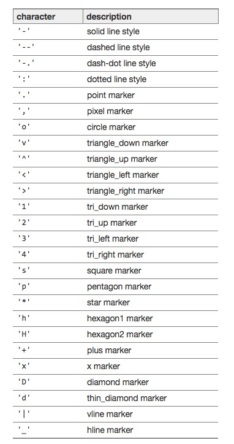

## matplot tutorial(객체화 방식)
### 2d

 import matplotlib.pyplot as plt

 1. 기본적인, 하나의 figure에 하나의 그래프
  - fig = plt.figure()
  - figure내 그래프창 추가
    1) axes1 = fig.add_axes([.1,.1,.8,.8]) #[x축위치,y축위치,가로길이,세로길이] ->그래프창(비균등)
    2) or axes1 = fig.add_subplot(111) #111 -> 가로분할1 세로분할1 첫번째그래프1(균등)
  - axes1.plot(x,y)
  - plt.show()

 2. figure한창 and 같은 그래프창 여러 그래프 
 **같은방식!, 다만 plot(그리기)을 여러번 호출**
  - axes1.plot(x,y,'색상')
  - axes1.plot(x1,y1,'색상')

 3. figure한창 and 독립적인 여러그래프 
  **객체에 여러 axes(비균등) 혹은 sub_plot(균등)을 추가하면 된다**
  - axes1 = fig.add_axes([.,.,.,.])
  - or axes1 = fig.add_subplot(222) #가로분할2 세로분할2 의 2번째그래프 의미
    - 이렇게 독립 그래프창 추가해주고 바로 밑에 라인에서 plot해서 해당 그래프 작성하는 방식

## 3d

 import matplotlib.pyplot as plt
 from mpl_toolkits.mplot3d import Axes3D  # 3d plotting을 위해서 이게 필요

 위방식과 같은 방식, 다만 그래프창 추가할때
 - ax = fig.add_subplot(111, projection = '3d') #2번째 arg가 들어간다
 - ax.plot(x,y,z,'색상')

 ## 부수적 내용

 - legend : 이선이 무슨선인지 
    ax.plot(x,y,z,색상,label = '') 
    ax.legend(loc = 10) #legend위치 arg로 넘긴다

 - plot 모양정하기! 
  ax.plot(x,y,z,color = '',linewidth = 5(선굵기), alpha = 5(투명도), linestyle = '-'
            ,maker = ''(점모양새), makersize = 20, makerfacecolor = '', markedgewidth = 3(마커외각모양)
            ,markeredgecolor = '')

 **파라미터 뭐 들어갈지는 인터넷에서 찾아서 상황에 따라 선택하기**

 - plot 말고 다른 형태
  - plt.scatter : 흩뿌리는 점형태
  - plt.hist : 히스토그램

  
  
