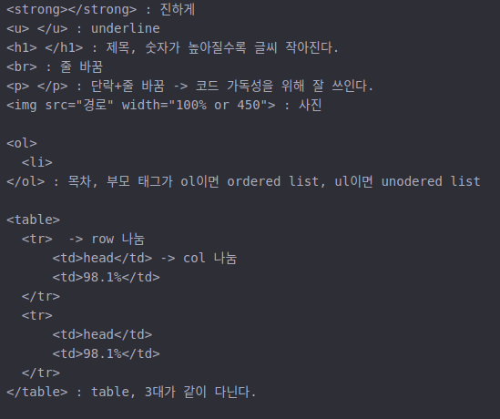
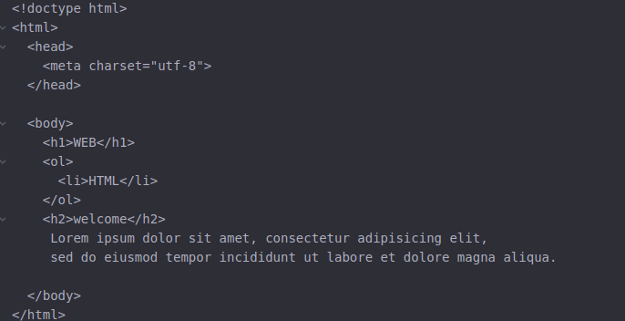
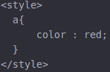
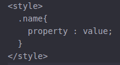
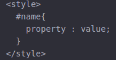
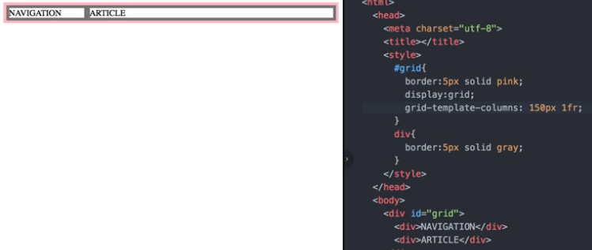
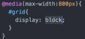
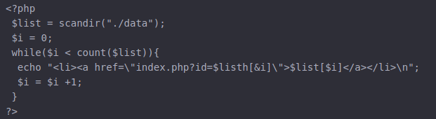

# HTML

## html cheating sheet

**html file은 웹브라우저 에서 ctrl+o로 html 파일을 열면 읽을 수 있다.**

### TAG

<u\> </u\> : underline 
<a href = 'url or file'\> : 링크

### Template

head 태그는 본문을 설명, body는 본문을 의미한다.

## Concept
Web Server는 도메인을 가지고 html 파일을 가지고 있다. Browser가 인터넷을 통해서
Web Server의 도메인/target.html으로 접근하여 가져온다.

즉 server의 도메인을 알면 client가 접근 가능.

- webhosting : 웹 서버를 빌려 주는 곳. ex) github
- apache : web server를 만들어준다.

[부가기능 - 동영상첨부, 댓글, 광고](https://www.youtube.com/watch?v=7T7r_oSp0SE&index=31&list=PLuHgQVnccGMDZP7FJ_ZsUrdCGH68ppvPb)

**현재 html 만으로는 단순히 몇 개의 태그만 가지고 글만 쓸 수 있다..**

---
# CSS
**디자인에 최적화된 새로운 언어**
**layout과 폰트 색 크기 등!**

기존 html 코드에 style 태그 or 속성을 써서 customize.

**1->3순으로 우선순위가 높아진다**

1. **style 기본**

 a 태그 걸린 글은 모두 색상이 빨간색으로 바뀐다.  
   이때 slector 는 a, property 는 color, value는 red가 된다

 선택자를 태그가 아닌 내가 원하는 거 끼리 하고싶을 경우

2. **class**

 태그의 속성에 class = "name active" 와 같이 주고 (띄어쓰기로 구별) 
 ex) <태그 class = "name activate">

3. **id**

class 와 같은 방식으로 class를 대신해 id를 쓴다.

**우선순위 id - class - 기본**

구체적인 것이 포괄적인 것보다 우선순위를 높혀 태그 선택자를 통해 전체적인 디자인을 하고 예외적인 것에
id를 찍어가며 예외를 주는 게 코딩에 효율적으로 한다.

### block level vs inline

**각 태그마다 화면의 어느 정도 차지하는 지분(?)이 있다.**
1. block : 화면전체를
2. inline : 자기 자신만을

#### property : value를 이용해 확인. (테두리)
- border-width:5px; 
- border-color:red; 
- border-style:solid; 

- padding:20px로 테두리 확장 가능
- margin:20px 테두리와 테두리 사이 간격
- width:100px 테두리 가로 수정

**!웹 상에서 요소 검사를 통해 px 수를 조정하자**

### Grid
- div 태그 : block 단위 무색무취 태그
- span 태그 : inline 단위 무색무취 태그

를 이용하여 layout을 만들자! 부모 태그 속성에 id를 주고
display를 이용하여 자식 태그 간에 어떻게 배치 할 것인지 결정

grid-template-columns: 150px(1번째컬럼) 1fr(2번째컬럼) 
fr은 비율

- padding, border은 -right, left, bottom 등 선택적으로도 줄 수 있다.
- #grid ol 과 같이 grid id 밑에 ol만 선택도 가능.

### 미디어 쿼리

**스마트폰, 모니터와 같이 화면에 크기에 따라 출력하는 화면 모습을 다르게 한다.**

조건을 주어 다시 화면 모습을 설정하게 한다.

### cheating sheet

**property:value**

**폰트**

color:red; #폰트 색  
text-decoration: none; #폰트 꾸미기 
font-size:60px; #폰트 사이즈 
text-align: center; #폰트 정렬 

**테두리**

border-color:red; #테두리 색 
border-style:solid; #테두리 선 모양 
border-width:5px; #테두리 두께 
border-bottom(etc..) : 1px solid grayl; #밑 테두리 1px두께 실선 으로 

**여백**

padding:20px로 테두리 확장 가능 
margin:20px 테두리와 테두리 사이 간격 
width:100px 테두리 가로 수정 

**grid**

display:inline (block) 
display:grid; 
grid-template-columns: 150px(1번째컬럼) 1fr(2번째컬럼)  #fr은 비율 

---
# php

**큰 html 틀에 css를 이용해 꾸미고 php를 이용해 동적이게 만든다.**

**web을 dynamic 하게 만들어준다**

**반복적인 일을 없애 하나의 파일만으로도 가능케한다**

<예시 : data에 있는 글 수만큼 리스트를 작성>
