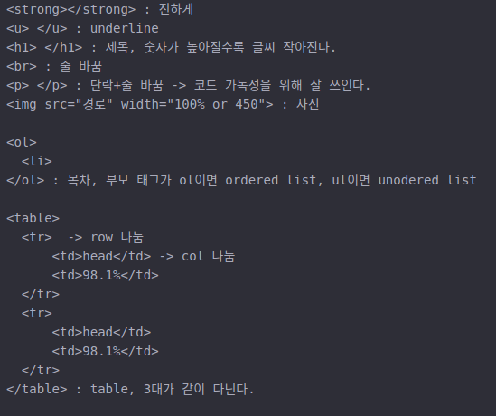

# HTML

## html cheating sheet

**html file은 웹브라우저 에서 ctrl+o로 html 파일을 열면 읽을 수 있다.**

### TAG

### Template

head 태그는 본문을 설명, body는 본문을 의미한다.

## Concept
Web Server는 도메인을 가지고 html 파일을 가지고 있다. Browser가 인터넷을 통해서
Web Server의 도메인/target.html으로 접근하여 가져온다.

즉 server의 도메인을 알면 client가 접근 가능.

- webhosting : 웹 서버를 빌려 주는 곳. ex) github
- apache : web server를 만들어준다.

[부가기능 - 동영상첨부, 댓글, 광고](https://www.youtube.com/watch?v=7T7r_oSp0SE&index=31&list=PLuHgQVnccGMDZP7FJ_ZsUrdCGH68ppvPb)

**현재 html 만으로는 단순히 몇 개의 태그만 가지고 글만 쓸 수 있다..**

---
# CSS
**디자인에 최적화된 새로운 언어**

기존 html 코드에 style 태그 or 속성을 써서 customize.

1. style 태그를 쓸 경우

 

 - a 태그 걸린 글은 모두 색상이 빨간색으로 바뀐다.  
   이때 slector 는 a, property 는 color, value는 red가 된다
 -  
