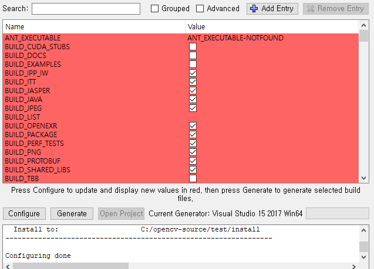

[해당 사이트 ](http://webnautes.tistory.com/1036) 참고하여 작성했습니다.

## OpenCV cmake로 build 하는 방법

1. [cmake사이트](https://cmake.org/download/)에서 최신 버전 zip파일 다운받아서 cmake 실행
2. [opencv사이트](https://opencv.org/releases.html)에서 최신버전 source code(zip) 다운로드
3. cmake 실행

  - sourece code에 opencv다운받은 경로입력 (해당파일)
  - build the binaries에 빌드 결과물이 저장될 위치입력 (opencv-source/build 디렉토리 새로 만들었다.)
  - configure 클릭

- 자신의 visual studio 버전 선택 (visual 15 2017 win64)

configure이 완성되면 빨간 배경과 함께 완성 메세지가 뜬다.

- 경로충돌을 막기위해서 빨간 창에서 **python을 serch** 하여 python 체크 해제
  **install을 serch** 하여 빌드결과물 최종 설치 위치 확인 및 수정
  **world serch** 하여  BUILD_opencv_wordl 체크하여 하나만 링크해도 가능하게한다.
  후에 다시 configure 버튼을 눌러준다

  이때 install에 작성한 경로가 최종 빌드 결과물 설치 위치이다.

- 이제 **generate** 버튼을 누른후 **Open Project** 버튼을 누른다

- Debug, Release모드 둘다 CmakeTargets내 **install 빌드**

## Project내에 Opnecv import 하는 방법

**어떠한 헤더파일도 해당 방식을 따르면 된다**

1. 새 빈 프로젝트,모든구성
2. (C/C++,일반)추가 포함 디렉토리에 빌드된(install폴더) include 경로 입력
3. (링커, 일반)추가 라이브러리 디렉토리에 빌드된 (x00\vc00)lib경로 입력
4. (구성속성,디버깅) 환경에 PATH=C:\경로\x64\vc15\bin;%PATH%
5. (링커,입력) 추가 종속성에 생성된 opencv_wordl000d.lib 입력

**kinect 또한 SDK를 download한뒤 같은 방식으로 링크하면 된다.**
