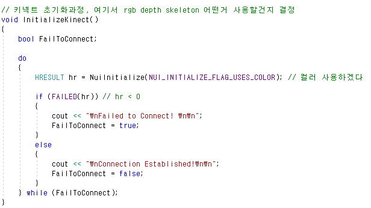
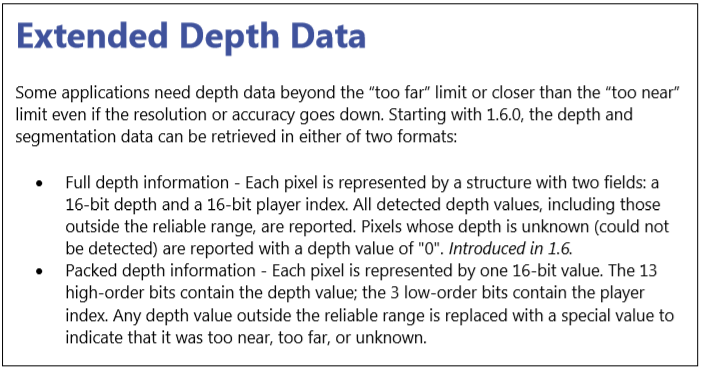
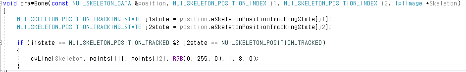

## kinect usage

Microsoft에서 출시한 Depth 카메라로 RGB 카메라, IR센서, 4-array microphone, 3축
센서로 구성되어 있으며 30FPS로 depth와 color stream을 얻는다.

**sdk를 [다운](https://www.microsoft.com/en-us/download/details.aspx?id=40278)받아 visual studio에서 data 사용 가능하다.**

---
### RGB stream

#### 헤더파일 및 네임 페이스 추가

640 * 480 size의 img

#### main()

**사용자 정의 함수에 대해서 위의 사진에 체크**

kinect로 받아드리는 img에대해서 HANDLE 자료형으로 받아 드린후  IplImage img 구조체로 변환하여 보여준다.

우선 정의한 **InitializeKinect()** 호출을 통해 원하는 RGB stream에 대해 초기화 과정을 거쳐서 연결시킨다.

이렇게 연결된 키넥트는 NuiImageStreamOpen() 함수를 통해
활성화된 기능에 대한 해상도 및 이벤트를 지정해주고 stream을 Open 시킨다.
stream open 실패시 hr에는 0보다 작은 값을 가지게 된다.

이렇게 준비가 완료되면 while문 안 정의한 **createRGBImage()** 호출을 통해 Kinect로 부터 얻은 img를
IplImage형태로 변환후 display 해주게 된다.

#### InitializeKinect()

NuiInitialize() 함수를 통해 키넥트를 초기화 시키며 연결한다.
이때 파라미터에는 kinect에서 사용하고자 하는 기능을 넘겨 주면 되는데

kinect의 RGB 영상과 Depth 영상을 동시에 이용하고자 할때
NUI_INITIALIZE_FLAG_USES_COLOR | NUI_INITIALIZE_FLAG_USES_DEPTH
와 같아 OR 연산자를 이용하면 된다.

#### createRGBImage()

뇌피셜) nextColorFrameEvent와 clolorStreamHandle은 직접 코드로
연결시키는 부분은 없음 -> NuiImageStreamOpen()를 통해 연결을 해주고
createRGBImage()함수내 NuiImageStreamGetNextFrame() 함수를 통해
data를 clolorStreamHandle로 가져오는듯..

pTexture = pImageFrame->pFrameTexture
NUI_LOCKED_RECT LockedRect;
pTexture->LockRect(0, &LockedRect, NULL, 0);

과정을 거쳐 KINECT img에 대한 BYTE정보를 획득하여서
cvSetData(Color, PBuffer, LockedRect.Pitch);
호출을 이용하여 IplImage 형태인 Color로 저장한다.

이때 cvSetData를 다시 설명하면
Parameters
arr – Array header
data – User data
step – Full row length in bytes

BYTE* 형태로 저장된 이미지 버퍼를 IplImage* 형태의 이미지 버퍼에 데이터를 채우기 할때 많이 사용된다.

예시)
BYTE* pBuff = 이미지 버퍼;
IplImage* RawImage = cvCreateImageHeader(cvsize(640,480),IPL_DEPTH_8U,3);
cvSetData(RawImage,pBuff,RawImage->widthStep);

---
### Depth stream

**depth의 값은 키넥트와의 직접적인 거리가아닌 수직거리 이다. 또한 키넥트의 좌표는 키넥트를
기준(0,0,0)으로 하는 상대적인 좌표계이다.**
이점을 이용하여 Kinect의 depth 값을 뽑아 이용한다.

**Depth stream 또한 RGB stream과 마찬가지로 같은 로직을 따른다** (main 함수내 code가 동일하다)
다만 사용하고자 하는 flag가 depth 이므로 NuiImageStreamOpen함수와 InitializeKinect함수 내
 flag를 Depth로 바꿔주고, 어떻게 Kinect로 부터 받은 값을 변환하는지에 따른다.

#### 차이점
#### int createDepthImage(HANDLE, IplImage*)

위 사진의 빨간부분을 통해 Depth value를 얻게된다
(USHORT : unsigned short )
depth 값을 시각적으로 표현하기 위해서는 RGBQUAD 자료형(rgb에 대한 속성을 지정)으로 표현했고  이를 변환해주는 Nui_ShortToQuad_Depth 함수를 정의하였다.

#### RGBQUAD Nui_ShortToQuad_Depth(USHORT)

**bit 연산 참고**
- 10진수랑 완전히 같은방식!
- 2진수에 2를 곱하면 이진수 뒤에 0이 하나 더 붙는다
- 1byte -> 8 bit, 16진수 1자리 -> 2진수 4자리, f -> 1111
- unsigned와 signed의 차이는 최상위bit를 부호bit로 사용하냐에 있다. 따라서 unsigned를
 사용하면 두 자료형 모두 메모리는 같지만 양수쪽으로 수의 **범위** 가 2배 증가한다 (자릿수가 늘어나서)
- 2byte인 수를 1byte로 형변환 하면 상위 4bit가 날아간다.
- 2^8 즉 100000000(2) 를 곱하면 이진수 뒤에 8개 0이 붙는다.
- 컴퓨터는 무엇이든 이진수인 수로 이뤄짐.

Depth 값은 GrayScale이기 때문에 rgb 값이 모두 동일한 값을 가진다.
Depth Value를 얻기 위해 아래 내용을 보자

위 사진의 내용에 따르면 필요한 depth는 최소 16bit이고 이중 상위 13bit가 픽셀의 depthValue,
 하위 3bit는 playerIndex값이다 때문에 위의 code realDepth = (s & 0xfff8) >> 3 를 통해
(16진수 fff8 -> 2진수 16bit 1111111111111000) bit and연산 후 오른쪽으로 3번 shift 한다.
이렇게 얻은 realDepth(13bt)를 이용해 연산을 통해 I에(8bit) 저장한후에 (**로직 알아내면 그때 다시!!**)
RGBQUAD자료형에 rgb값을 각각 255값 내로 변환된 I 값으로 동일하게 저장한다. 이때 ~(bit 반전)
을 하게되면 사물이 가까울수록 어둡게 시각화되며 ~을 안할경우 그 반대가 된다.

---

### Skeleton stream

키넥트는 사람의 관절을 20개 영역으로 나눠서 처리한다. 각각의 관절에는 TrackingID가 할당되어 있기 때문에
여러 사람이 들어가도 한사람의 관절을 계속 따라갈 수 있다. 이때 Skleton Tracking을 통해서
 잡을수 있는 사람은 최대 2명이다 (참고. Player Index은 최대 6 이며 이걸로 관절추출 불가)

Skeleton도 앞서 본 RGB, Depth와 마찬가지로 비슷한 방식을 따른다.
따라서 차이점에 대해서만 서술한다.

#### 차이점
#### main문 내

RGB, DPETH 와 달리 NuiImageStreamOpen대신 NuiSkeletonTrackingEnable()을 사용.
나머지 main내 코드는 RGB, Depth와 동일하다.

#### void createSkeleton(HANDLE, IplImage)

skeletonFrame 에는 skeleton 정보가 들어있는 구조체 이며
skeleton data에 대해 6개 배열이 있다.(한 sksleton frame 구조체 안에 skeleton 정보들과 skeleton data [6]이 들어있다.)

NuiSkeletonGetNextFrame에 &skeletonFrame을 넘겨줌 으로 skeletonFrame에 Frame을 가져오고 for문을 통해 가져온 skeleton data에 접근하여 skeleton data 상태가 어떤지 확인후 관절의 연결과 위치가 정확히 인지된 상태일 경우에만 skeleton을 보여준다

이때 Skeleton Tracking 상태에는 3가지 경우가 있다.
1. Tracked : 관절의 연결과 위치가 정확히 인지된 상태 (바른값)
2. PositionOnly : 관절의 위치값은 뽑을 수 있지만 정확히 어느 관절인지 인지못함(틀린값)
3. NotTracked : 인지가 안되는 상태

#### void drawSkeleton(NUI_SKELETON_DATA, IplImage)

createSkeleton에서 얻은 skeleton_data가 for문을 통하여 다시 drawSkeleton의 arg로 들어간다. 각 skeleton_data는
skeleton_data.SkeletonPositions[i]를 통하여 각부위(총 20개의 관절포인트)의 좌표에 접근할 수 있다.  이때 SkeletonPositions는 x,y,z,w 값을 가진 Vector4형 꼴이다. 따라서 IplImage 상에 바로 표현을 해줄수 없고, 이를 화면의 픽셀 좌표로 변환시켜주는 함수가 필요하다.
이역활을 SkeletonToScreen()이 해준다.

이렇게 화면의 픽셀 좌표로 변환시킨 결과가 drawBone()으로 들어가 skeleton 그림을 그려주게 된다.

#### void SkeletonToScreen(Vector4)

NuiTransformSkeletonToDepthImage가 해당 픽셀의 skeleton joint값을 받아서 ColorStream과 맞춰주는 일종의 Mapper 이다. 때문에 ColorStream의 Resolution을 같게 arg로 넘겨줘야한다.

**이러한 변환없이 그대로 사용할 경우 kinect의 상대좌표를 이용하는 것이다.**

#### void drawBone(NUI_SKELETON_DATA, NUI_SKELETON_POSITION_INDEX, NUI_SKELETON_POSITION_INDEX,IplImage )

이렇게 얻은 좌표를 drawBone통해서 골격좌표끼리 선으로 이어 주게된다.
