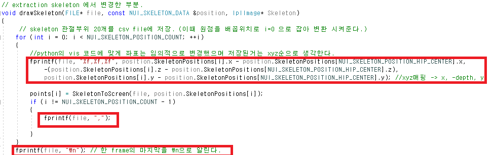
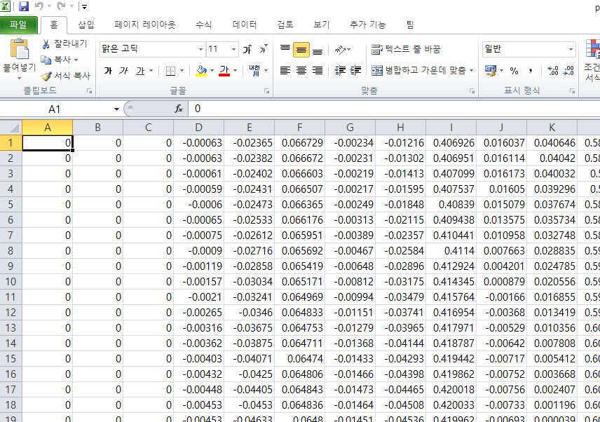

## 라벨링 작업

이전에 포스팅한 OpneCV Build 방법과 Kinect Tutorial 을 통해서 Skeleton data를 얻을 수
있게 되었다. 이를 이용하여 skeleton data를 csv 파일로 저장하고 python에서 vispy라는 lib를
이용하여  저장한 skeleton data를 시각화 하며 라벨링 하는 과정을 가진다.  

### CSV 파일 저장.

우선 C에서 파일을 저장하는 방법은 다음과 같다
~~~
FILE* file;
file = fopen(dir, "w");
fprintf(file, %c, 변수);
fclose(file);
~~~
다시 본문으로 돌아와 Skeleton data를 얻을때 drawSkeleton()함수에서
position.SkeletonPositions[idx] 에서 idx에 맞는 Skeleton joint에서 Vector4 형태의
Kinect 상대좌표 (value : 0~1 사이)를 얻을 수 있었다.
따라서 한개의 행동단위 마다 모든 joint의 x,y,z를 쉼표로 구분하여 저장 하였으며
한개의 행동 단위가 끝나게 되면 \n을 통해 줄바꿈을 실시하여 저장하였다.

이때 원점을 Hip_Center(index = 0)로 두어 모든 좌표의 원점을 변경하였다.
이를 통해서 유저가 어느 자리에 위치 하더라도 원점(Hip_Center : (0,0,0))이 동일하도록 하여
data를 통일성 있게 하였다.
(x,y,z 순서는 뒤에 이어질 vispy로 만든 프로그램에 맞게 저장하였습니다.)

---

### vispy 를 이용한 data 시각화

해당 프로젝트는 끝으로 행동은 인식하는데 목적을 두고 있다.
따라서 몇개의 skeleton data 들이 모여 어떠한 행동이라는게 인식이 필요하다
(필자는 한개의 skeleton data set를 frame이라 할때 30개 frame을 단위로 행동은 인식
 하는 프로그램을 만들었다.)

 이렇게 수치로 csv에 저장된 것을 보고 라벨링 작업을 하기엔 힘든 점이 있어
 아래 동영상과 같은 프로그램을 vispy lib를 이용하여 만들었다.

<iframe width="560" height="310" src="https://www.youtube.com/embed/gIQbT2ZRu3A" frameborder="0" allowfullscreen></iframe>

**데이터 분포 확인과 흐름을 보기위한 추가 프로그램**
<iframe width="560" height="310" src="https://www.youtube.com/embed/LBFqX-t0xSM" frameborder="0" allowfullscreen></iframe>

**vispy.scene usage**
[해당링크](http://vispy.org/) doc를 보면서 정리하였습니다.

**흐름 (틀을 만들고 -> viewbox widget을 삽입)**
1. canvas =  scene.canvas.SceneCanvas(title='Skeleton Pose', size=(1280, 960), keys='interactive')
윈도우 화면을 생성

2. grid = canvas.central_widget.add_grid()
윈도우 화면을 나눠쓰겠다.(.central_widget 전체화면 .add_grid() 에 격자추가)
**나눠진 격자를 또 그안에서 나눠진 widget을 만들고 싶으면 4. 참조**

3. viewbox 준비
skeleton_v = scene.ViewBox(camera='turntable') 로 viewbox를 만들어 하나의 widget을 따로 만들어 격자에 넣는 방식.

- camera 종류 : turntable (주로 3d), panzoom(주로 2d)
- vispy.scene.visual의 함수를 이용하여 viewbox에 그림을 그린다.

  3-1. 마커
    - p1 = scene.visuals.Markers() : 마커 객체생성
    - p1.set_data(pos, face_color) : pos는 튜플형식 ex) [[x1,y1,z1], [x2,y2,z2], ...]

  3-2) 선
    - b1 = scene.visuals.Line(pos, color=b_colors, width=10, connect=np.array(bones, dtype=np.uint8))
      pos 마찬가지, connect는 몇번점과 몇번점을 이을지?
      connet가 없으면 순서대로 점을 이은다

  3-2) 글자
  - txt = scene.visuals.Text("",color,font_size)

  이렇게 생성한 visuals 객체들은 Viewbox.add(객체) 해야 윈도우에 그려진다

4. 만들어진 viewbox를 원하는 격자에 삽입
 - widget =  grid.add_widget(ViewBox, row =1, col = i)
  나눠진 격자를 또나누고 싶다? 4) 함수 결과 나온 객체에 다시 add_grid한다 이때 ViewBox 안넣어도 된다.

5. event 처리
  - global : 전역변수 이용하여 데이터의 idx및 viewbox에 들어가는 그림들의 데이터를 변경
  - 객체에 들어가는 데이터는 객체에 대한 변수이기 때문에 함수가 끝나도 사라지지 않는다.
  -> 이러한것을 이용하여 class의 __init__을 이용해 sub_widget을 만드는 과정을 함 소스코드에서
   event처리 하는 템플릿에서 viewbox의 data들을 재설정하여 화면을 제어

#### 라벨링 과정 영상

<iframe width="560" height="310" src="https://www.youtube.com/embed/-tBS5io9EgY" frameborder="0" allowfullscreen></iframe>
