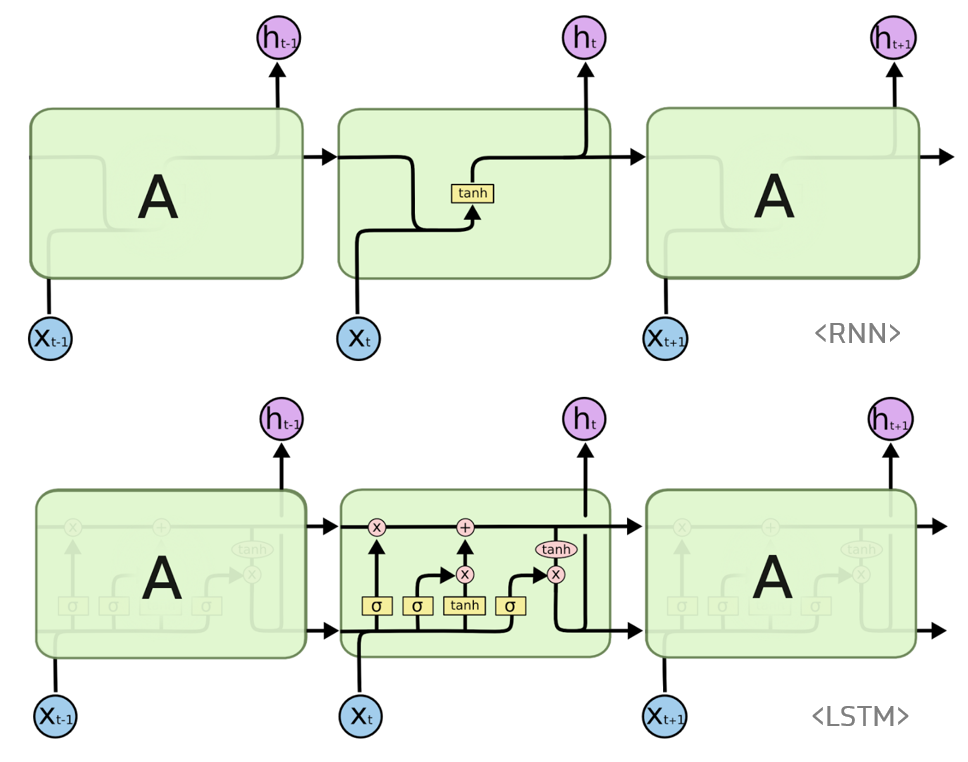

## AI model 학습

해당 프로젝트는 키넥트로 부터 skeleton data를 받아 행하는 행동이 어떤 행동인지
인식하는데에 목적을 두고있다.
행동은 연속되는 frame에 따른 어떠한 행동이라는 한개의 결과를 도출하기 때문에 순차적으로
등장하는 데이터에 적합한 RNN을 이용하여 모델링을 했다.

### RNN와 LSTM 기본개념

#### RNN

히든 노드가 방향을 가진 엣지로 연결되어 순환구조를 이루는 인공신경망.
순차적으로 등장하는 데이터 처리에 적합하다 (음성이나 문자)

초록색 부분을 히든 state라 하며 이전상태의 히든 state와 입력을 받아서(각각의 가중치를 곱하여)
 현재 히든 state를 갱신한다. (히든 state의 활성화 함수는 비선형 함수인 하이퍼 볼릭 탄젠트)

이렇게 갱신된 현재 히든state에 가중치를 곱하여 output을 이끌어 낸다
**표기 : W_hh 히든state에서 히든state로 가는 가중치**

####LSTM

RNN은 관련정보와 그 정보를 사용하려는 지점상이 거리가 멀 경우 역전파시
Vanishing Gradient Problem이 발생하는 문제가 있다. 이를 고안하고자 RNN의 hidden state에
cell-state를 추가한 구조 이다.

 

 cell state는 일종의 컨베이어 벨트 역할을 하기때문에 state가
 꽤 오래 경과 하더라도 그래디언트가 비교적 잘 전파된다.

 

 **forget gate f_t** 는 과거 정보를 잊기 위한 게이트이다. 이전 히든스테이트와 입력을 받아
  시그모이드 취해준 값이다. 시그모이드 출력 범위는 0~1이기에 0에 가까울 수록 이전 상태 정보를 잊는것이다.

 **input gate i_t⊙g_t** 는 현재 정보를 기억하기 위한 게이트이다.
 i_t와g_t는 이전 히든스테이트와 입력을 가중치와 곱한 선형 식에서
 활성화 함수가 시그모이드 인게 i_t, 하이퍼 볼릭 탄젠트 인게 g_t이며
 시그모이드는 범위가 0~1, 하이퍼 볼릭 탄젠트는 범위가 -1~1 이므로
 각각 강도와 방향을 나타낸다.

 

### Modeling

우선 행동의 종류를 7가지로 행동안함, 기본자세, 총 꺼내기, 권총 꺼내기, 칼 꺼내기,
문 열기, 주먹 휘두르기로 구분하였다.
**행동 종류에 대해선 다시 구분지어 할 예정**

우선 LSTM model 2개를 이용하여 각각 이들이 예측한 결과를 fully connect로 연결하여
하나의 결과를 내게 하였다.

1. LSTM model 1 : 이곳에는 skeleton data 좌표가 그대로 들어가며 30개의 연속된 데이터가 입력으로 들어간다

2. LSTM modle 2 : 구분되는 행동을 살펴 보았을때 행동에는 상체의 움직임의 변화가 눈에 띄이며
손에 좌표나 움직임이 있음에 따라 구분되어질 수 있다고 보여져
왼손, 오른손의 속도, 또한 왼손-가슴-오른손 이 이루는 각도, 손의 좌표를 인풋으로 들어간다.

### Overfitting Problem

오버피팅은 신경망이 학습 데이터를 보고 패턴을 인식하는게 아니 데이터 자체를 외워 버리는것이다.
따라서 train set에 비해 test set의 성능이 현저이 낮을때 의심해 볼 수 있다.
이를 해결하기 위해 신경망을 더 깊게하거나 drop-out 방식들을 이용할 수 있고
data를 augmentation 하여 더 많은 데이터를 학습 시키는 방법도 있다.

필자는 기존에 저장한 skeleton data에 가우스 잡음을 추가하여 데이터를 확장 하였다.
가우스 잡음을 더한 결과  확장한 데이터는 각 관절이 갑자기 튀어 버리는 data를 갖지 않지만
기존의 data와 다른 data를 가지게 된다.

이를 확인하기 위해 기존에 만든 vispy로 살펴보면 다음과 같다
<iframe width="560" height="310" src="https://www.youtube.com/embed/lyxGgGtxXBo" frameborder="0" allowfullscreen></iframe>

왼쪽은 기존 DATA 오른쪽은 잡음을 더한 DATA 이다.
영상에서 볼수 있다 시피 특정 관절에서 갑자기 튀어버리는 현상은 보여지지 않는다.

**모델 학습 결과 test set에서 약 88 % 의 정확도를 보였다.**

### Error 분석

Test set을 입력으로 넣을 때 에러가 발생하는 행동 set에 대해서 기록하여 csv로 저장하였다.

우선 결과적으로 위의 img의 왼쪽 부분 0 label, 1 label , .. 은 실제 라벨링 한 값이며
각각 배열안 수는 idx에 따라 ai model이 틀리게 예측한 횟수를 말한다
즉 1label을 보면 총 에러 갯수는 50개 이며 그중 49개가 1label을 0label로 잘못예측
, 1개가 0label을 4label로 잘목 예측을 말한다.

6label에 대해서는 오류가 발생하지 않았으면 대체적으로 각 label들은 보통 0 label(행동안함)
로 오류가 발생하며 4label이(칼 꺼내기) 3label(권총 꺼내기)로 잘못 예측되는 특징이 있다.
또한 0label이 어떠한 행동을 하였다는 잘못된 예측이 많았다

이를 에러난 data에 대해서 확인해보자

<iframe width="560" height="310" src="https://www.youtube.com/embed/m9qetRHZTcc" frameborder="0" allowfullscreen></iframe>

위의 동영상은 test set에 대해서 에러가 발생한 데이터를 시각화 한 동영상이며
왼쪽 숫자는 실제 labeling 한 수 오른쪽 숫자는 ai model이 예측한 수 이다.
