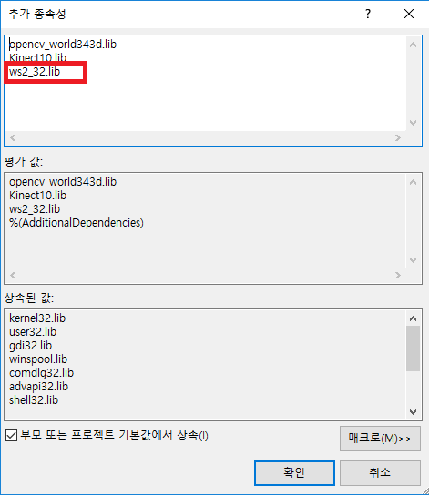
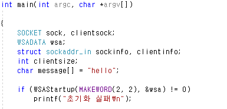
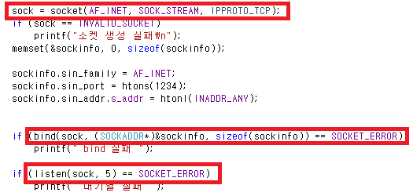
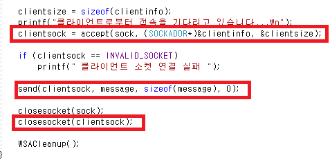
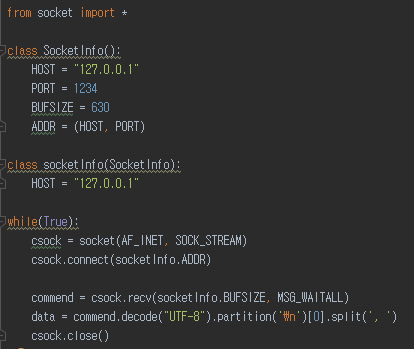
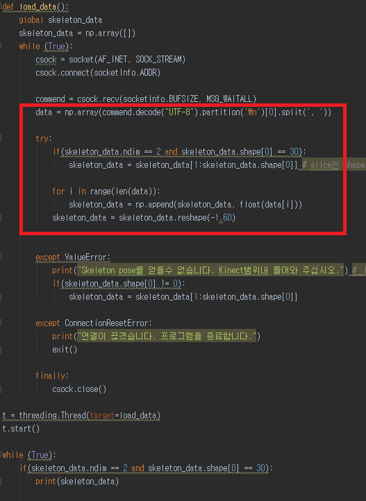

## 소켓 통신 (C -> Python)

이제 Action Recognition 프로그램도 완성하였다.
하지만 Kinect에서 Data를 받아오는 프로그램은 C++에서 작성되었으나
행동인식하는 프로그램은 python에서 작성되었다.
때문에 Kinect에서 받아오는 Data를 소켓통신을 이용해 python으로 보내자.

### 흐름도

소켓은 TCP(Transmission Control Protocol)와 UDP(User Datagram Protocol)로 구분할수 있다.
TCP는 신뢰할 수 있는 통신, UDP는 몇가지 신뢰도는 포기하되 좀더 직접적인 통신을 의미한다.

차이점은 만약 데이터가 도착하지 않은 상태에서 recv()로 데이터를 수신하고자 할때 데이터가
올때까지 대기(block)하느냐 아니면 그냥 수신된 데이터가 없다는 정보만 리턴하고 넘어가느냐 차이이다.

**TCP(스트림)** : 오류수정, 전송처리, 흐름제어 등을 보장해 주며 송신된 순서에 따른
중복되지 않은 데이터를 수신하게 된다. 또한 메세지를 보내기 위해 별도의 연결을 맺는 행위를
하므로 약간의 오버헤드가 존재한다.
품질의 통신을 수행하기 위해서 TCP 사용

**UDP** : 명시적으로 연결을 맺지 않으므로 비연결형 소켓이라 한다. 이 프로토콜은
 메세지의 크기에 약간의 제한이 있으며 메시지의 확실한 전달 역시 보장되지 않는다.

### C++ 서버 (data를 client에 보냄)

ws2_32.lib를 (링커,입력) 추가종속성에 포함시켜야 #include<winsock2.h>이 가능 해 진다.

SOCKET 통신에 필요한 변수들을 선언한다.  이때 sockaddr_in 구조체는 socket에 주소와
port를 할당하기 위한 구조체 이다.

sock = socket(AF_INET, SOCK_STREAM, IPPROTO_TCP);
을 통해 **서버 소켓** 을 만든다. (ip Protocol TCP를 따르는 소켓)

이렇게 만든 서버소켓의 **정보** 를 기입 하기 sockaddr_in 구조체를 이용한다.

AF_INET는 IPv4 인터넷 프로토콜을 의미하며
htons를 통해 포트번호
htonl을 이용해 ip주소 정보를 기입한다

ip정보를 정할때 inet_addr("ip")로도 지정가능하나 실행되는 시스템 마다 ip가 다를 것
임으로 고정 ip 대신 htonl(INADDR_ANY)을 통해 지정한다

**소켓이 통신하기 위해선** 서버 소켓이 커널에 등록 되어야 가능하다
bind를 통해서 서버소켓의 ip와 port를 할당하여 커널에 등록이 되고
커널이 socket을 이용하여 외부로 부터 자료를 송수신 가능하게 된다.

이후 listen() 함수로 클라이언트 접속 요청을 확인한다.

이제 accept로 접속요청을 허락하게 되면 클라이언트와 통신을 하기위해서 커널이 자동으로
소켓을 생성한다. 이 소켓을 client socket이라 명하겠다. (이때 accept 코드 라인에서
client 프로그램이 접속할때까지 대기한다)

이렇게 생성된 client socket을 이용해 send 함수로 메세지를 보낼 수 있다.

**현재 포스팅은 소켓 통신의 간단한 예시만 소개하며, 현재 진행되는 프로젝트 main문 에서
 서버소켓을 커널에 등록후 skeleton data를 얻어내는 while문 내에서 client socket을 생성후
보낸뒤 closesocket(clientsock)한다. (즉 한번 데이터를 보낼때 마다 client socket 재생성)**
보낼때 마다 재생성 이유 : 보내는 문자열의 길이 (버퍼 사이즈)를 특정 지을수 없어 원하는 데이터가 짤려서 들어오기 때문에.

skeleton data는 문자열로 저장되며 끝에 \n을 기입하여 끝부분임을 명시하였다.

### python (data를 받음)

파이썬에서 문자열을 받는 기본 예제는 위 사진과 같다.
소켓 정보를 담는 socketinfo 클래스를 정의후 csock 소켓 생성 및 연결을 한다.
recv 함수를 통해 버퍼사이즈 만큼 데이터를 받아 들이며 이를 UTF-8 방식으로 디코딩한다.

**[참고](http://redscreen.tistory.com/163). encoding & decoding**
인코딩이란? 특정한 문자 집합 안의 문자들을 컴퓨터 시스템에서 사용할 목적으로 일정한
범위안의 정수들로 변환을 말한다. 이러한 변환 table 종류에는 Ascii, Unicode, UTF-8, Base64, URL 등이 있다.

유니코드는 바이트 인코딩 방식이 아니라 각국의 언어를 겹치지 않게 매핑한 코드 이며
즉 나라마다 할당받은 유니코드 범위가 있다.
이범위가 1~4 byte 에 해당하는 범위에 걸쳐 있으므로 (아스키코드는 1byte 내로 표현됨)
한글 utf-8은 3 byte가 된다.

해당 프로젝트에선 data를 계속 받아오며 30개의 data가 들어오면 동시에 data를 가지고
행동을 예측해야하기 때문에 쓰레드를 사용 하였다.

소켓으로 받은 data를 UTF-8로 디코딩, 그리고 끝을 알리는 \n 문자로 자르고
쉼표로 데이터를 찢어 data 변수에 저장한다.
이렇게 저장한 data를 float 으로 데이터 형변환을 하며 skeleton_data에 append 해준다.

만일 30개의 data가 모두 들어온 후에 또 다시 31번째 data가 들어오면
skeleton_data = skeleton_data[1:skeleton_data.shape[0]]
을 통해 선입한 data를 삭제해주었다.
**참고로 slice만 할때는 해당 data에 shape 영향을 안줌.**

#### 결과 동영상
<iframe width="560" height="310" src="https://www.youtube.com/embed/mdGhFOe2Fn8" frameborder="0" allowfullscreen></iframe>

c++ kinect에서 skeleton data를 python으로 보내어 일전에 학습된 model을 가지고
실시간으로 행동을 인식하는 프로그램의 동영상이다.

추후 model이 예측하는 라벨번호를 이용하여 GTA 와 같은 게임을 통해
키를 눌리게 함으로써 다시 업로드 할 예정이다.
