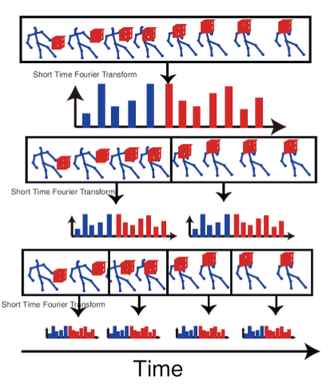

# Human Action Recognition

**2017년 10월 ICCV에서 연세대 박사과정 이인웅님 께서 발표한 내용을 토대로 작성.**

## Intro

1. **RGB 영상에서의 행동인식**

Two-stream convolutional networks for action recognition in videos, in NIPS 2014
논문에서 UCF-101(88.0%), HMDB-51(59.4%)의 성능을 보여준다
현재는 CVPR 2017에서 UCF-101(94.9%), HMDB-51(72.2%) 성능이 나타난다.

행동인식은 temporal data이기때문에 single frame(spatial stream convnet), apperance
자체를 보기보단 optical flow(temproal stream convnet)라는 것을 이용하여 two-stream
(single frame과 optical flow)으로 가능 형태.

**여기서 중요한점은 행동인식은 대부분 이 two-stream으로 진행되고 있다.**

비디오에서 어떠한 행동을 했는지 맞추는 문제이나 이렇게 맞춰 버리면 맞추기는 했는데
**어떠한걸 근거로 했는지 알수없다.**

만일 행동을 인식할때 context 정보를 이용한다면? 행동을 맞췄을때 그 원인이 어떠한 context
기반으로 만들어 졌는지 알수 있기 때문에 중간 단계를 통해 성능을 올릴 수 있고 분석도 더 잘 되게 된다.

2. **Skeleton data**

RGB에서 2D Skeleton를 open pose라는 오픈소스를 이용하면 쉽게 얻을 수 있다.
3D skeleton data를 사용하게 되면 정보가 2D보다 많기 때문에 행동인식에 도움이 된다
**3D skeleton data를 가지고 행동인식을 주력하고 있다.**

## Issues of Skeleton-based Action Recognition
1. Variable Scale
2. Very Noisy
3. Variable View Orientation
4. attributes of Human action

data의 특징. 기본적으로 depth value가 튀기 때문에 skeleton data는 잡음을 가지며카메라와
 객체의 거리에 따라 scale이 달라진다 또한 카메라 view의 위치에 따라 좌표 값이 달라지는 특성을 가진다.

**attributes of Human action**
Rate Variation : 행동의 temporal 특징으로 행동의 길이가 다양하다 가령 펀치 한 행위를 하는데에도
  한번의 행동이 4frame 이내로 끝나고 다음번에는 6frame으로 끝나는 등

Intra-action Variation : 같은 펀치라도 다른 방식

## Overview of the proposed deep learning network

**Inwoong Lee, Doyoung Kim, Seoungyoon Kang and Sanghoon Lee, "Ensemble Deep Learning
for Skeleton-based Action Recognition using Temporal Sliding LSTM networks" in ICCV 2017.**

1. preprocessing : scale 과 orientation issues 해결하기 위해 좌표계 변환함 이를 가지고
Motion 이라는 feature을 추가적으로 추출. (trimed data?)

2. modeling : 위 사진에서 LSTM 각 박스 길이는  video action sequence의 총길이 인데 그중에서 일부만을
 집어 넣어 서로 다른 행동특성을 잡아 내도록 구성하여 concatenation 한후 softmax classfier에 집어 넣어
  오른쪽 진하게 칠해진 부분이 각각의 모델들이 어디로 매핑하고 있느냐를 의미.

이렇게 나온 **short-term, mid-term, long-term** LSTM이 뱉어낸 각 결과를 averaging 하여 서로 보완하는 Ensemble.

## Feature Representation

3가지로 나눔
1. 순전한 kinect skeleton data 사용 : 부하가 너무 커진다.
2. Realative skeleton data : 중심좌표를 선택하여 좌표계 변환(일관성)통해
Variation이 줄어들지만 Jump 같은 행위에 문제가 생긴다.
3. 1 + 2 를 동시에 사용 : Jump같은 행동 인식을 해결하기위해 initial frame을 reference로 잡고
다음 frame의 좌표는 initial frame(trimed data의 첫 frame)과의 차이로. temporal skeleton movements를 반영 하여
이로써 orientation and location variation 을 줄이게 되고 이게 **성능입장에서 중요했다.**

### Pose orientation alignment

행동에서 다른 방향성으로 가기에 기계가 알기 어렵기 때문에 같은 행동으로 매핑.

initial frame을 가지고 사람의 머리방향을 Y축, 오른쪽에선 왼쪽 HIP으로 가능 방향을 X축, 이를 외적한 Z축 으로 설정.

### Motion feature extraction

두개의 frame사이의 joint 좌표 차이를 구하는 것 (움직임을 기반으로한 motion feature)

pose feature(skeleton 좌표)와 motion feature 둘 다 사용
사람이 행동을 인식할때 형태(pose feature)를 보기도 하고 움직임(motion feature)을
보기도 한다. 라는 것에서 직관에 따라 modeling하였다.

## Modeling of Human Action, Traditional work

### Mining Actionle Ensemble for Action Recognition with Depth Cameras, in CVPR 2012

**기존에 temporal data를 어떻게 처리 하였느냐?**
Fourier temporal pyramids 형태로 data를 쪼개서 처리

global하게 trimed data의 처음부터 끝까지를 가지고 어떤 feature를 summary(요약) 하는게 맨위 히스토그램
그걸 아래로 가며 짤라 가며 짤라진 sequence에대해 다시  히스토그램 정리(각각의 변화들이 global하게 본것보다
쪼개어 본것이 세부적인 특성들이 들어나기 좋아진다.)

이러한 쪼개진 데이터를 이용 temporal 적인 차이들을  반영하는 형태로,
Mining actionlet ensemble/pooling(compression)해서 svm에 넣어준다

### Human Action Recognition by Representing 3D Skeletons as points in A Lie Group, in CVPR 2014

**다른 temproal data 처리 방법**
이 당시에도 skeleton 기반 행동인식에 딥러닝 논문 안나왔음.

manifold 라는 라이브러리 이용하여 feature를 Representation 했다.
여기서 주목할건 **dynamic time warping**

(Forier Temporal Pyramids 한뒤)
행동의 속도가 서로 다르기 때문에 행동간에 sync가 안맞을수 있다.이를 dynamic time warping을
통해서 특정한 샘플갯수를 정해 서로 sequence 길이를 맞춰 줌으로써 temporal 적인 misalignment를 맞춰준다.
최종적으로  SVM 수행

**dynamic time warping이 deep learning에서 어떻게 사용되나?**
이분은 이것을 풀링이라 생각한다
풀링을 하게 되면 이미지 분류에서도 이미지 사이즈가 줄어들면 큰사이즈에서 움직임이
작은사이즈에서 움직은 작아지기 때문에 고양이가 어디에있든 작게보면 차이가 안나는것처럼
temporal 에서도 pooling 을 하게 되면 sequence의 동작들이 차이가 컸던것들이 pooling을
하게되면 디멘저가 축소되기 떄문에 자동적으로 time warping과 비슷한 효과를 낸다

### Hierarchical Recurrent Neural Network for Skeleton Based Action Recognition, in CVPR 2015

RNN이 temporal data에 대한 딥러닝 으로 계속 소개가 되는 해당 논문이 최초로 소개 된것으로 보인다.

사람의 structure knowledge를 deeplearning에 적용하고 싶은 한듯 하다.

LSTM이 한번에 몸전체를 학습하게 되면 몸 전체에 대해서 부위별로 나눠줬다는걸 인식을 할수 없기 때문에 나눠줬다는걸 강제로 학습시키기 위해
단계 단계로 합쳐가며 bidirection RNN으로 학습을 해간다.

###  Spatio-Temporal LSTM with Trust Gates for 3D Human Action Recognition, in ECCV 2016

LSTM은 기본적으로 temproal적으로 적용한게 전부였다.
이와같은 경우에는 joint적인 모양과 temporal 적인 특성을 LSTM이 같이 학습하는것을 목적으로 했다

2D(skeleton의 모양과 temporal적인 모양도 넣기도 하여)로 배열을 만들어서 LSTM을 학습을했기때문에 Spatio 하고 temporal한 feature를 조인트하게 lstm에 넣었다는것을 contribution 해서 3D행동인식을 했더니 결과가 괜찮았다는 논문

## Temporal Sliding LSTM, 해당 발표 논문

기존의 네트워크 들은 trimed data가 있으면 LSTM을 처음부터 끝까지 끊지 않고 전부이용 하였다.
이분이 이것을 생각한 동기는 LSTM이 아무리  forget gate를 가지고있다 하더라도 자동으로 forget gate를 완벽하게 원하는 만큼 끊어줄수 없을것이다라는게 생각의 시초 (LSTM이 완벽하지 않다.)

중간에 구부러지거나 끊어지는 동작들 같은 경우에는
일전에 temporal pyramid에서 본것과 같이 3/4 지점 까지 frame만 들어오면 되는데 이후 frame이 들어오면 섞여 버리기 때문에
그렇게 전체 sequence를 사용하기 보다는 이렇게 끊어서 하는것들도 필요 할 것이다.

이렇게 term을 다양하게하여 더 다양한 행동특성을 모델링하는데 도움이 될것이다 라는게 main idea

### TS-LSTM v1

**motion feature만 사용함**

 - 3개의 Long-term TS-LSTM (3개 motion feature에 대해)
 - 2개의 Medium-term TS-LSTM (2개 motion feature에 대해)
 - 1개의 Short-term TS-LSTM (1개 motion feature에 대해)
이때 개인적으로 n개 motion feature란 의미는 1개의 total sequence에 대해 다르게 motion을 추출 했다 이해, reference에 대해 1frame 혹은 5frame 차이의 motion feature(단타성 or 길게하는 행동, 즉 각 LSTM의 input이 달라짐)

long term을 3개 사용한 이유는 실험적으로 long term의 결과 값이 가장 좋았기 때문에, 성능에 영향을 가장

### TS-LSTM v2

**pose feature 추가**
pose feature은 각행동들의 레퍼런스를 중간중간 잡아주는 형태라 생각을 함

각각의 개별 LSTM의 결과를 Concat을 해서 Temporal 축으로 pooling
(motion feature에 대해선 sumpool을하고 pose feature에 대해선 meanpool을 한게 실험적인것으로 정확히 원인규명은 안됨)

## Remaining Issues

- Network design : 모델을 더 한다. 파라미터 evaluation을 통해
- Untrimed data : skeleton의 localization 문제가 추가로 발생
- Human poas estimation

## 현재 내 졸업작품과 차이점

(작성 필요)
