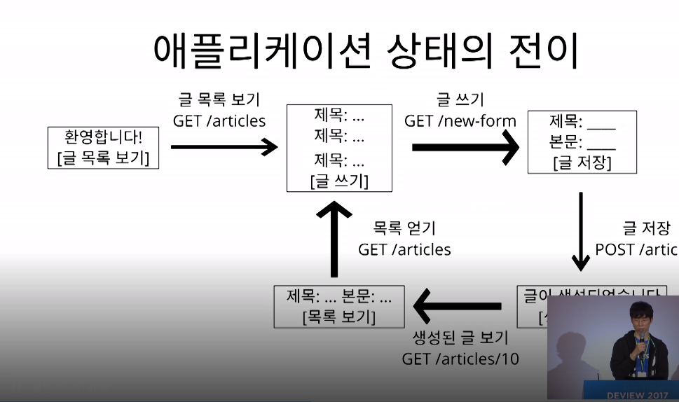
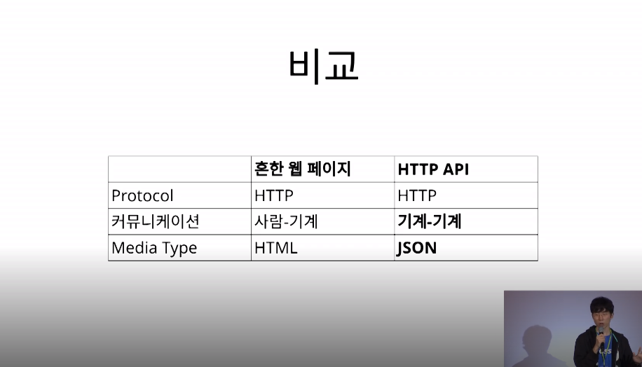
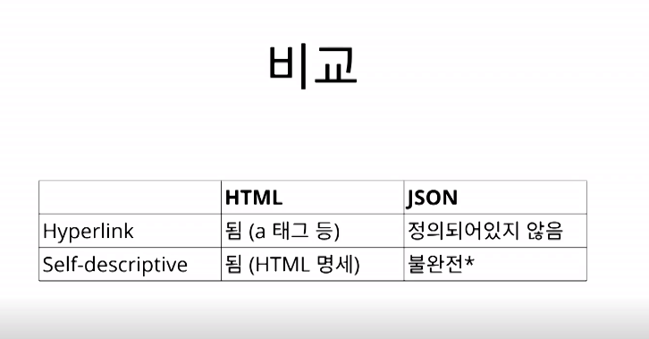
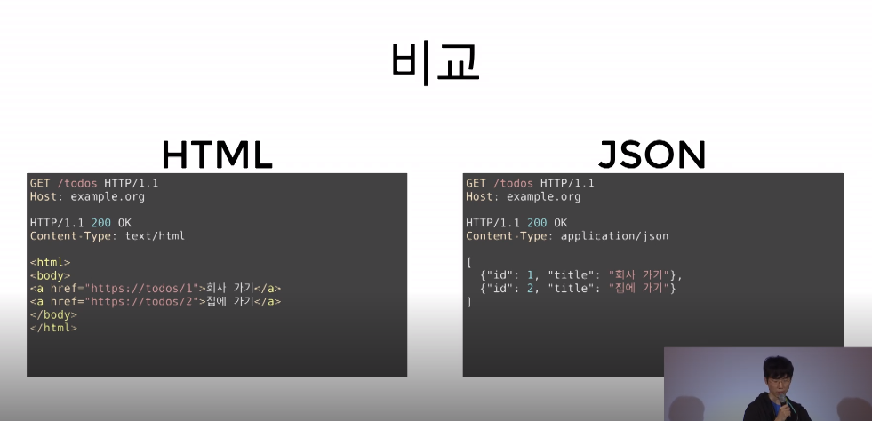

DEVIEW2017 이응준 님의 강연을 정리 하였습니다.

# REST API
Rspresentational State Transfer, 컴퓨터간 상호 운용 하는 방법.

## REST가 어떻게 나왔는가?

Web(1991)은 정보들을 하이퍼 텍스트로 연결한다.
(표현방식 : HTML, 식별자 : URL, 정보들을 전송하는 방법: HTTP)

94년 HTTP 1.0 프로토콜 작업 참여하며 Roy Fielding는 어떻게 이미 사용되는 HTTP 프로토콜에
기능을 더하고 고쳐야 하는 상황에서 웹을 망가트리지 않고 증본 시킬까 라는 생각을 한다.
이는 REST 가 된다.

## REST API란?
REST 아키텍쳐 스타일을 따르는 API를 말한다.
여기서 REST는 분산 하이퍼 미디어 시스템 (예를 들어 웹)을 위한 아키텍쳐 스타일이며
아키텍쳐 스타일은 제약 조건들의 집합을 뜻한다.

## 그럼 REST의 제약조건은 무엇인가?
1. client-server
2. stateless
3. cache
4. uniform interface
5. layered system
6. code-on-demand (optional)
 (-> 서버에서 코드를 클라이언트에 보내서 실행할 수 있어야 한다. js)

이중 http만 따라도 5가지는 만족한다.
문제는 **uniform interface** 이다.

## uniform interface의 제약조건
1. identification of resources
2. manipulation of resources through representations
3. self-descriptive messages
4. hypermedia as the engine of application state(HATEOAS)

1번, 리소스가 URI로 식별되면 되며 2번 representation 전송을 통해서 resource를 조작해야한다. 리소스를 CURD 할때 HTTP 메세지에다가 그 표현을 담아서 전송을 하면 된다.
대체로 1번과 2번의 조건은 만족하게된다.

대체로 3번과 4번이 문제가 된다.

### uniform interface의 제약조건 self-descriptive messages
**메세지는 스스로 설명해야한다.**
예를들어
~~~
GET /HTTP/1.1
~~~
GET은 ROOT를 얻어오는 메소드인 요청 메세지가 있다 해보자. 이 요청 메세지에는 목적지가 빠져있어서 self-descriptive하지 못한다.
~~~
GET / HTTP/1.1
HOST: www.example.org
~~~
목적지를 추가함으로써 메세지는 스스로 설명되어진다.

~~~
HTTP/1.1 200 OK
[{"op": "remove", "path" : "/a/b/c"}]
~~~
이런 응답메세지가 있다 해보자. 200 ok라는 응답과 함께 아래 json으로된 본문이 있다.
이걸 받은 클라이언트는 이 메세지를 해석하려면 이게 어떤 문법으로 작성된건지 모르기
때문에 해석을 못하게 된다.
~~~
HTTP/1.1 200 OK
Content-Type : application/json-patch+json
[{"op": "remove", "path" : "/a/b/c"}]
~~~
이처럼 Content-Type 헤더 (미디어 타입)가 들어가게 되어
파싱이 가능해지고 문법을 해석할 수 있게된다.
이는 json-patch+json 라는 미디어타입으로 정의되어잇는 메시지 이기때문에 얘에대한
명세를 찾아가서 이해한 다음에 이메세지를 해석하게 된다.

**self-descriptive messages는 메세지 만으로 온전히 해석이 가능해져야 한다**

### uniform interface의 제약조건 HATEOAS
**애플리케이션의 상태는 하이퍼링크를 이용해 전이 되어야 한다.**

이런 웹사이트가 있다고 보자. 웹사이트 ROOT에 접근하면 단순한 게시판에서
게시판 전체를 보는 목록이있고 링크를 누르면 글 목록 보기를 위한
HTTP 요청을 보내서 글 목록을 가져오고 ..
이상태 전이마다 항상 해당 페이지에 있던 링크를 따라가며 전.

HTML같은 경우 보면  태그를 통해서 하이퍼 링크가 나와있고 이 하이퍼링크를
통해서 그 다음 상태로 전이가 가능하기 때문에 HATEOAS를 만족을 한다.
jason으로 표현해도 만족하는 방법이 있다.

## 왜 Uniform interface를 만족해야 하느냐?
독릭적인 진화를 하기 위해서 이다.
1. 서버와 클라이언트가 각각 독립적으로 진화한다.
2. 때문에 서버의 기능이 변경되어도 클라이언트를 업데이트할 필요가 없다.
이게 바로 REST를 만들게 된 계기 이다.

웹을 예시로 들어보자.
웹 페이지를 변경했다고해서 웹 브라우저를 업데이트 할 필요가 없다.
또 웹 브라우저를 업데이트 했다고 웹 페이지를 변결 할 필요도 없다.
HTML 명세가 변경되어도 웹은 잘 동작하게 된다. 또한 HTTP 명세가 변경되어도
웹은 잘 동작하게 된다.

## 왜 API는 REST가 잘 안되나? 그냥 웹페이는 REST가 잘되는데..

우선 프로토콜은 같다.
커뮤니케이션에서 다른데 우선 웹페이지는 HTML문서를 사람이 본다.
그러나 API는 기계가 해석한다. 때문에 미디어 타입이 다르게 된다.
웹페이지는 HTML이고 API는 json.
그렇다면 문제가 되는것은 미디어 타입이겠구나..

이 둘을 비교해보자.

JSON의 self-descriptive가 불완전하다는 것은 적어도 문법은 정의가 되어있으나
그안에 들어갈 값(key value)들이 어떤 의미를 가져야 한다는것은 정의되어 있지않다.
html 같은경우 html 명세에 정립되어있다.
json경우 문법 해석은 가능하지만 의미를 해석하려면 별도로 문서(api 문서 등)가 필요하다

self-descriptive하다는 것은 이것만 보고 온전히 이해 가능해야한다.
HTML경우
1. 응답 메시지의 Content-type을 보고 미디어 타입이 text/html임을 확인한다.
2. HTTP명세에 미디어타입은 IANA에 등록되어있다고 하므로, IANA에서 text/html을 확인
3. IANA에 따르면 text//html의 명세는 http://www.w3.org/TR/html 이므로 링크로 찾
아가 명세를 해석한다.
4. 명세에 모든 태그의 해석방법이 구체적으로 나와있으므로 이를 해석을 할 수 있다.
HATEOAS측면으로 써는 a태그를 이용해 다음 상태로 전이 가능

JSON경우
마찬가지로 IANA에 application/json을 찾아간다. 거기서 명세는
draft-left-jsonbis-rfc7159bis-04이므로 링크를 찾아가 명세를 해석한다.
명세에서 json문서를 파싱하는 방법이 명시 되었으므로 성공적으로 파싱을 성공하는데
**그러나 id가 무엇을 의미하고 title이 무엇을 의미하는지 명세에서 알수없다**
HATEOAS경우도 다음상태로 전이할 링크가 없다.

## self-descriptive와 hateoas가 독립적 진화에 어떻게 도움이 될까?
**self-descriptive** 는 확장 가능한 커뮤니케이션을 가능하게 한다 왜냐하면
서버나 클라이언트가 변경되더라도 오고가는 메세지는 언제나 self-descriptive하므로 언제나 해석이가능하다

**HATEOAS** 애플리케이션 상태전이의 late binding이 가능하다는 것인데
어디서 어디로 전이가 가능한지 미리 결정되지 않는다. 어떤상태로 전이가 완료되고 나서야 그다음
전이될수 있는 상태가 결정된다. 쉽게 말해 링크는 동적으로 변경될수있다.  서버가 바꿔도
클라이언트가 자연스럽게 따라간다

참고 [link](https://tv.naver.com/v/2292653)
