# 탐색과 최적화

## 정의
탐색 : 문제의 해(Solution)가 될 수 있는 집합을 공간(space)으로 간주하고 **최적의 해를
찾기위해** 공간을 체계적으로 찾아내는 것.
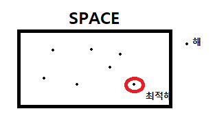

상태 : 특정 시점에 문제세계가 처해있는 모습(현재상태) 
세계 : 대상들과 이들의 상황을 포괄적으로 지칭 
상태공간 : 초기상태 로 부터 도달 할 수 있는 모든 상태들의 집합 (모든 상태의 경우의 수) 
상태공간 그래프 : 상태공간에서 각 행동에 따른 상태의 변화를 나타낸 그래프 
(즉 상태공간을 그래프로 연결)
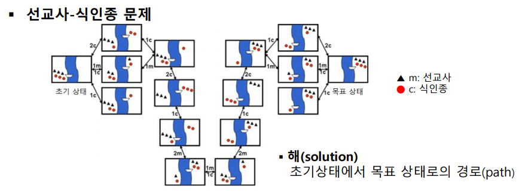

**문제점** 일반적으로 상태공간(모든 경우의 수) 매우큼 (메모리문제, 복잡)
 -> 처음부터 그래프 완성 하기 힘들다.
 그래서 인공지능 에서는 **탐색 과정 중에 그래프를 만든다**

## 그러면 어떻게 탐색을 하냐?
### 1. 맹목적 탐색
**문제에 대한 특성을 고려 안하고** 정해진 순서에 따라 상태 공간 그래프를 만들며 해 탐색.

#### 깊이 우선 탐색 (DFS)
초기상태에서 여러 가지 경우로 나뉠 수 있을 때 한놈만 잡고 끝까지 가본다
더이상 진행 못하면 **백트래킹** 하여 이전 노드로 돌아가 다른 노드로 가며
메모리를 지운다. (한 우물만 파는 느낌)
**방문한 노드는 재방문 안함**
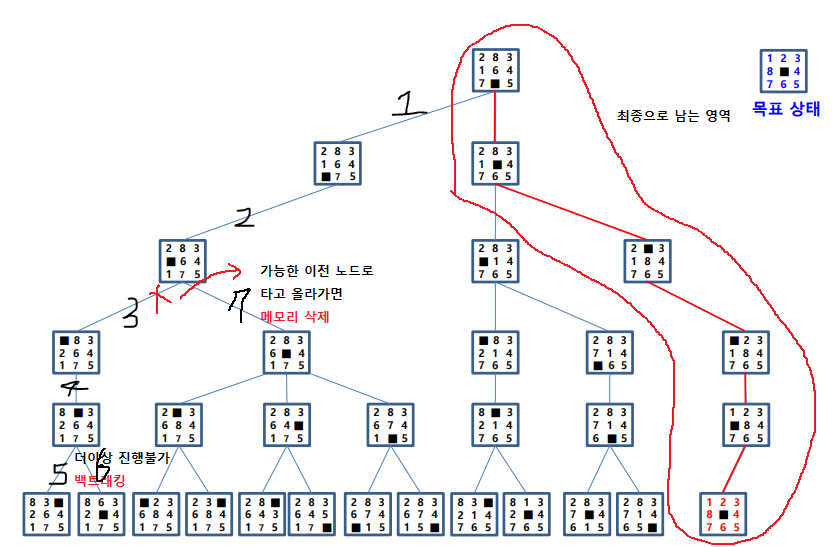
백트래킹을 통해 메모리 지우기 때문에 결국 해에대한 일련으 과정만 메모리에 남는다
(빨간색으로 칠한 부분)
-> 메모리 부담 없지만 최적해를 보장 못한다.

#### 너비 우선 탐색 (BFS)
초기 상태에서 여러 가지 경우로 나뉠 수 있을때 모두 확장 (단계 단계 하는 느낌)
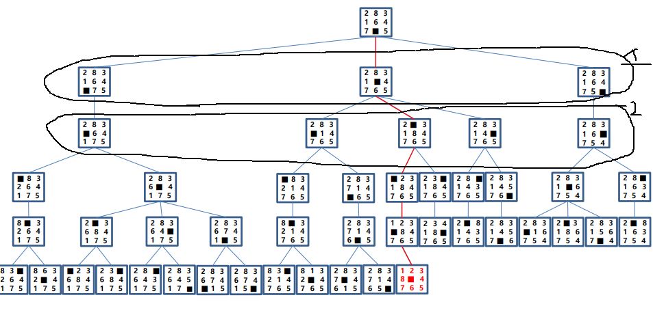
초기상태에서 목정상태로 가는 최단경로를 보장하지만 전체트리를 메모리에서 관리하므로
부담된다.

#### 반복적 깊이 우선 탐색
**우선 고려 사항이다!** 깊이 한계를 1씩 증가 시키며 그때마다 **깊이 우선 탐색** 을 반복
적으로 실행한다.
ex) 깊이 제한 0일때 깊이 우선 탐색, 깊이 제한 1일때 DFS, 깊이 제한 2일때 DFS ...
깊이 우선 이기에 메모리 효율성 또한 깊이 제한을 +1씩 증가 시키면서 하므로 최단 경로 보장한다.
But 반복적으로 깊이 우선 탐색 하므로 방문했던 **노드를 재방문 하는 비효율** 발생
사실 전체 비용은 크게 증가하지 않는다.
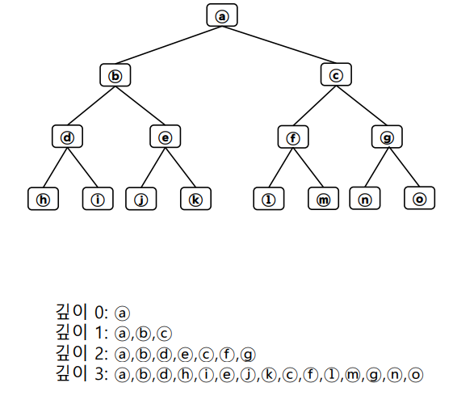

#### 양방향 탐색
초기노드와 목적노드에서 동시에 너비 우선 탐색을 진행. 중간에 만나도록 함
-> 불필요한 노드 방문을 줄인다.

### 2. 정보 이용 탐색
탐색시간을 줄이기 위해 문제의 정보(휴리스틱 정보)를 이용하면서 탐색 
휴리스틱 : 합리적 판단을 못하거나 필요 없는 상황(시간,정보부족)에서 신속하게 어떠한 기준을
어림 잡는것 -> 이를 이용해 탐색시 최적해 보장 어렵다.

휴리스틱 정보 ex) 
최단 경로 문제 : 목적지까지 지도상 직선거리
8-퍼즐 : 제자리에 있지 않는 타일 수
8-퀸 : 충돌하는 횟수

#### 언덕 오르기 방법
현재 노드에서 휴리스틱 평가 값이 가장 좋은 이웃 노드로 확장 
문제 : 국소 최적해에 빠짐. 즉, initial state에 따라 최적해 보장 안한다.
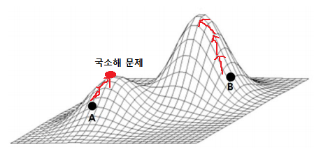

#### 최상 우선 탐색 (Best-first search)
목표노드 까지 남은 거리가 가장 짧은 노드를 확장 
8-퍼즐 경우 휴리스틱을 제자리에 있지 않는 타일 수
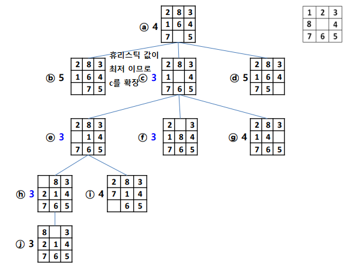

#### 빔 탐색
휴리스틱 값이 우수한 **일정개수** 노드만 확장 (최상 우선 탐색과 비슷)

#### A* 알고리즘 (중요)
전체 비용을 최소로 하는 노드를 확장. 
전체비용 = 투입된 비용 + 남은비용 
이때 남은비용을 추정하기 어렵기 때문에 남은비용 대신 휴리스틱 함수를 적용한다.
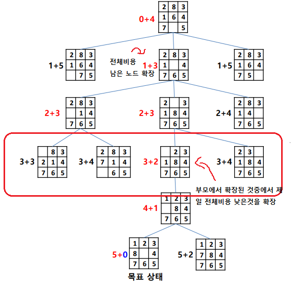

### 3. 게임에서의 탐색
게임트리란? 상대가 있는 게임에서 자신과 상대방의 가능한 게임 상태를 나타낸 트리 
많은 수를 볼 수록 게임에서 유리하다.

#### mini-max 알고리즘
먼저 가능한 모든 경우를 트리로 만들고(단말노드를) **단말 노드로 부터 위로 올라 간다.** 
자신-max : 자식 판세중 높은 값 선택 
상대방-min : 자식 판세중 낮은 값 선택
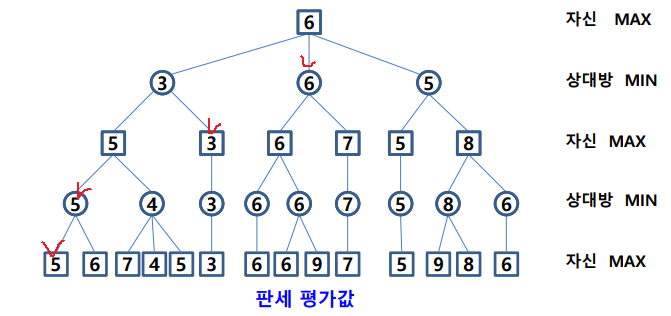

#### α-β 가지치기
검토해 볼 필요가 없는 부분을 탐색 안한다. 깊이 제한된 깊이 우선 탐색으로 min-max 노드값 결정. 
α 자르기 : min 노드 현재값이 부모 보다 작거나 같으면 탐색중지, 어차피 부모는 max 고르니 
β 자르기 : max 노드 현재값이 부모 보다 크거나 같으면 탐색중지 
**헷갈리지 말게 우리는 단말 노드만 알고있고 이를 이용해 트리의 값을 완성시킨다**
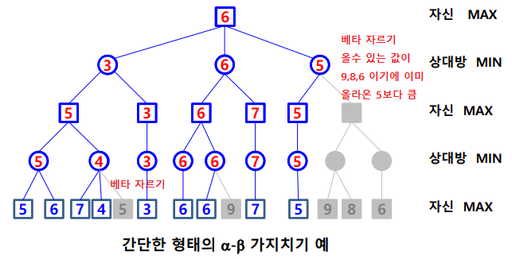

#### 몬테 카를로 트리 (중요!)
탐색 공간을 무작위 표본 추출 하면서 탐색트리 확장한다. 휴리스틱으로 (특정기준을 두고) 확장 노드 선택 
4단계를 반복하여 시간이 허용하는 동안 트리 확장 및 시뮬레이션 한다.
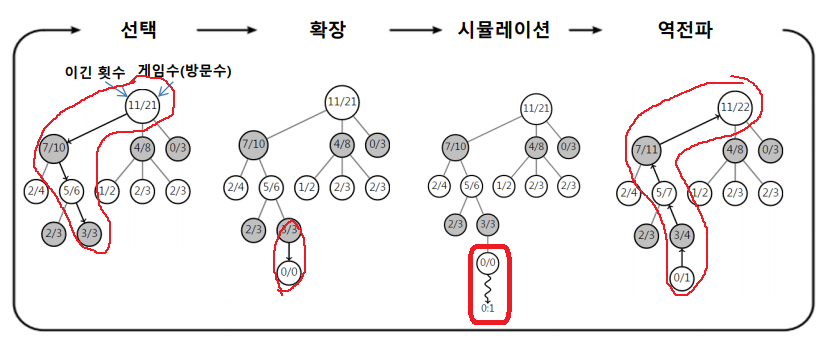
1. 선택
UCB(트리정책, upper confidence bound)에 의해 단말노드까지 내려가서 단말노드 선택
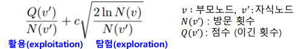

선택에 여러 방법이 있음(승률, 방문횟수, 승률+빈도, confidence bound)
2. 확장
트리정책에 따라 단말노드에 노드 추가. 예로, 단말 노드 일정 횟수이상 방문시 확장
3. 시뮬레이션
그 단말노드에서 시뮬레이션 (기본정책, 몬테카를로 시뮬레이션, 무작위 실행, 게임 끝날 때 까지)
4. 역전파 : 승점 반영
가능성이 높은 수 들에 대해 노드 생성해 트리의 탐색폭 줄이고 트리 깊이를 늘리지 않기위해

알파고가 몬테카를로 트리를 사용했다. 다만 시뮬레이션 시에 무작위가 아니라 바둑 기사 기보를
학습 (지도, 강화학습) 한 확장 정책을 사용했다.

### 4. 제약 조건 문제
제약조건을 만족하는 조합해 찾는 문제 (8퀸, 열,행,대각선 불가 -> 제약조건)
#### 백트래킹
깊이우선탐색 처럼 변수에 허용된 값 하나씩 대입, 조건 만족 안할시 백트래킹

#### 제약 조건 전파
인접 변수간 제약 조건에 따라 각 변수에 허용될 수 없는 값 제거.
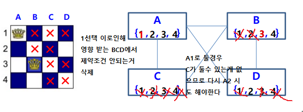

## 최적화
여러가지 허용 되는 값 중 기준을 가장 잘 만족하는것 선택

### 조합 최적화
순회 판매자(TSP)와 같이 주어진 항목들의 조합으로 해가 표현되는 최적화 문제
목적함수는 : 경로의 길이

**유전 알고리즘(중요)** : 생물 진화를 모방한 기법이다
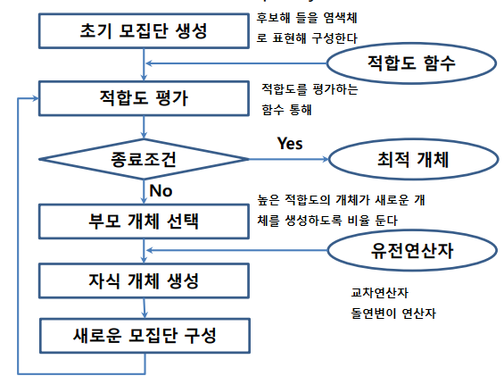
순회 판매자, ABCDE 5가지 종류의 도시, A출발해서 A로 돌아오는 방법을 보자.
1. 유전자 표현, 후보해 표현 : 크기가 4인 배열로 인코딩
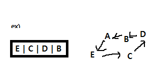
2. 초기 모집단 생성 : 초기 염색체 생성 연산에 의해
(E,C,D,B) (B,C,E,D) (B,C,D,E) (E,B,C,D)
3. 적합도 계산 : 특정 적합도 함수에 따라 모집단  적합도 계산
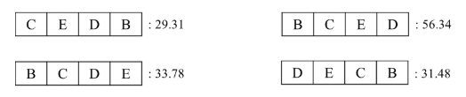
4. 룰렛 휠 선택 방법으로 부모개체 선택
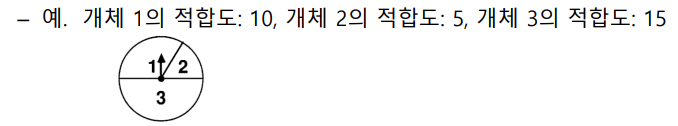
5. 자식 개체 생성
선택된 두 부모 개체로 부터 **교차(크로스오버)연산**
원래 개념
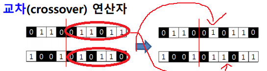
이지만 TSP경우 도시를 한번만 경유 해야 하기에
첫번째 부모로 부터 BC를 받는경우 두번째 부모 염색체에서 CB를 그대로 받는게 아니라
중복되지 않은 도시들을 순서대로 가져온다
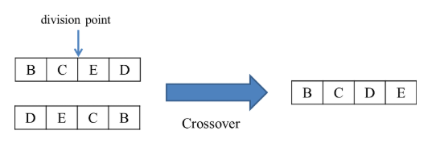

새로운 자손 생성후 **확률적으로 돌연변이 연산**
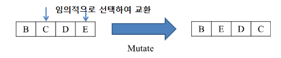
조건에 따라 한세대당 자손수 만들어질 만큼 선택->교차연산-> 돌연변이 과정을 계속함

이렇게 만들어진 자손들을 적합도 계산하고 또한 **엘리트 주의** 에 의해 이전세대에서
우수한 개체를 자손과 같이 다음세대로 유지하고 다시 룰렛 휠 선택을 한다.

### 함수 최적화
어떤 목적함수가 있을때, 이 함수값을 최대or최소 하는 변수값 찾는 최적화 문제
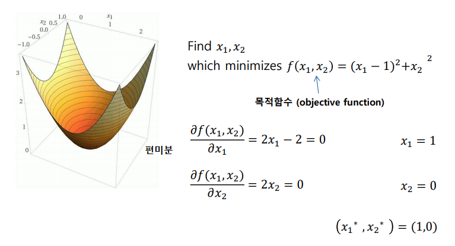

#### 제약조건 최적화
제약조건을 만족시키면서 목적함수를 최적화시키는 변수 찾는문제
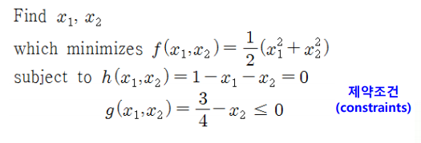
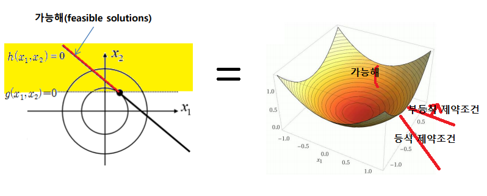
SVM 머신에서 목적함수를 Convex fuction을 사용한다. 이를 최적화 하는 방법은
랑그랑주 함수를 이용하는 것이다.

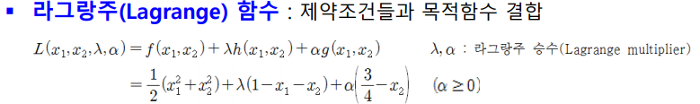
이를 최적하 하는 방법으로

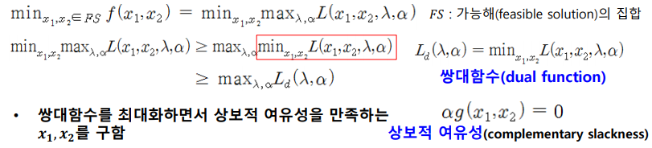

위와 같은 순서를 따르면 되는데 등식조건은 항상 0 이고 부등식 조건제약 조건은 항상 음수 이기
때문에 라그랑주 함수가 최대가 되기 위해선 a*부등식제약조건은 0이 되어야한다(상보적 여유성)

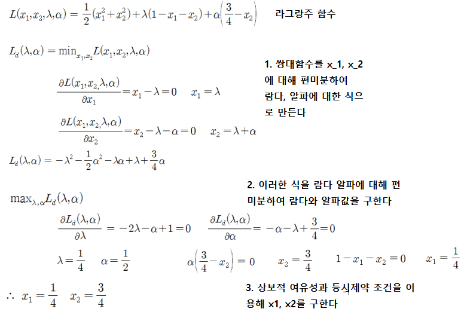

#### 회귀 문제의 최적 함수
주어진 데이터를 가장 잘 근사 하는 함수를 찾는다.
최소 평균 제곱법을 목적함수로 두어 이를 최소화 하는 값을 찾아 낸다.
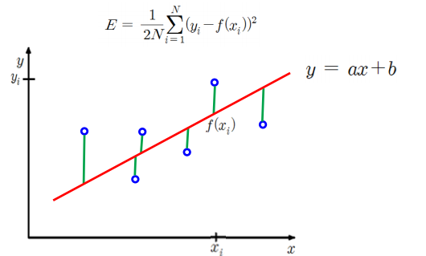

#### 경사 하강법
함수의 최소값 위치를 찾는 문제에서 오차함수의 경사 반대 방향으로 조금씩 움직이며
최적의 파라미터를 찾으려는 방법이다.
이때 경사는 각 파라미터에 대해 목적함수를 편미분한 벡터를 뜻한다.
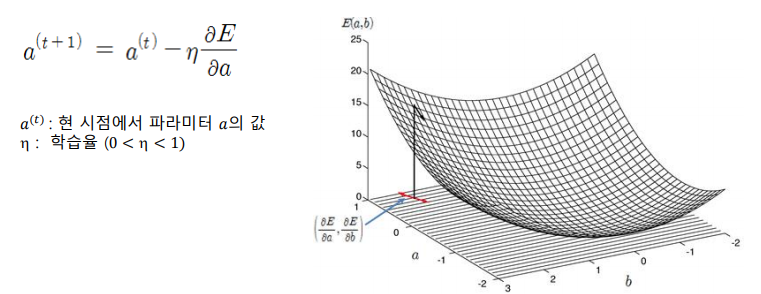

이러한 방식은 회귀모델, 신경망등의 기본 학습 방법이며 국소해에 빠질 위험이 있다
이를 개선된 형태론 conjugate gradient method 등 있다.

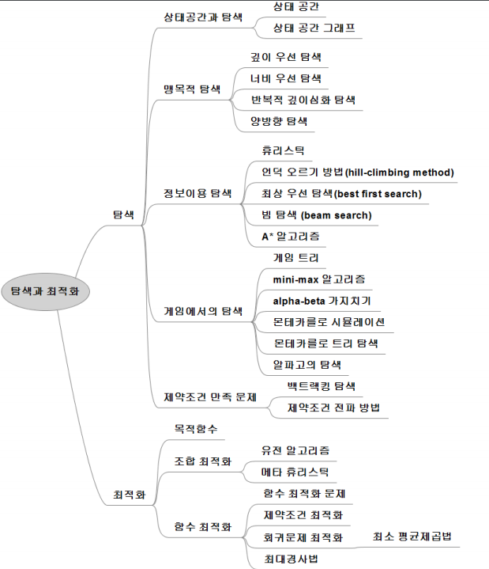
