# 지식표현
## 지식표현과 추론에 대한 용어 정리
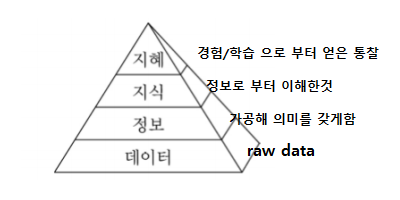

**규칙** : A->B, IF THEN 구조.
규칙을 표현해보면 IF 신호등(대상) 이 녹색(속성)이면 (조건부) 건넌다(행동/판단, 결론부)
규칙통해 인과관계, 추천, 지시, 전략, 휴리스틱을 표현한다

## 1. 프레임
**프레임** : 지식표현 방법중 하나. 특정 객체 OR 개념에 대한 **지식을 슬롯의 집합으로 표현**
프레임의 종류로 클래스(부류에 대한 표현), 인스턴스(객체에 대한 표현)
상하위 프레임이 있는데 클래스로 부터 상속을 받은게 인스턴스 프레임 이다.
클래스의 붕어빵 틀로부터 객체를 생성해 표현한다.

**클래스 표현**
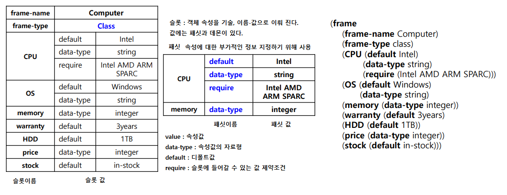

**인스턴스 표현**
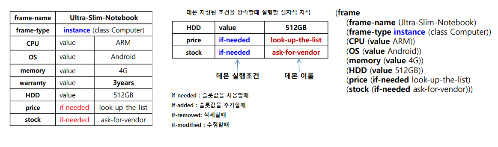

## 2. 논리
**논리** : 문장을 기호로 표현하고 조작을 통해 참 or 거짓을 판정하는 분야.
**명제** : 참 거짓을 분명하게 판정할 수 있는 문장, 한개 기호로 표현, 진리값 사용.
**기본명제, 복합명제** : 복합 명제는 and or로 연결된 명제
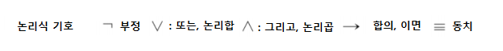
**리터럴** : 명제기호 or ㄱ명제기호 (한개)
**절** : 논리곱, 논리합 으로 연결
**논리곱 정규형 CNF** : 논리합들이 곱으로 연결 됨
**논리합 정규형 DNF** : 논리곱들이 합으로 연결 됨
**정형식** : 논리 문법에 맞는 식
**진리표** : p->q에서 전제가 T이고 결론부가 F경우만 F이다
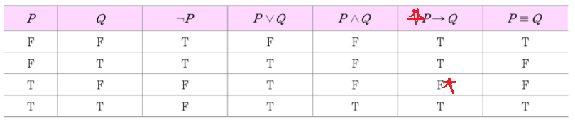
**명제기호의 외연** : 명제기호의 의미, p의 외연은 토마토는 빨갛다 이다
**모델** : 논리식 명제기호에 T,F 할당 하는것 -> 이로써 해석가능
논리 기호가 n개 있으면  모델은 2^n개 존재한다
**항진식** : 모든 모델에 대해 항상 참인 논리식 (p와 ㄱp의 논리합)
**항위식** : 모든 모델에 대해 항상 거짓인 논리식 (p와 ㄱp의 논리곱)
**충분 가능한 논리식** : 참으로 만들수 있는 모델이 1개라도 있는 논리식
**충분 불가능한 논리식** : 항위식
**동치관계** : 어떤 모델에 대해서도 같은값을 같는 두 논리식
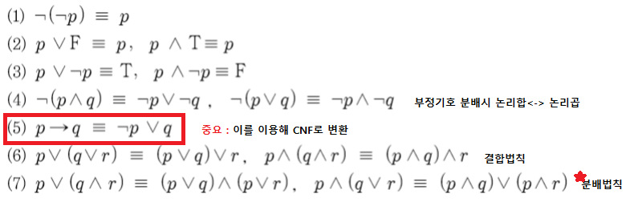
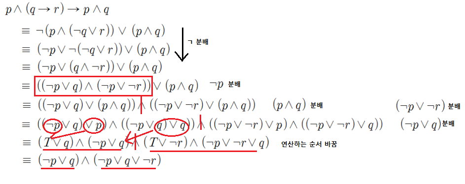
**논리적 귀결**
Δ : 정형식의 집합
ω : 정형식
Δ에 있는 모든 정형식을 참으로 만드는 모델이 반드시 ω를 참으로 만든다. (Δ참 -> ω참도 이다)
Δ는 ω를 논리적으로 귀결한다.
ω는 Δ를 논리적으로 따른다 or 논리적 결론이다.
Δㅑω

### 추론
**귀납적 추론** : 관측된 여러 사실로 부터 일반화하여 패턴 또는 명제 도출(인공지능)
**연역적 추론** : 참인 사실,명제로 부터 새로운 사실 명제 도출 (논리에서 추론)
p(전제)->(함의) q(결론)
**추론규칙**  : 참인 논리식 들이 논리적으로 귀결 하는 새로운 논리식 만들어내는 규칙
1. 긍정논법 : Δ = {p->q , p} 로부터 ω = q 추론 (p->q, pㅏq) (추론규칙에 의해 만들어질땐 ㅏ)
2. 부정논법 : Δ = {p->q , ㄱp} 로부터 ω = ㄱp 추론 (p->q, ㄱqㅏㄱp)
3. 삼단논법 : Δ = {p->q , q->r} 로부터 ω = p->r 추론 (p->q, (q->r)ㅏ(p->r))
4. **논리 융합** : 두 논리합절에 같은 기호의 긍정,부정의 리터럴을 서로 나눠 가질때 이를 없애고
하나의 논리합절로 만들수 있다.
이는 긍정,부정,삼단논법 규칙을 모두 포함 하므로 따라서 추론규칙은 논리융합만 써도된다.
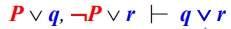
**추론규칙 정당성** : Δㅏω(추론규칙에 의한) -> Δㅑω 를 의미, 즉 추론규칙이 만들어낸것은 항상 참
**추론규칙 완전성** : 논리적으로 귀결하는것은 추론규칙이 찾아낼 수 있다.

### 증명
**공리** : 추론할때 참으로 주어지는 논리식
**정리** : 추론하여 얻은 논리식
**증명** : 공리들을 이용하여 정리가 참임을 보임
1. 구성적 증명 : 공리들에 추론 규칙들을 적용하여 증명을 만들어 보이는 증명
2. 논리융합 반박 : 정리를 부정하여 이를 이용해 부정한 정리와 공리를 논리 융합
false임을 보이면서 정리가 참임을 보인다.
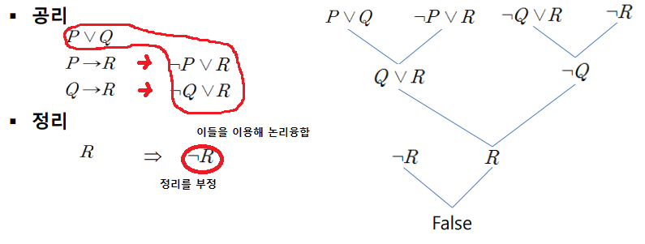

## 3. 술어논리
변수,함수에 따라 참거짓을 결정한다. 술어가 서술어에 해당.
**한정사** : 변수 대상의 범위를 표현

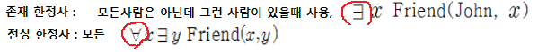
**함수** : 술어의 인자로 사용한다. 참거짓값이 아니라 일반적인 값을 나타낸다  예를 들어 h(x,f(x))
**항** : 함수의 인자가 될수 있는것, 개체상수(Adam), 변수(x), 함수(f(x))
**일차 술어 논리** : 변수에만 한정사 쓸수 있게 한 논리
**고차 술어 놀리** :  변수뿐만 아니라 함수, 술어 기호 등에도 한정사 가능

### 술어논리 추론
CNF로 변환후 논리융합 반박을 통해 증명을 한다.

- 읽을 수 있으면 문맹이 아니다
- 원숭이는 문맹이다.
- 어떤 원숭이는 지능적이다
- 지능적이어도 문맹일 수 있다. **이를 증명해야함**

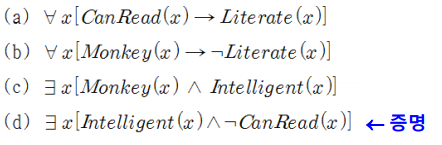

1. 한정사를 없앤다 (술어를 만족시키는 것을ㄱ, **논리합** 으로 변환)
전칭한정사 경우 그저 한정사를 없애면 되고 존재한정사 경우
술어에 변수가 단독인경우 특정 상수 A를 대입하고 다른변수와 있을경우
스콜렛 함수(x에대해서 술어를 참으로 만족 시키는 y를 찾는 함수)를 도입한다.
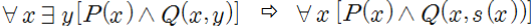

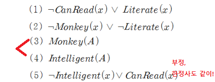

2. 단일화 과정 : 리터럴이 같아지도록 변수의 값을 맞춘다.
ex) ㄱKnow(John, x) V Hate(John, x) , Know(John, jim)을 논리융합 할때
Know의 리터럴이 같도록 x에 jim을 대입 Hate(john, jim) 이 된다.

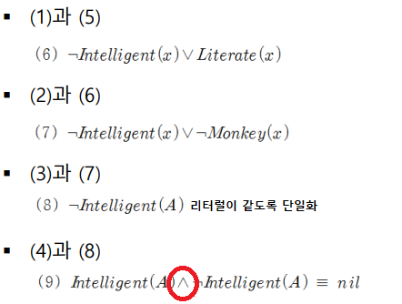

**논리 프로그래밍 언어**
Horn절 : 논리식을 논리합 형태로 표현할때 ㄱA(x) v ㄱB(x) v c(x) 와 같이
긍정인 리터럴을 최대하나만 사용
즉 ㄱ(A(x) ^ B(x)) v C(x), A(x) ^ B(x) -> C(x) 꼴이 되고
결론부가 없거나 하나만 있는 것을 Horn절 이라고 한다.

prolog : Horn 절만 허용하는 논리 프로그래밍 언어

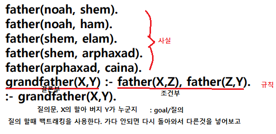

## 4. 의미망
지식을 이항관계 들의 집합으로 표현한다.
**노드** : 항(대상,개념, 보통 명사)
**간선(Edge)** : 관계에 따른 방향성을 가지며, 관계의미 라벨 부여. (보통 서술어)

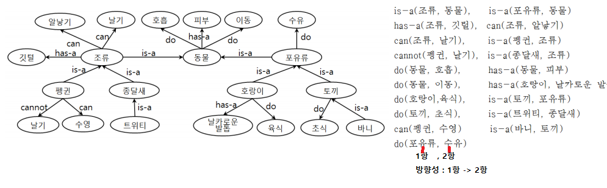

**is-a 관계** : 상위클래스와 하위클래스, 클래스와 객체를 표현 (2항이 1항을 포괄함)
ex) 사자 ->(is-a) 포유류, is-a(사자,포유류)
**has-a 관계** : 전체-부분 관계로 part-of와 역관계다
ex) 돼지 ->(has-a) 뒷다리, has-a(돼지, 뒷다리), part-of(뒷다리, 돼지)
is와 has 모두 추이적 관계를 만족시킨다
예를들어 is(펭귄, 조류) ^ is(조류,동물) -> is(펭귄,동물)

**다항관계 표현** : 의미망은 이항관계만 표시하기에 다항관계의 지식은 관계(서술어)를
객체로 간주하여 표현 (즉, 동사를 사물화(객체))

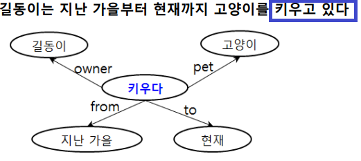

**추론**
상속이용 따라가서 값을 찾아낸다. 단 가장 가까운 값 가져온다
예를 들어 펭귄은 알을 낳는가? 질문이 있을때  is-a관계 간선을 따라 질문을 찾아감
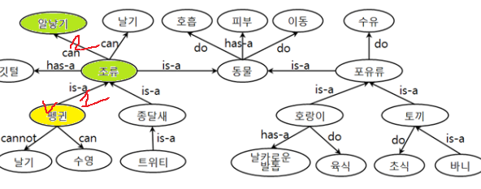

**새로운 사실 추론도 가능**
주어진 사실로 부터 규칙의 의미망을 이용해 결론부를 추론가능
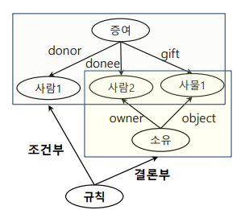
위의 사진은 규칙의 의미망표현
사람1이 사람2에게 사물1을주면 사람2는 사물1을 소유하게된다.

여기서 철수가 영희에게 반지를 주었다는 사실이 주어지면
추론결과 영희가 반지를 가지고 있다.

**의미망의 프레임으로변환**
노드별로 프레임을 생성하고 노드에서 나가는 Edge를 슬롯
위의 의미망을 프레임으로 변환
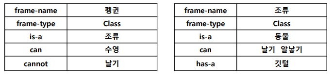

**의미망 장점** : 시각->직관적이해, 노드추가 변경으로 쉽게 지식추가 가능, 계층상속관계
지정가능, 복잡한 지식 구조화 가능
**의미망 단점** : 지식양많을시 관리복잡, 개념관계임의정의->통일성 부족, 공유나 재사용 고려 무,
정적인 지식의 표현, 논리적 결합관계or인과관계 기술시 링크 도입 필요 -> 일관성 떨어짐

## 5. 스크립트
전형적인 상황에서 발생하는 일련의 사건을 기술하는 지식표현
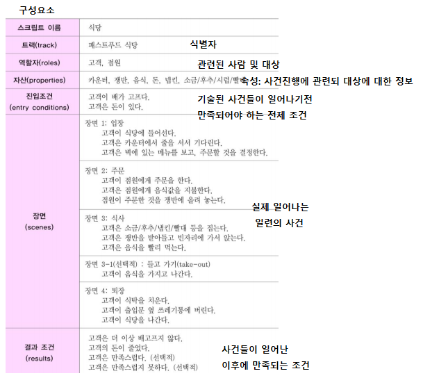

## 6. 온톨로지
이전에 표현 방식은 다른 system 만들때 재사용 할수 없다. (의미가 모호)
온톨로지는 지식을 **공유** 하고 **재사용** 할 수 있도록 해당 영역의 개념과 관계를 나타내는
**어휘를 정의** (RDFS) 이 정의를 이용해 지식을 **표현**  
쉽게 말해 공통의 약속을 하고 사용 하는 거지.

**RDFS** : resource description framework schema, RDF를 사용하여 온토로지 표현시
 사용할 **관련 어휘를 정의** 한 온톨로지  
**RDF** : 자원에 대한 메타데이터를 기술하는 명세, 즉 자원에 대한 기술
자원(대상) - 속성(특징,속성) - 값으로 분해 (tuple)
URI : 모든 대상을 고유한 식별체계룰 준다. 실제론 존재하지 않는 그냥 꼬리표

abc 기관의 이메일이 인 홍길동 부장이라는 사람
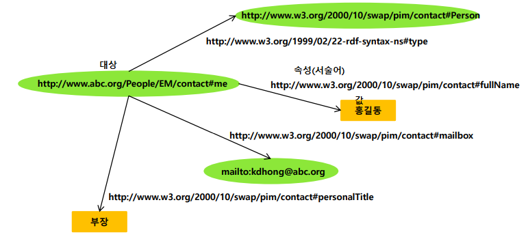
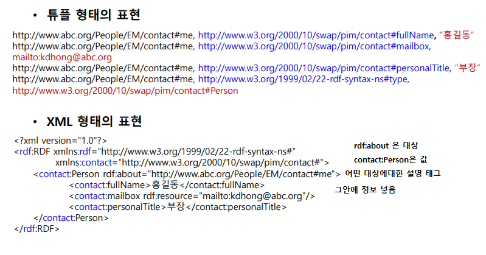

**SPARQL** : RDF 형태로 저장된 데이터에 대한 질의어
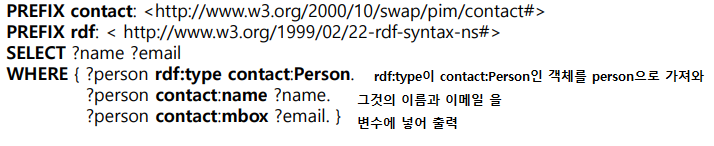

**RIF** : Rule Interchange Format, 규칙을 정의하고 교환하기 위한 규약.
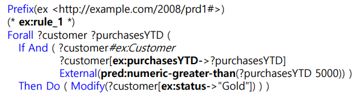
당해년도 누적 구매금액이 5000이상이면 Gold등급으로 조정

**OWL** : Web Ontology Language 웹상의 자원과 이들의 속성에대한 지식
을 표현하기 위한 온톨로지 언어

### 시멘틱 웹
프로그램(소프트웨어 에이전트)이 어떤 사이트에 접근해서 그사이트의 내용을 이해하고
필요한 정보를 가지고 오게 함 그러기 위해 각각의 정보를 기술할때 통일된 형태로 기술하자.
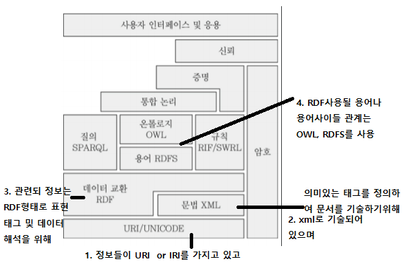

의미망은 대상 관계등의 표현에 사용되는 용어가 임의적이지만
온톨로지는 **공유와 상호운영성** 을 위해 명확학 지침에 따라 표현한다
따라서 정보 및 지식의 재사용이 용이하다.

## 7. 불완전한 지식표현은 어떻게?
### 불확신의 원인
조건과 결론부는 인과관계이다. 이 인과관계가 애매한것.
1. 약한 인과성, 애매한 관계 (확신도 사용(연관정도 표현), 베이즈정리 사용 으로 해결)
2. 자연어의 모호성 ex) 작다 크다 자주 (퍼지이론을 통해 정성->정량)
3. 불완전하거나 결손된 데이터를 이용해 지식을 뽑을때 (근사적인 추론)
4. 상충되는 지식의 통합 (지식 소스별 가중치 부여)

### 방법론
#### 확신도
규칙 (A->B)과 사실(A)에 신뢰정도[-1,1] 부여 (ex. cf(0.8))
**추론결과의 확신도 계산**
- A->B, A 통해 B 추론. B의 확신도는 cf(B) = cf(A) * cf(A->B)
  **규칙과 사실의 확신도 곱** 으로 추론 확신도를 계산한다.

- if A and B then C ,A,B  통해 C 추론 (and로 연결된)
 C의 확신도는 A,B 사실에 **확신도 최소값 * 규칙의 확신도**

- if A or B then C ,A,B 통해 C추론 (or로 연결)
C의 확신도는 A,B 사실에 **확신도 최대값 * 규칙의 확신도**

**여러 규칙에 의해 추론된 사실의 확신도를 결합**
여러 규칙에 의해 cf1(B) , cf2(B) 같은 사실에 대해 두개의 확신도를 얻었다 가정해보자.
아래와 같이 계산한다.
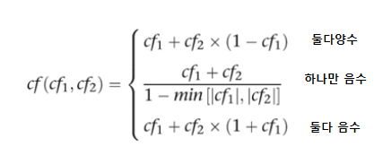

#### 베이즈 정리
확률의미
1. 상대빈도확률 : 관심삭건 발생갯수/ 전체실험수 (실험에 의한)
2. **주관적확률** : 실험이 아닌 경험에 의한, 머신러닝에서 보통 지식표현시 주관적 확률 사용.
 ex) 내일 A가 B할 확률

**결합 확룔** : 교집합, A와B가 동시에 일어날 확률 P(A,B) = P(AB)
**조건부 확률** : B가 주어질때 A가 일어날 확률 P(A|B)
 표본을 전체에서 B로 줄인다는 개념.

**베이즈정리 의미** : 기계학습의 학습에서 B를 DATA A를 모델. DATA로 부터 모델을 찾는문제.
추가되는 B로인해 A를 수정

P(A|B) (사후확률) = (P(B|A) (가능도) * P(A) (사전확률)) / P(B) (증거)
처음에 A에 대한 믿음정보 확률이 있었다 (사전확률) 거기에 추가로 B라는 정보가 주어질때(증거)
A에대한 확률이 어떻게 변하는지 (사후 확률)

#### 규칙의 불확실성 표현 (A->B)
B에 대한 사전확률을 가지고 규칙에 의해  B가 추론된다면 그떄 B에 대한 확률값은 어떻게 되는지?

#### 퍼지이론
개념이나 범주가 항상 이분적이지 않기에 정도의 문제. 퍼지 집합을 이용한다.
언어항에 있어 어느정도 연관성이 있는지 [0, 1]

**언어항** : 모호한 언어를 언어항 (작다, 평균이다, 크다)

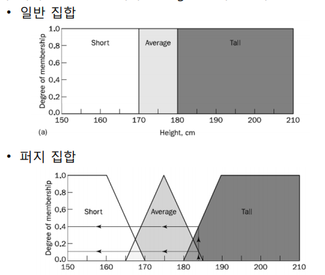
소속함수를 이용해 언어항의 소속정도를 [0,1]로 표현한다

**퍼지규칙** : 언어항을 소속함수로 표현한 규칙
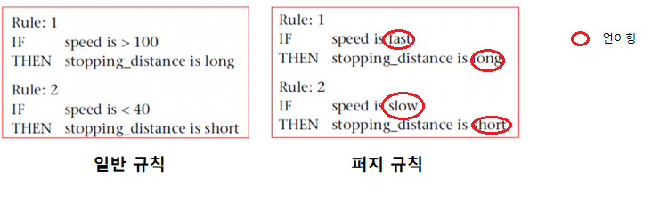

**퍼지 추론**

1. 퍼지규칙에 의해 퍼지값을 계산하고
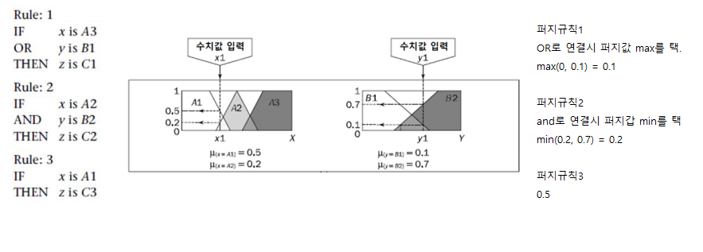

2. 여러규칙을 통해 얻은 결과를 합집합으로 겹쳐그린다
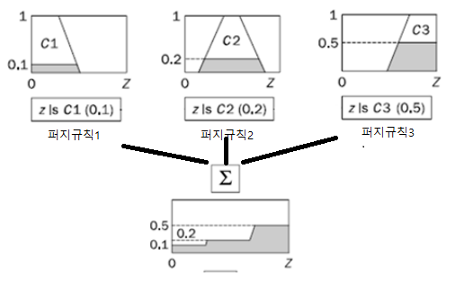

3. 비퍼지화 : 무게중심을 계산하여 수치값으로 바꾼다
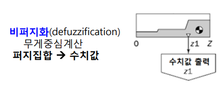

## 8. 확률 그래프 모델
Probabilistic Graph Model, PGM
확률이론을 사용해 지식표현, 확률 변수들이 많아지면 복잡해지기 때문에
그래프 이론을 도입한다.

**확률분포를 이용해 지식표현 한다 (확신도x)**
절도 경보 문제를 살펴보자
- 절도가 발생하거나 지진이 발생하면 경보발생
- 경보가 울리면 이웃이 전화
이것들은 이웃이 전화 해줄수도 있고 안해줄수도 있기때문에 불확실하다.

이러한 불확신 요소가 있어 확률로 표현한다.
확률변수 : 경보작동(A), 절도발생(B), 지진발생(E), 이웃전화(N)
**결합확률 분포로 표현한다!**
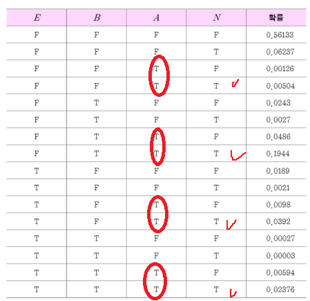
경보가 울릴때 이웃이 전화할 확률은 ?
P(N=T | A=T) : 체크한것을 이용해 확률값을 계산한다.
(확률 값은 주어짐.)

**사건의 독립** : P(E,B) = P(E) * P(B) (E와B는 서로 확률값 영향 없음)
**조건부 독립(중요)** : P((R,A)|E) = P(R|E) * P(A|E)
**확률분포 인수분해** :
 P(N,A,E,B) = P(N|A,E,B) * P(A|E,B) * P(E|B) * P(B)
 이때 만족하는 조건부독립은
 - P(N|A,E,B) = P(N|A) (이웃이 전화하는건 절도와 지진발생과 연관이없다)
 - P(E|}B) = P(E) (지진이 나는것과 절도가 발생하는것 관계없다)

이를 통해 결합확률분포를 다시 표현하면
P(N,A,E,B) = P(N|A) * P(A|E,B) * P(E) * P(B)
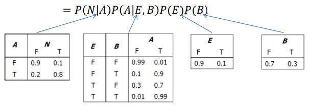

### 베이지안 네트워크
조건부 확률 곱으로 표현된 결합확률 분포를 방향성 그래프로 표현
노드: 확률변수 , 엣지 : 의존관계
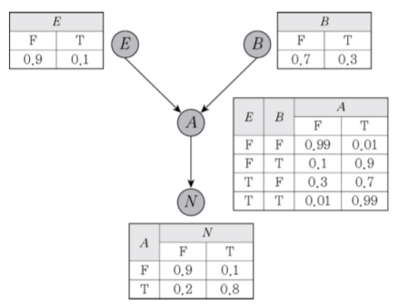
결합확률 분포로 답변이 가능하다
-> 결합확률 분포를 가져야한다.
-> 이를 인수분해한 형태로 가능하다
-> 모델링

### 마르코프 네트워크
무방향성그래프, 조건부 독립이 아니라 관련된 변수간의 값들이 가질수
있는 값의 부합정도를 가지고 확률분포를 표현
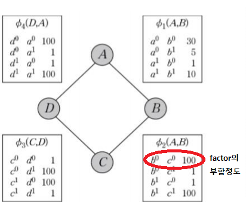
0(a^0, b^0, c^0,d^0) = {0(a^0, b^0) * 0(b^0, c^0) * 0(c^0,d^0) * 0(d^0,a^0)} / 전체 조합 경우의 부합정도 합

## 9. 함수 기반 지식 표현
기호 대신 수치값과 수치값을 계산하는 함수를 사용하여 지식표현.
회귀분석, 신경망, SVM, 딥러닝
(그래프 형태로 표현해서 복잡한 함수를 표현하고 그런 함수들을 데이터를 이용해 찾아냄)

## 10. 규칙 기반 시스템
rule-based system (RBS)
주어진 문제상황에 적용될수있는 규칙들을 사용하여 문제에 대한 해를 찾도록한다
(규칙들을 만들어 두고 정보가 주어지면 해결)

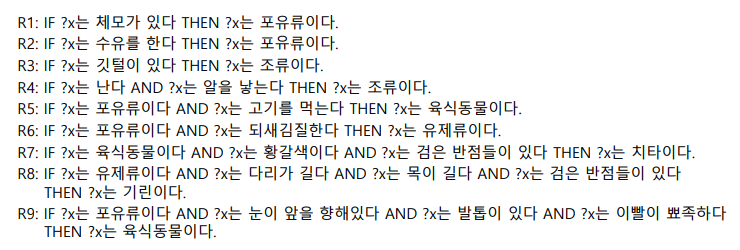

### 전향 추론
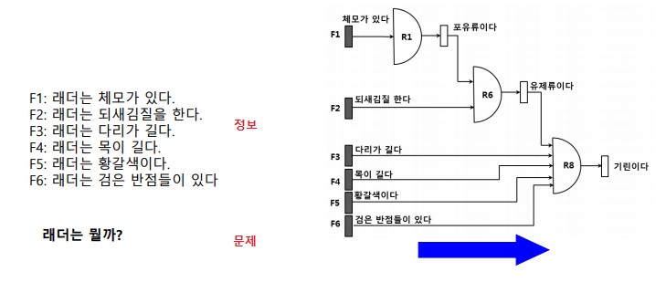
전향추론은 어떤게 사실이다 아니다만 나타내는게 아니라 계산하고
없애기도 하고.. 여러가지 일을 할 수있다
1. 대상의 사실들을 가지고 그림 만들고
2. 그 대상이 뭔지 알아낸다.
만족하는 규칙으로 부터 통과하여 문제를 해결

### 후향 추론

후향추론은 문제에 대해서 검증하는것이다.
불필요한게 안생기지만 뭘 관심을 가지는지 명확해야한다.
1. 치타가 될 규칙들을 정리하고 그림 만들고
2. 대상이 그 조건 만족하는지 본다.

### 규칙 기반 시스템 구조

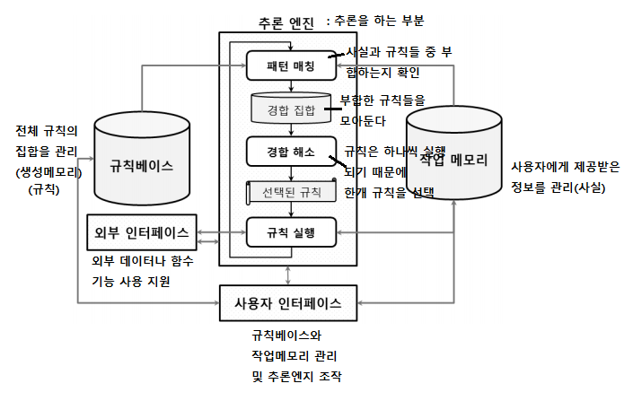
이러한 시스템 구조에 사용자는 규칙들과 사실들만 집어 넣어 규칙 기반 시스템을 사용할수있다.
**경합 해소 전략**
1. 규칙 우선 순위 : 우선순위가 높은 규칙을 먼저
2. 최신 우선 : 가장 최근에 입력된 데이터와 매칭된 규칙 먼저(시간태그 부여, [03/25 08:16PM])
3. 최초 우선 : 가장 먼저 패턴매칭된 규칙을 먼저
4. 상세 우선 : 가장 복잡하게 기술된 규칙을 먼저

### JESS를 이용한 지식표현
이러한 규칙 기반 시스템 툴이다.
사실 : 이름이 멍키인 원숭이가 나이가 세 살이고 거실에 있다.
(monkey (name 멍키) (age 3) (room 거실))

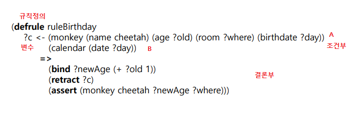
치타라는 이름의 원숭이를 age는 old라는 변수값으로 room은 where의 변수값 birthdate는 day변수값
이러한 사실을 c라는 변수에 넣고 캘린더의 오늘 날짜를 day로.
두 day가 같으므로 원숭이의 생일과 오늘 날짜가 같으면 old변수에 1을 더해 newage 값에 넣고
c라는 사실을 지우고 치타라는 원숭이의 사실을 새로 집어 넣는다.

이러한 규칙기반시스템은 현업에서 업무규칙을 시스템에 직접등록(새로 넣어서 바로 동작)
프로그래밍으로 할시에는 뜯어 고쳐야한다..
시간 절약, 오류 적음, 신속한 시장 대응 가능하다.
