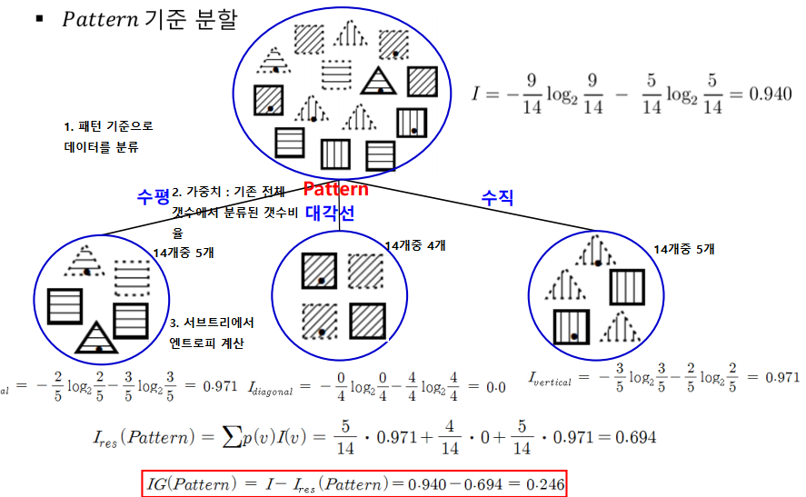

# 기계 학습
경험(data)을 통해 시스템의 구조나 파라미터를 바꾸는것

파라미터(가중치)가 많을수록 DATA가 많이 필요하다 
일반화 능력이 좋은것이 이상적인 프로그램이다.

**귀납적 학습** : 사례(data)들을 일반화 하여 패턴 or 모델추출
<-> Overfitting (데이터를 외워버림)

**오컴의 면도날** : 1. h(x,y) = x+y 2.h(x,y) = (2x+3y)(2x+2y)y/(4xy+6y^2) 
1과 2식이 같은 결과값을 나오게 할때 가장 간단한 형태로 표현

## 1. 지도학습
입력과 출력이 있는 데이터로 부터 패턴추출
### 분류
출력이, 정해진 class 중의 하나로 결정

결정 경계를 찾아내는 함수를 찾는 문제이다. 
**분류기** : 결정경계를 이용하여 데이터 분류하는 프로그램
!기본적으로 분류 문제에선 각 class 마다 데이터 갯수가 같아야 한다.

#### 데이터
- 학습 데이터 : 학습에 사용되는 데이터
- 테스트 데이터 : 학습된 모델을 평가하기위한 unseen data
- 검증 데이터 : 학습과정중 학습을 중단할 시점을 결정하기위한 데이터 (오버피팅 방지)

학습과정중에서 검증데이터를 통해서 test를 실행하고 (학습에 관여하지는 않는다) 
tensorboard를 이용해 검증데이터 오류가 증가하는 시점에 학습 중단 시점을 파악한다.

#### Overfitting
학습데이터에 대해서 지나치게 학습됨 (데이터를 외워버림) 
데이터는 오류나 잡음을 포함하기 쉽기에 오버피팅시 일반화가 되지 않는다,
unseen한 데이터에 대해 성능이 좋지않다

#### K-fold cross-validation
데이터가 부족한 경우에 성능평가 방식이다. 
테스트 데이터도 학습을 시킨다.
1. 전체 데이터를 k 등분
2. 각 등분을 한번씩 테스트 데이터로 사용하여 성능평가하고 **평균값 선택**

위의 사진과 같이 1개의 data set으로 부터 4가지의 다른 영역의 학습데이터/테스트데이터
를 준비하고 각각 개별로 다른 데이터셋 (다르게 학습/테스트 셋을 구분한) 을 가지고
학습 및 평가 한후 metric의 평균값을 통해 어느정도 성능을 낼것이다 판단. 
그후 **최종 모델** 을 만들때 전체 dataset을 가지고 학습을 시킨다 (data가 적기 때문에)

#### 불균형 데이터 문제
정확도에 의한 성능 평가는 무의미 할수 있다 
왜냐? A,B class 문제 에서A class 데이터가 99프로 인경우 분류기가 항상 A class로
분류하더라도 전체 성능은 99%이다 
**해결**  
1. 많은쪽에서 재표본 추출(re-sampling,under smapling) 못하거나
2. 적은쪽에서 인공적인 데이터를 생성한다.
3. 또는 class별 가중치를 두어 정확도 계산한다

인공적으로 데이터를 만들어 내는 방법 
**SMOTE(Synthetic Minority Over-sampling Technique) 알고리즘**

1. 임의로 낮은 빈도 부류의 학습데이터 선택
2. x의 k-근접이웃 인 같은 부류의 데이터 선택
3. k-근접이웃중 무작위로 하나 y 선택
4. x와 y를 연결하는 직선상의 무작위 위치에 새로운 데이터 생성
k의미 : 근접이웃 직선 만드는 갯수

#### 이진분류 metric

- 정확도 : (TP+TN) /(TP+FP+TN+FN) (전체중에 제대로 예측한 비율)
- **민감도** : (TP) / (TP+FN) (전체 P중 제대로 P로 맞춘 비율) (sensivity, true positive rate)
- **특이도** : (TN) / (TN + FP) (전체 N중 제대로 N을 맞춘 비율) (specificity, true negative rate)
- 정밀도 : TP / (TP+FP) (P로 예측한것중에 진짜로 P인 비율) (precison)
- 음성 예측도 : TN / (TN+FN) (N으로 예측한것중 진짜로 N인 비율)
- **위양성율** : FP / (TN + FP) = 1-특이도
- 위발견율 : FP / (TP+FP)  = 1-정밀도
- F1측도 = 2*((정밀도*재현율) / (정밀도 + 재현율))

#### ROC 커브

ROC 커브 밑 면적을 AUC라 하는데 AUC가 높을수록 좋은 모델이다.

### 회귀
출력값이 실수인 **함수** 를 찾는 문제

목적함수로 **평균제곱근** 을 사용한다.(성능)

#### 회귀의 과적합 대응방법
모델이 깊어질수록 잘맞출수 있으나 오버피팅 문제가 발생할수도 있다 
이러한 모델의 복잡도를 성능 평가에 반영한다 
목적함수 (cost, Err function) = 오차의 합 + 가중치 * 모델의 복잡도를

#### 로지스틱 회귀
분류 문제에서 결정경계를 찾을때 사용한다.(0,1)

로지스틱 함수에서 간단히 Θ와x의 shape을 (1,n)이라고 보자.(Θ는 가중치 파라미터)
Θ의 전치 행렬과 x 곱은 행렬의 내적을 뜻한다 (선형 결합, Θ1x1 + Θ2x2 +..+ Θnxn)
이에 따라 로지스틱 함수는 [0,1] 사이 값을 리턴하고

목적함수를 위의 식으로 씀으로써 실제y값이 1일경우 ylogf(x) 0일경우 (1-y)log(1-f(x))로
계산된다.(크로스 엔트로피)

## 2. 비지도학습
결과정보가 없는 데이터로부터 **패턴** 을 찾아내는것(데이터 잠재구조, 계층구조, 문서 주제, 사용패턴) 
대표적으로 군집화(clustering) 밀도추정(density estimation) 자원축소(dimensionality reduction)

### 군집화

데이터를 유사성에 따라 분할한다. 
영상분할경우 픽셀은 rgb 3차원 값으로 되어있고 이를 공간상에 찍어두면 비슷한 색들은
데이터가 뭉쳐 있다. 이를 군집화

군집화는 두가지로 나뉨
1. 일반 군집화 : 데이터가 하나의 군집에만 속함
2. 퍼지 군집화 : 데이터가 여러 군집에 부분적으로 속함 (소속정도의 합은 1)

용도 : 전반적 데이터 구조파악, 이상치 감지, 데이터압축(rgb영상 군집별 같은값), 전처리 
성능 : 군집내의 분산과 군집간 거리

### 밀도추정

class별 데이터 분포는 가우시안 분포를 가질것이다. 이 확률 분포를 찾는것.
이러한 확률 분포를 찾고 데이터가 들어올때 각 class 분포별 확률을 계산하여
확률이 높은 쪽 class로 판단.

밀도추정은 두가지로 나뉨
1. 모수적 밀도 추정 : 분포가 수학의함수(ex 가우시안)를 가질것이다 **가정후**
학습을 통해 함수를 알아 내는것 (mixture of gaussian)

2. 비모수적 밀도 추정 : 주어진 데이터로 부터 밀도함수 형태 표현 (히스토그램)

### 차원축소

시각화를 통해 직관적 데이터 분석위해 사용. 
고차원 데이터를 저차원으로 변환 (정보손실 최소화하며) 
차원의 저주 문제 완화

차원의 저주
1. 차원이 커질수록 거리분포 일정해 뭉치는 현상
2. 차원이 커질수록 부분공간의 개수가 기하 급수적 증가

**주성분 분석** : 분산이 큰 축으로 데이터를 projection하여 저차원으로 변환(정보손실 최소화)
데이터의 공분산행렬에 대한 고유값이 큰 소수의 고유벡터를 축으로.
(Principle Component Analysis, PCA)

### 이상치 탐지
**이상치** : 다른데이터와 크게달라 다른 메커니즘에서 생성된건지 의심받는 데이터 (관심대상) 
**잡읍** : 관측 오류,오차에의한것 관심대상 x

3가지 종류
1. 점 이상치 : 다른데이터와 비교해 큰차이 보이는
2. 상황적 이상치 : 상황에 맞지 않는 데이터 (겨울철 30도)
3. 집단적 이상치 : 데이터 모아보면 비정상으로 보이는

활용 : 부정사용감지, 침입감지, 시스템 고장, 임상 모니터링, 유행병 탐지, 관측오류 탐지

## 3. 반지도학습
미분류 데이터를 지도학습에 사용하는 방법 (데이터 획득 비용 과정으로 인해)

같은 군집에 속하는것은 같은 class로 분류

가정
1. 평활성 가정 : 가까이 있는 점들은 서로 같은 class
2. 군집 가정 : 같은 군집 데이터는 class 같음
3. 매니폴드 가정 : 원래보다 낮은 차원의 매니폴드에 데이터가 분포할 가능성

---

## 4. 결정트리
의사결정을 트리형태로 표현한것.
- 내부 노드 : 속성
- 간선 : 속성값
- 단말 노드 : class

**PlayTennis 문제** 를 예로 들어보자

위 사진은 학습데이터이다(경험)  이름 통해서 아래 사진과 같이 결정트리를 만든다

### 어떻게 결정트리를 만드는가?

1. 처음에 루트노드에 모든 데이터가 있다.
2. 분할 속성 선택
3. 분할속성 값 갯수에 따라 서브트리를 만들고 서브트리로 데이터 분류
이 과정을 반복 .

**하지만 어떤 분할속성을 택하느냐에 따라 트리가 복잡해 질수 있다** 
오컴의 면도날에 따라 간단한 트리를 만들어야함.

### 그럼 어떻게 간단한 트리를 만들것인가?
최대한 빠르게 단말노드를 뽑아내야한다. 
**엔트로피를 이용한다** : 데이터가 섞여 있는정도를 의미. (데이터가 넓게 분포하고 있다.)
class(!)별 확률에 대한 식 
**분류전 A에서 엔트로피 계산**

**정보이득** : I-I_res(분류전 엔트로피, 분류후 각 서브트리 엔트로피 가중평균) 
**정보이득이 우수한 분할속성, 좋다**

### 예제
**학습데이터**

**루트노드에서 엔트로피 계산**

**속성에 따른 엔트로피 계산**

**속성별 정보이득 계산 다하면 그 결과**

를 얻는다.
정보이득이 패턴이 가장 높으므로 분류를 패턴으로 한다.
