# 탐색과 최적화

## 정의
탐색 : 문제의 해(Solution)가 될 수 있는 집합을 공간(space)으로 간주하고 **최적의 해를
찾기위해** 공간을 체계적으로 찾아내는 것.

상태 : 특정 시점에 문제세계가 처해있는 모습(현재상태) 
세계 : 대상들과 이들의 상황을 포괄적으로 지칭 
상태공간 : 초기상태 로 부터 도달 할 수 있는 모든 상태들의 집합 (모든 상태의 경우의 수) 
상태공간 그래프 : 상태공간에서 각 행동에 따른 상태의 변화를 나타낸 그래프 
(즉 상태공간을 그래프로 연결)

**문제점** 일반적으로 상태공간(모든 경우의 수) 매우큼 (메모리문제, 복잡)
 -> 처음부터 그래프 완성 하기 힘들다.
 그래서 인공지능 에서는 **탐색 과정 중에 그래프를 만든다**

## 그러면 어떻게 탐색을 하냐?
### 1. 맹목적 탐색
**문제에 대한 특성을 고려 안하고** 정해진 순서에 따라 상태 공간 그래프를 만들며 해 탐색.

#### 깊이 우선 탐색 (DFS)
초기상태에서 여러 가지 경우로 나뉠 수 있을 때 한놈만 잡고 끝까지 가본다
더이상 진행 못하면 **백트래킹** 하여 이전 노드로 돌아가 다른 노드로 가며
메모리를 지운다. (한 우물만 파는 느낌)
**방문한 노드는 재방문 안함**
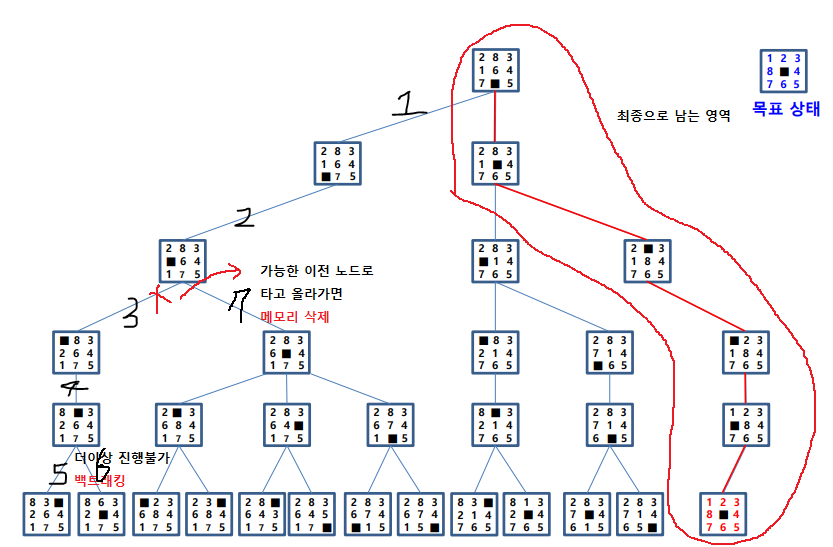
백트래킹을 통해 메모리 지우기 때문에 결국 해에대한 일련으 과정만 메모리에 남는다
(빨간색으로 칠한 부분)
-> 메모리 부담 없지만 최적해를 보장 못한다.

#### 너비 우선 탐색 (BFS)
초기 상태에서 여러 가지 경우로 나뉠 수 있을때 모두 확장 (단계 단계 하는 느낌)

초기상태에서 목정상태로 가는 최단경로를 보장하지만 전체트리를 메모리에서 관리하므로
부담된다.

#### 반복적 깊이 우선 탐색
**우선 고려 사항이다!** 깊이 한계를 1씩 증가 시키며 그때마다 **깊이 우선 탐색** 을 반복
적으로 실행한다.
ex) 깊이 제한 0일때 깊이 우선 탐색, 깊이 제한 1일때 DFS, 깊이 제한 2일때 DFS ...
깊이 우선 이기에 메모리 효율성 또한 깊이 제한을 +1씩 증가 시키면서 하므로 최단 경로 보장한다.
But 반복적으로 깊이 우선 탐색 하므로 방문했던 **노드를 재방문 하는 비효율** 발생
사실 전체 비용은 크게 증가하지 않는다.
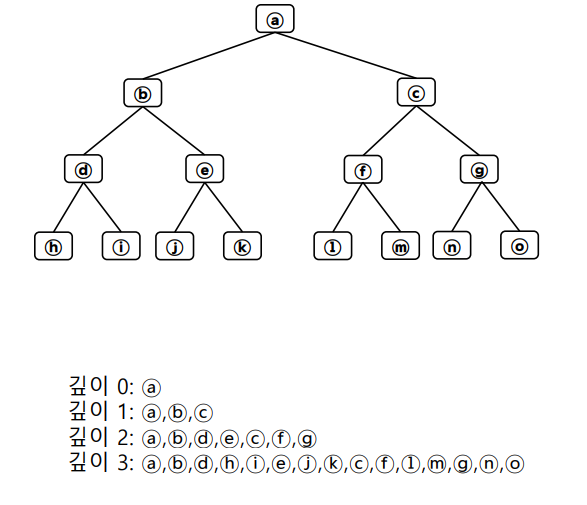

#### 양방향 탐색
초기노드와 목적노드에서 동시에 너비 우선 탐색을 진행. 중간에 만나도록 함
-> 불필요한 노드 방문을 줄인다.

### 2. 정보 이용 탐색
탐색시간을 줄이기 위해 문제의 정보(휴리스틱 정보)를 이용하면서 탐색 
휴리스틱 : 합리적 판단을 못하거나 필요 없는 상황(시간,정보부족)에서 신속하게 어떠한 기준을
어림 잡는것 -> 이를 이용해 탐색시 최적해 보장 어렵다.

휴리스틱 정보 ex) 
최단 경로 문제 : 목적지까지 지도상 직선거리
8-퍼즐 : 제자리에 있지 않는 타일 수
8-퀸 : 충돌하는 횟수

#### 언덕 오르기 방법
현재 노드에서 휴리스틱 평가 값이 가장 좋은 이웃 노드로 확장 
문제 : 국소 최적해에 빠짐. 즉, initial state에 따라 최적해 보장 안한다.

#### 최상 우선 탐색 (Best-first search)
목표노드 까지 남은 거리가 가장 짧은 노드를 확장 
8-퍼즐 경우 휴리스틱을 제자리에 있지 않는 타일 수

#### 빔 탐색
휴리스틱 값이 우수한 **일정개수** 노드만 확장 (최상 우선 탐색과 비슷)

#### A* 알고리즘 (중요)
전체 비용을 최소로 하는 노드를 확장. 
전체비용 = 투입된 비용 + 남은비용 
이때 남은비용을 추정하기 어렵기 때문에 남은비용 대신 휴리스틱 함수를 적용한다.
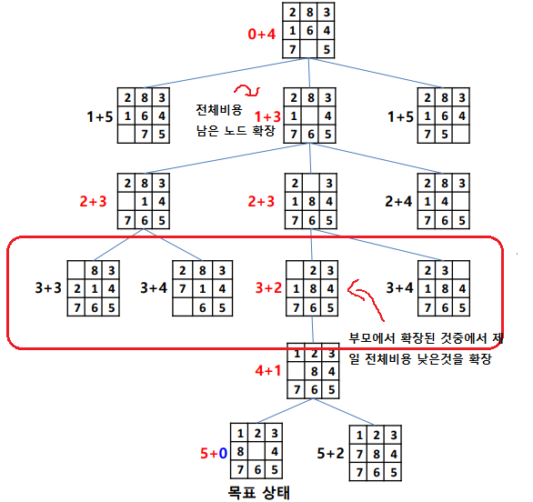

### 3. 게임에서의 탐색
게임트리란? 상대가 있는 게임에서 자신과 상대방의 가능한 게임 상태를 나타낸 트리 
많은 수를 볼 수록 게임에서 유리하다.

#### mini-max 알고리즘
먼저 가능한 모든 경우를 트리로 만들고(단말노드를) **단말 노드로 부터 위로 올라 간다.** 
자신-max : 자식 판세중 높은 값 선택 
상대방-min : 자식 판세중 낮은 값 선택

#### α-β 가지치기
검토해 볼 필요가 없는 부분을 탐색 안한다. 깊이 제한된 깊이 우선 탐색으로 min-max 노드값 결정. 
α 자르기 : min 노드 현재값이 부모 보다 작거나 같으면 탐색중지, 어차피 부모는 max 고르니 
β 자르기 : max 노드 현재값이 부모 보다 크거나 같으면 탐색중지 
**헷갈리지 말게 우리는 단말 노드만 알고있고 이를 이용해 트리의 값을 완성시킨다**
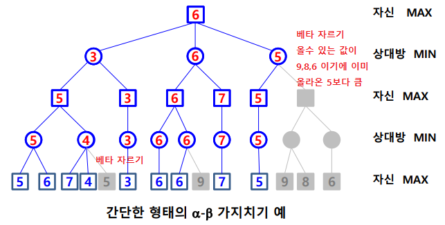

#### 몬테 카를로 트리 (중요!)
탐색 공간을 무작위 표본 추출 하면서 탐색트리 확장한다. 휴리스틱으로 (특정기준을 두고) 확장 노드 선택 
4단계를 반복하여 시간이 허용하는 동안 트리 확장 및 시뮬레이션 한다.
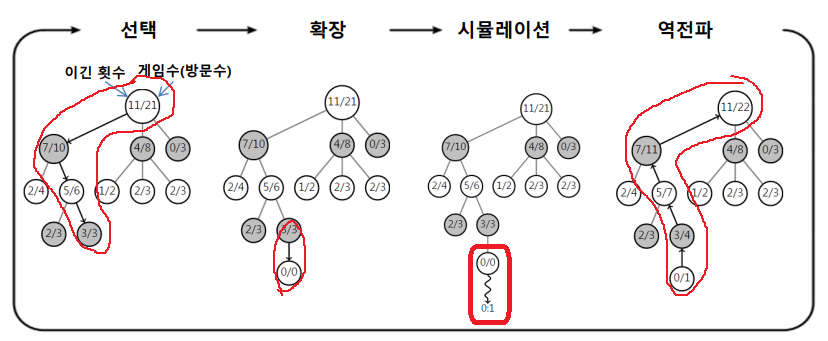
1. 선택
UCB(트리정책, upper confidence bound)에 의해 단말노드까지 내려가서 단말노드 선택

선택에 여러 방법이 있음(승률, 방문횟수, 승률+빈도, confidence bound)
2. 확장
트리정책에 따라 단말노드에 노드 추가. 예로, 단말 노드 일정 횟수이상 방문시 확장
3. 시뮬레이션
그 단말노드에서 시뮬레이션 (기본정책, 몬테카를로 시뮬레이션, 무작위 실행, 게임 끝날 때 까지)
4. 역전파 : 승점 반영
가능성이 높은 수 들에 대해 노드 생성해 트리의 탐색폭 줄이고 트리 깊이를 늘리지 않기위해

알파고가 몬테카를로 트리를 사용했다. 다만 시뮬레이션 시에 무작위가 아니라 바둑 기사 기보를
학습 (지도, 강화학습) 한 확장 정책을 사용했다.

### 4. 제약 조건 문제
제약조건을 만족하는 조합해 찾는 문제 (8퀸, 열,행,대각선 불가 -> 제약조건)
#### 백트래킹
깊이우선탐색 처럼 변수에 허용된 값 하나씩 대입, 조건 만족 안할시 백트래킹
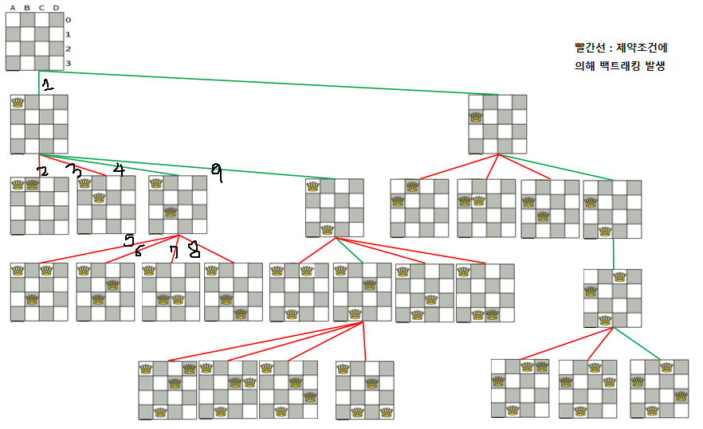
#### 제약 조건 전파
인접 변수간 제약 조건에 따라 각 변수에 허용될 수 없는 값 제거.
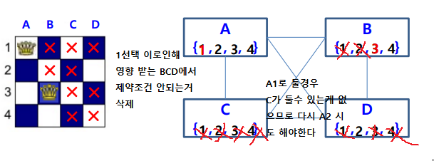

## 최적화
여러가지 허용 되는 값 중 기준을 가장 잘 만족하는것 선택

### 조합 최적화
순회 판매자(TSP)와 같이 주어진 항목들의 조합으로 해가 표현되는 최적화 문제
목적함수는 : 경로의 길이

**유전 알고리즘(중요)** : 생물 진화를 모방한 기법이다

순회 판매자, ABCDE 5가지 종류의 도시, A출발해서 A로 돌아오는 방법을 보자.
1. 유전자 표현, 후보해 표현 : 크기가 4인 배열로 인코딩

2. 초기 모집단 생성 : 초기 염색체 생성 연산에 의해
(E,C,D,B) (B,C,E,D) (B,C,D,E) (E,B,C,D)
3. 적합도 계산 : 특정 적합도 함수에 따라 모집단  적합도 계산
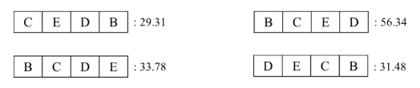
4. 룰렛 휠 선택 방법으로 부모개체 선택

5. 자식 개체 생성
선택된 두 부모 개체로 부터 **교차(크로스오버)연산**
원래 개념

이지만 TSP경우 도시를 한번만 경유 해야 하기에
첫번째 부모로 부터 BC를 받는경우 두번째 부모 염색체에서 CB를 그대로 받는게 아니라
중복되지 않은 도시들을 순서대로 가져온다

새로운 자손 생성후 **확률적으로 돌연변이 연산**
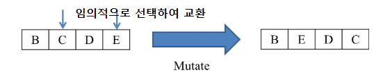
조건에 따라 한세대당 자손수 만들어질 만큼 선택->교차연산-> 돌연변이 과정을 계속함

이렇게 만들어진 자손들을 적합도 계산하고 또한 **엘리트 주의** 에 의해 이전세대에서
우수한 개체를 자손과 같이 다음세대로 유지하고 다시 룰렛 휠 선택을 한다.

### 함수 최적화
어떤 목적함수가 있을때, 이 함수값을 최대or최소 하는 변수값 찾는 최적화 문제
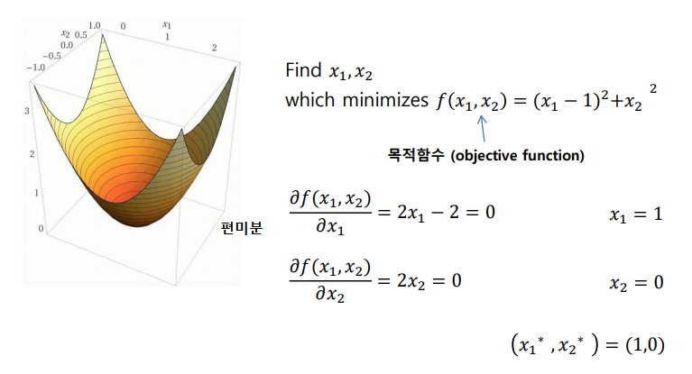

#### 제약조건 최적화
제약조건을 만족시키면서 목적함수를 최적화시키는 변수 찾는문제

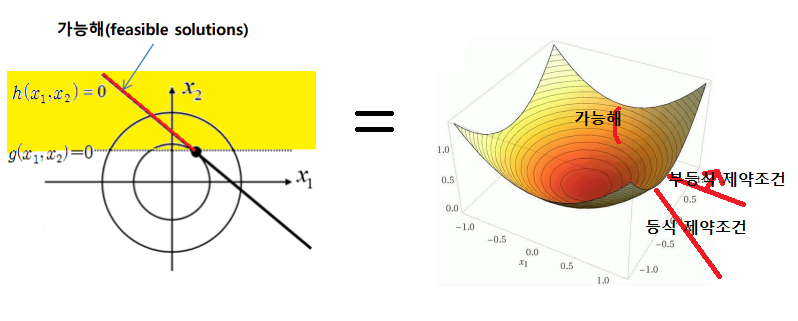
SVM 머신에서 목적함수를 Convex fuction을 사용한다. 이를 최적화 하는 방법은
랑그랑주 함수를 이용하는 것이다.

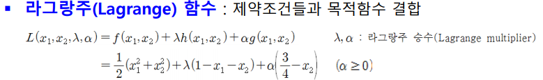
이를 최적하 하는 방법으로

위와 같은 순서를 따르면 되는데 등식조건은 항상 0 이고 부등식 조건제약 조건은 항상 음수 이기
때문에 라그랑주 함수가 최대가 되기 위해선 a*부등식제약조건은 0이 되어야한다(상보적 여유성)

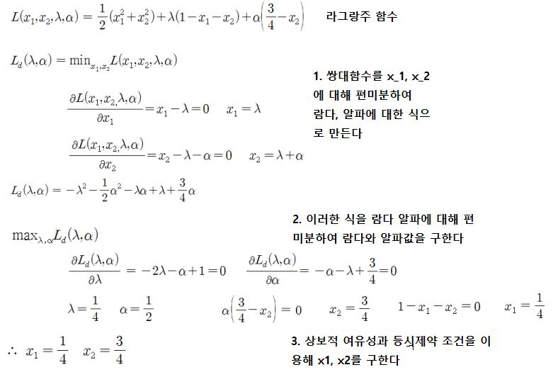

#### 회귀 문제의 최적 함수
주어진 데이터를 가장 잘 근사 하는 함수를 찾는다.
최소 평균 제곱법을 목적함수로 두어 이를 최소화 하는 값을 찾아 낸다.

#### 경사 하강법
함수의 최소값 위치를 찾는 문제에서 오차함수의 경사 반대 방향으로 조금씩 움직이며
최적의 파라미터를 찾으려는 방법이다.
이때 경사는 각 파라미터에 대해 목적함수를 편미분한 벡터를 뜻한다.
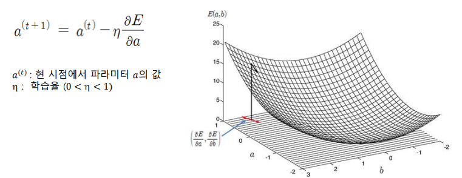

이러한 방식은 회귀모델, 신경망등의 기본 학습 방법이며 국소해에 빠질 위험이 있다
이를 개선된 형태론 conjugate gradient method 등 있다.

---

# 지식표현
## 지식표현과 추론에 대한 용어 정리

**규칙** : A->B, IF THEN 구조.
규칙을 표현해보면 IF 신호등(대상) 이 녹색(속성)이면 (조건부) 건넌다(행동/판단, 결론부)
규칙통해 인과관계, 추천, 지시, 전략, 휴리스틱을 표현한다

## 1. 프레임
**프레임** : 지식표현 방법중 하나. 특정 객체 OR 개념에 대한 **지식을 슬롯의 집합으로 표현**
프레임의 종류로 클래스(부류에 대한 표현), 인스턴스(객체에 대한 표현)
상하위 프레임이 있는데 클래스로 부터 상속을 받은게 인스턴스 프레임 이다.
클래스의 붕어빵 틀로부터 객체를 생성해 표현한다.

**클래스 표현**

**인스턴스 표현**

## 2. 논리
**논리** : 문장을 기호로 표현하고 조작을 통해 참 or 거짓을 판정하는 분야. 
**명제** : 참 거짓을 분명하게 판정할 수 있는 문장, 한개 기호로 표현, 진리값 사용. 
**기본명제, 복합명제** : 복합 명제는 and or로 연결된 명제 

**리터럴** : 명제기호 or ㄱ명제기호 (한개) 
**절** : 논리곱, 논리합 으로 연결 
**논리곱 정규형 CNF** : 논리합들이 곱으로 연결 됨 
**논리합 정규형 DNF** : 논리곱들이 합으로 연결 됨 
**정형식** : 논리 문법에 맞는 식 
**진리표** : p->q에서 전제가 T이고 결론부가 F경우만 F이다 
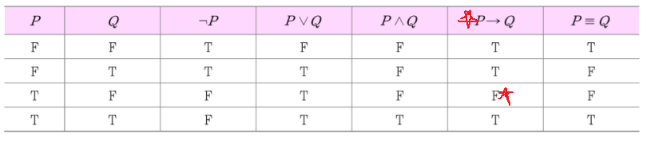
**명제기호의 외연** : 명제기호의 의미, p의 외연은 토마토는 빨갛다 이다 
**모델** : 논리식 명제기호에 T,F 할당 하는것 -> 이로써 해석가능
논리 기호가 n개 있으면  모델은 2^n개 존재한다 
**항진식** : 모든 모델에 대해 항상 참인 논리식 (p와 ㄱp의 논리합) 
**항위식** : 모든 모델에 대해 항상 거짓인 논리식 (p와 ㄱp의 논리곱) 
**충분 가능한 논리식** : 참으로 만들수 있는 모델이 1개라도 있는 논리식 
**충분 불가능한 논리식** : 항위식 
**동치관계** : 어떤 모델에 대해서도 같은값을 같는 두 논리식 
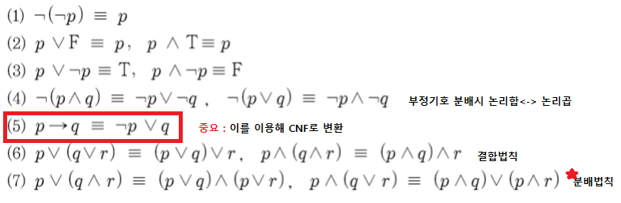
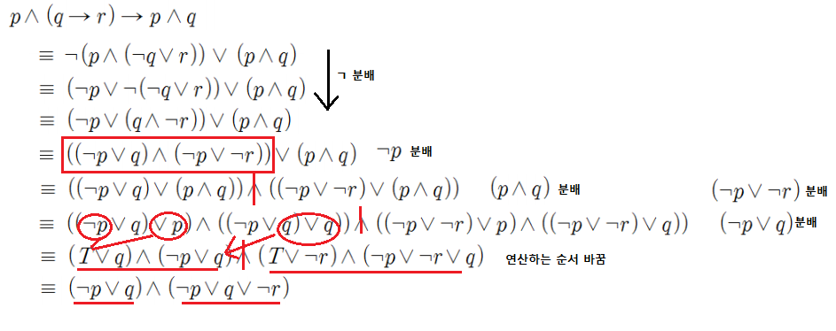
**논리적 귀결**
Δ : 정형식의 집합 
ω : 정형식 
Δ에 있는 모든 정형식을 참으로 만드는 모델이 반드시 ω를 참으로 만든다. (Δ참 -> ω참도 이다) 
Δ는 ω를 논리적으로 귀결한다. 
ω는 Δ를 논리적으로 따른다 or 논리적 결론이다. 
Δㅑω 

### 추론
**귀납적 추론** : 관측된 여러 사실로 부터 일반화하여 패턴 또는 명제 도출(인공지능) 
**연역적 추론** : 참인 사실,명제로 부터 새로운 사실 명제 도출 (논리에서 추론) 
p(전제)->(함의) q(결론) 
**추론규칙**  : 참인 논리식 들이 논리적으로 귀결 하는 새로운 논리식 만들어내는 규칙 
1. 긍정논법 : Δ = {p->q , p} 로부터 ω = q 추론 (p->q, pㅏq) (추론규칙에 의해 만들어질땐 ㅏ)
2. 부정논법 : Δ = {p->q , ㄱp} 로부터 ω = ㄱp 추론 (p->q, ㄱqㅏㄱp)
3. 삼단논법 : Δ = {p->q , q->r} 로부터 ω = p->r 추론 (p->q, (q->r)ㅏ(p->r))
4. **논리 융합** : 두 논리합절에 같은 기호의 긍정,부정의 리터럴을 서로 나눠 가질때 이를 없애고
하나의 논리합절로 만들수 있다. 
이는 긍정,부정,삼단논법 규칙을 모두 포함 하므로 따라서 추론규칙은 논리융합만 써도된다. 
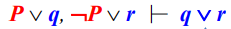
**추론규칙 정당성** : Δㅏω(추론규칙에 의한) -> Δㅑω 를 의미, 즉 추론규칙이 만들어낸것은 항상 참 
**추론규칙 완전성** : 논리적으로 귀결하는것은 추론규칙이 찾아낼 수 있다. 

### 증명
**공리** : 추론할때 참으로 주어지는 논리식 
**정리** : 추론하여 얻은 논리식 
**증명** : 공리들을 이용하여 정리가 참임을 보임 
1. 구성적 증명 : 공리들에 추론 규칙들을 적용하여 증명을 만들어 보이는 증명
2. 논리융합 반박 : 정리를 부정하여 이를 이용해 부정한 정리와 공리를 논리 융합
false임을 보이면서 정리가 참임을 보인다.

## 3. 술어논리
변수,함수에 따라 참거짓을 결정한다. 술어가 서술어에 해당. 
**한정사** : 변수 대상의 범위를 표현

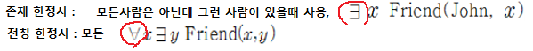
**함수** : 술어의 인자로 사용한다. 참거짓값이 아니라 일반적인 값을 나타낸다  예를 들어 h(x,f(x)) 
**항** : 함수의 인자가 될수 있는것, 개체상수(Adam), 변수(x), 함수(f(x)) 
**일차 술어 논리** : 변수에만 한정사 쓸수 있게 한 논리 
**고차 술어 놀리** :  변수뿐만 아니라 함수, 술어 기호 등에도 한정사 가능 

### 술어논리 추론
CNF로 변환후 논리융합 반박을 통해 증명을 한다.

- 읽을 수 있으면 문맹이 아니다
- 원숭이는 문맹이다.
- 어떤 원숭이는 지능적이다
- 지능적이어도 문맹일 수 있다. **이를 증명해야함**

1. 한정사를 없앤다 (술어를 만족시키는 것을ㄱ, **논리합** 으로 변환)
전칭한정사 경우 그저 한정사를 없애면 되고 존재한정사 경우 
술어에 변수가 단독인경우 특정 상수 A를 대입하고 다른변수와 있을경우 
스콜렛 함수(x에대해서 술어를 참으로 만족 시키는 y를 찾는 함수)를 도입한다. 

2. 단일화 과정 : 리터럴이 같아지도록 변수의 값을 맞춘다. 
ex) ㄱKnow(John, x) V Hate(John, x) , Know(John, jim)을 논리융합 할때 
Know의 리터럴이 같도록 x에 jim을 대입 Hate(john, jim) 이 된다.

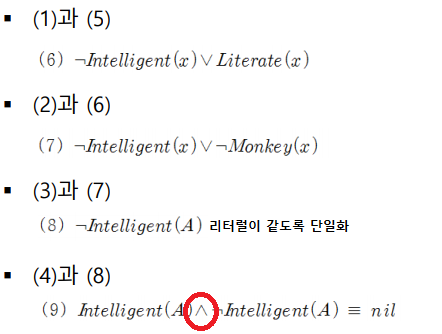

**논리 프로그래밍 언어**
Horn절 : 논리식을 논리합 형태로 표현할때 ㄱA(x) v ㄱB(x) v c(x) 와 같이
긍정인 리터럴을 최대하나만 사용 
즉 ㄱ(A(x) ^ B(x)) v C(x), A(x) ^ B(x) -> C(x) 꼴이 되고
결론부가 없거나 하나만 있는 것을 Horn절 이라고 한다.

prolog : Horn 절만 허용하는 논리 프로그래밍 언어

## 4. 의미망
지식을 이항관계 들의 집합으로 표현한다.
**노드** : 항(대상,개념, 보통 명사) 
**간선(Edge)** : 관계에 따른 방향성을 가지며, 관계의미 라벨 부여. (보통 서술어) 

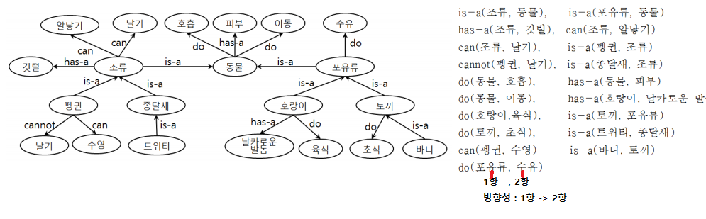

**is-a 관계** : 상위클래스와 하위클래스, 클래스와 객체를 표현 (2항이 1항을 포괄함) 
ex) 사자 ->(is-a) 포유류, is-a(사자,포유류) 
**has-a 관계** : 전체-부분 관계로 part-of와 역관계다 
ex) 돼지 ->(has-a) 뒷다리, has-a(돼지, 뒷다리), part-of(뒷다리, 돼지) 
is와 has 모두 추이적 관계를 만족시킨다 
예를들어 is(펭귄, 조류) ^ is(조류,동물) -> is(펭귄,동물) 

**다항관계 표현** : 의미망은 이항관계만 표시하기에 다항관계의 지식은 관계(서술어)를
객체로 간주하여 표현 (즉, 동사를 사물화(객체))

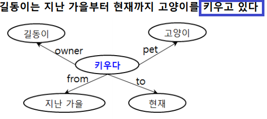

**추론** 
상속이용 따라가서 값을 찾아낸다. 단 가장 가까운 값 가져온다
예를 들어 펭귄은 알을 낳는가? 질문이 있을때  is-a관계 간선을 따라 질문을 찾아감
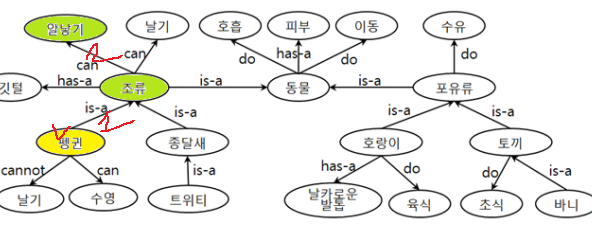

**새로운 사실 추론도 가능** 
주어진 사실로 부터 규칙의 의미망을 이용해 결론부를 추론가능 
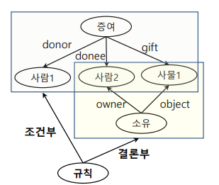

위의 사진은 규칙의 의미망표현 
사람1이 사람2에게 사물1을주면 사람2는 사물1을 소유하게된다.

여기서 철수가 영희에게 반지를 주었다는 사실이 주어지면
추론결과 영희가 반지를 가지고 있다.

**의미망의 프레임으로변환** 
노드별로 프레임을 생성하고 노드에서 나가는 Edge를 슬롯
위의 의미망을 프레임으로 변환

**의미망 장점** : 시각->직관적이해, 노드추가 변경으로 쉽게 지식추가 가능, 계층상속관계
지정가능, 복잡한 지식 구조화 가능

**의미망 단점** : 지식양많을시 관리복잡, 개념관계임의정의->통일성 부족, 공유나 재사용 고려 무,
정적인 지식의 표현, 논리적 결합관계or인과관계 기술시 링크 도입 필요 -> 일관성 떨어짐

## 5. 스크립트
전형적인 상황에서 발생하는 일련의 사건을 기술하는 지식표현
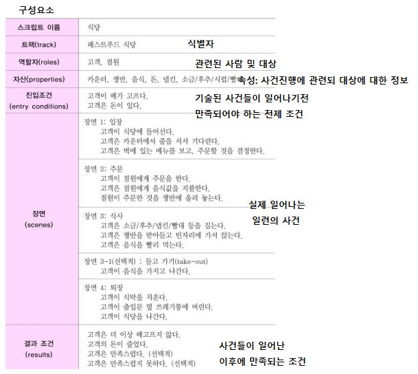

## 6. 온톨로지
이전에 표현 방식은 다른 system 만들때 재사용 할수 없다. (의미가 모호)
온톨로지는 지식을 **공유** 하고 **재사용** 할 수 있도록 해당 영역의 개념과 관계를 나타내는
**어휘를 정의** (RDFS) 이 정의를 이용해 지식을 **표현**  
쉽게 말해 공통의 약속을 하고 사용 하는 거지.

**RDFS** : resource description framework schema, RDF를 사용하여 온토로지 표현시
 사용할 **관련 어휘를 정의** 한 온톨로지  
**RDF** : 자원에 대한 메타데이터를 기술하는 명세, 즉 자원에 대한 기술
자원(대상) - 속성(특징,속성) - 값으로 분해 (tuple)
URI : 모든 대상을 고유한 식별체계룰 준다. 실제론 존재하지 않는 그냥 꼬리표

abc 기관의 이메일이 인 홍길동 부장이라는 사람
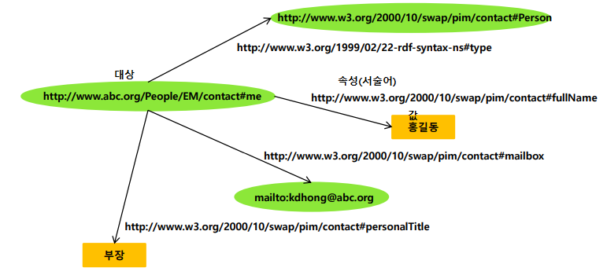
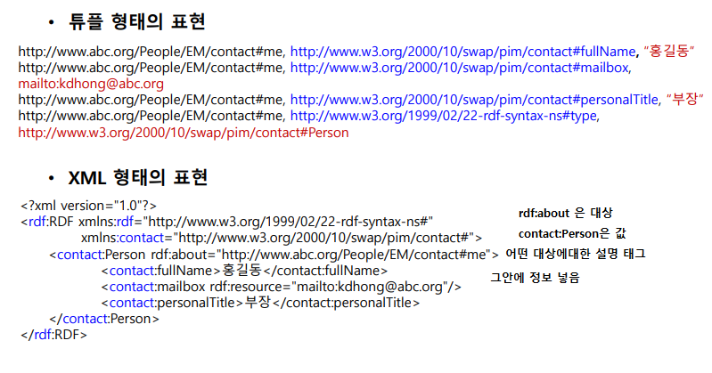

**SPARQL** : RDF 형태로 저장된 데이터에 대한 질의어

**RIF** : Rule Interchange Format, 규칙을 정의하고 교환하기 위한 규약.
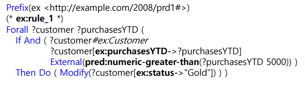
당해년도 누적 구매금액이 5000이상이면 Gold등급으로 조정

**OWL** : Web Ontology Language 웹상의 자원과 이들의 속성에대한 지식
을 표현하기 위한 온톨로지 언어

### 시멘틱 웹
프로그램(소프트웨어 에이전트)이 어떤 사이트에 접근해서 그사이트의 내용을 이해하고
필요한 정보를 가지고 오게 함 그러기 위해 각각의 정보를 기술할때 통일된 형태로 기술하자.
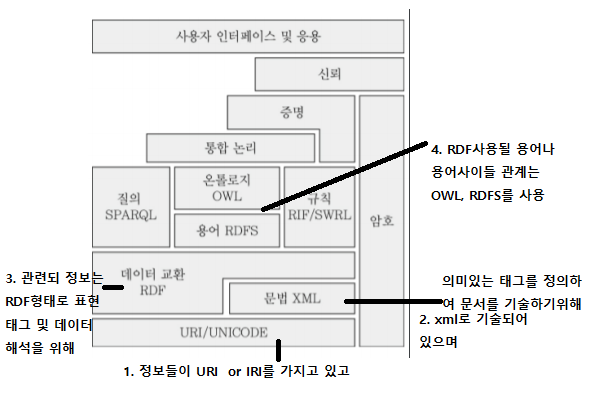

의미망은 대상 관계등의 표현에 사용되는 용어가 임의적이지만
온톨로지는 **공유와 상호운영성** 을 위해 명확학 지침에 따라 표현한다
따라서 정보 및 지식의 재사용이 용이하다.

## 7. 불완전한 지식표현은 어떻게?
### 불확신의 원인
조건과 결론부는 인과관계이다. 이 인과관계가 애매한것.
1. 약한 인과성, 애매한 관계 (확신도 사용(연관정도 표현), 베이즈정리 사용 으로 해결)
2. 자연어의 모호성 ex) 작다 크다 자주 (퍼지이론을 통해 정성->정량)
3. 불완전하거나 결손된 데이터를 이용해 지식을 뽑을때 (근사적인 추론)
4. 상충되는 지식의 통합 (지식 소스별 가중치 부여)

### 방법론
#### 확신도
규칙 (A->B)과 사실(A)에 신뢰정도[-1,1] 부여 (ex. cf(0.8))
**추론결과의 확신도 계산**
- A->B, A 통해 B 추론. B의 확신도는 cf(B) = cf(A) * cf(A->B)
  **규칙과 사실의 확신도 곱** 으로 추론 확신도를 계산한다.

- if A and B then C ,A,B  통해 C 추론 (and로 연결된)
 C의 확신도는 A,B 사실에 **확신도 최소값 * 규칙의 확신도**

- if A or B then C ,A,B 통해 C추론 (or로 연결)
C의 확신도는 A,B 사실에 **확신도 최대값 * 규칙의 확신도**

**여러 규칙에 의해 추론된 사실의 확신도를 결합**

여러 규칙에 의해 cf1(B) , cf2(B) 같은 사실에 대해 두개의 확신도를 얻었다 가정해보자.
아래와 같이 계산한다.

#### 베이즈 정리
확률의미
1. 상대빈도확률 : 관심삭건 발생갯수/ 전체실험수 (실험에 의한)
2. **주관적확률** : 실험이 아닌 경험에 의한, 머신러닝에서 보통 지식표현시 주관적 확률 사용. 
 ex) 내일 A가 B할 확률

**결합 확룔** : 교집합, A와B가 동시에 일어날 확률 P(A,B) = P(AB) 
**조건부 확률** : B가 주어질때 A가 일어날 확률 P(A|B)
 표본을 전체에서 B로 줄인다는 개념.

**베이즈정리 의미** : 기계학습의 학습에서 B를 DATA A를 모델. DATA로 부터 모델을 찾는문제.
추가되는 B로인해 A를 수정

P(A|B) (사후확률) = (P(B|A) (가능도) * P(A) (사전확률)) / P(B) (증거)
처음에 A에 대한 믿음정보 확률이 있었다 (사전확률) 거기에 추가로 B라는 정보가 주어질때(증거)
A에대한 확률이 어떻게 변하는지 (사후 확률)

#### 규칙의 불확실성 표현 (A->B)
B에 대한 사전확률을 가지고 규칙에 의해  B가 추론된다면 그떄 B에 대한 확률값은 어떻게 되는지?

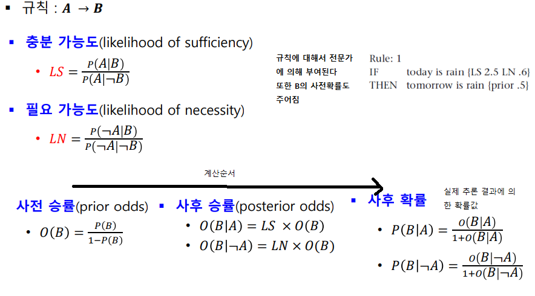

#### 퍼지이론
개념이나 범주가 항상 이분적이지 않기에 정도의 문제. 퍼지 집합을 이용한다.
언어항에 있어 어느정도 연관성이 있는지 [0, 1]

**언어항** : 모호한 언어를 언어항 (작다, 평균이다, 크다)

소속함수를 이용해 언어항의 소속정도를 [0,1]로 표현한다

**퍼지규칙** : 언어항을 소속함수로 표현한 규칙

**퍼지 추론**

1. 퍼지규칙에 의해 퍼지값을 계산하고
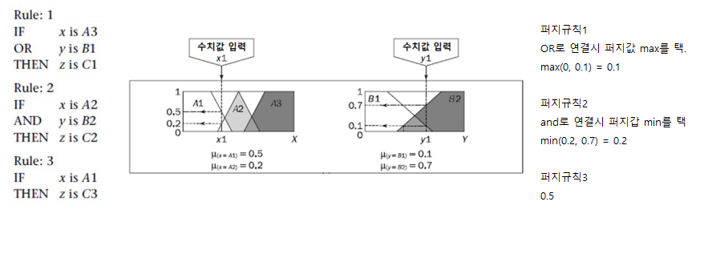

2. 여러규칙을 통해 얻은 결과를 합집합으로 겹쳐그린다
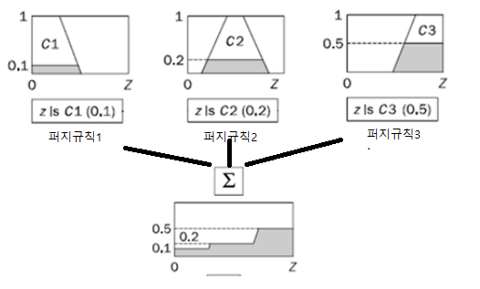

3. 비퍼지화 : 무게중심을 계산하여 수치값으로 바꾼다
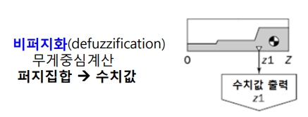

## 8. 확률 그래프 모델
Probabilistic Graph Model, PGM
확률이론을 사용해 지식표현, 확률 변수들이 많아지면 복잡해지기 때문에
그래프 이론을 도입한다.

**확률분포를 이용해 지식표현 한다 (확신도x)** 
절도 경보 문제를 살펴보자
- 절도가 발생하거나 지진이 발생하면 경보발생
- 경보가 울리면 이웃이 전화
이것들은 이웃이 전화 해줄수도 있고 안해줄수도 있기때문에 불확실하다.

이러한 불확신 요소가 있어 확률로 표현한다. 
확률변수 : 경보작동(A), 절도발생(B), 지진발생(E), 이웃전화(N) 
**결합확률 분포로 표현한다!** 

경보가 울릴때 이웃이 전화할 확률은 ? 
P(N=T | A=T) : 체크한것을 이용해 확률값을 계산한다. 
(확률 값은 주어짐.)

**사건의 독립** : P(E,B) = P(E) * P(B) (E와B는 서로 확률값 영향 없음)

**조건부 독립(중요)** : P((R,A)|E) = P(R|E) * P(A|E)

**확률분포 인수분해** :
 P(N,A,E,B) = P(N|A,E,B) * P(A|E,B) * P(E|B) * P(B)
 이때 만족하는 조건부독립은
 - P(N|A,E,B) = P(N|A) (이웃이 전화하는건 절도와 지진발생과 연관이없다)
 - P(E|}B) = P(E) (지진이 나는것과 절도가 발생하는것 관계없다)

이를 통해 결합확률분포를 다시 표현하면
P(N,A,E,B) = P(N|A) * P(A|E,B) * P(E) * P(B)

### 베이지안 네트워크
조건부 확률 곱으로 표현된 결합확률 분포를 방향성 그래프로 표현 
노드: 확률변수 , 엣지 : 의존관계 

결합확률 분포로 답변이 가능하다 
-> 결합확률 분포를 가져야한다. 
-> 이를 인수분해한 형태로 가능하다 
-> 모델링 

### 마르코프 네트워크
무방향성그래프, 조건부 독립이 아니라 관련된 변수간의 값들이 가질수
있는 값의 부합정도를 가지고 확률분포를 표현

0(a^0, b^0, c^0,d^0) = {0(a^0, b^0) * 0(b^0, c^0) * 0(c^0,d^0) * 0(d^0,a^0)} / 전체 조합 경우의 부합정도 합

## 9. 함수 기반 지식 표현
기호 대신 수치값과 수치값을 계산하는 함수를 사용하여 지식표현. 
회귀분석, 신경망, SVM, 딥러닝 
(그래프 형태로 표현해서 복잡한 함수를 표현하고 그런 함수들을 데이터를 이용해 찾아냄) 

## 10. 규칙 기반 시스템
rule-based system (RBS) 
주어진 문제상황에 적용될수있는 규칙들을 사용하여 문제에 대한 해를 찾도록한다 
(규칙들을 만들어 두고 정보가 주어지면 해결) 

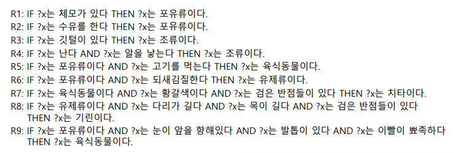

### 전향 추론

전향추론은 어떤게 사실이다 아니다만 나타내는게 아니라 계산하고
없애기도 하고.. 여러가지 일을 할 수있다
1. 대상의 사실들을 가지고 그림 만들고
2. 그 대상이 뭔지 알아낸다.
만족하는 규칙으로 부터 통과하여 문제를 해결

### 후향 추론
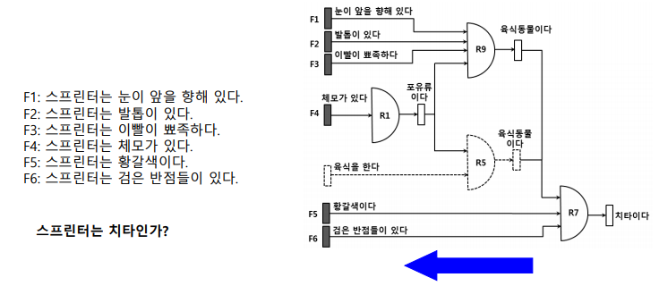
후향추론은 문제에 대해서 검증하는것이다.
불필요한게 안생기지만 뭘 관심을 가지는지 명확해야한다.
1. 치타가 될 규칙들을 정리하고 그림 만들고
2. 대상이 그 조건 만족하는지 본다.

### 규칙 기반 시스템 구조

이러한 시스템 구조에 사용자는 규칙들과 사실들만 집어 넣어 규칙 기반 시스템을 사용할수있다. 
**경합 해소 전략**
1. 규칙 우선 순위 : 우선순위가 높은 규칙을 먼저
2. 최신 우선 : 가장 최근에 입력된 데이터와 매칭된 규칙 먼저(시간태그 부여, [03/25 08:16PM])
3. 최초 우선 : 가장 먼저 패턴매칭된 규칙을 먼저
4. 상세 우선 : 가장 복잡하게 기술된 규칙을 먼저

### JESS를 이용한 지식표현
이러한 규칙 기반 시스템 툴이다.
사실 : 이름이 멍키인 원숭이가 나이가 세 살이고 거실에 있다.
(monkey (name 멍키) (age 3) (room 거실))

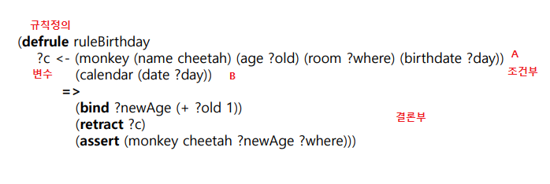
치타라는 이름의 원숭이를 age는 old라는 변수값으로 room은 where의 변수값 birthdate는 day변수값
이러한 사실을 c라는 변수에 넣고 캘린더의 오늘 날짜를 day로.
두 day가 같으므로 원숭이의 생일과 오늘 날짜가 같으면 old변수에 1을 더해 newage 값에 넣고
c라는 사실을 지우고 치타라는 원숭이의 사실을 새로 집어 넣는다.

이러한 규칙기반시스템은 현업에서 업무규칙을 시스템에 직접등록(새로 넣어서 바로 동작)
프로그래밍으로 할시에는 뜯어 고쳐야한다..
시간 절약, 오류 적음, 신속한 시장 대응 가능하다.

---

# 기계 학습
경험(data)을 통해 시스템의 구조나 파라미터를 바꾸는것
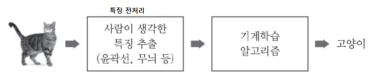
파라미터(가중치)가 많을수록 DATA가 많이 필요하다 
일반화 능력이 좋은것이 이상적인 프로그램이다.

**귀납적 학습** : 사례(data)들을 일반화 하여 패턴 or 모델추출
<-> Overfitting (데이터를 외워버림)

**오컴의 면도날** : 1. h(x,y) = x+y 2.h(x,y) = (2x+3y)(2x+2y)y/(4xy+6y^2) 
1과 2식이 같은 결과값을 나오게 할때 가장 간단한 형태로 표현

## 1. 지도학습
입력과 출력이 있는 데이터로 부터 패턴추출
### 분류
출력이, 정해진 class 중의 하나로 결정

결정 경계를 찾아내는 함수를 찾는 문제이다. 
**분류기** : 결정경계를 이용하여 데이터 분류하는 프로그램
!기본적으로 분류 문제에선 각 class 마다 데이터 갯수가 같아야 한다.

#### 데이터
- 학습 데이터 : 학습에 사용되는 데이터
- 테스트 데이터 : 학습된 모델을 평가하기위한 unseen data
- 검증 데이터 : 학습과정중 학습을 중단할 시점을 결정하기위한 데이터 (오버피팅 방지)

학습과정중에서 검증데이터를 통해서 test를 실행하고 (학습에 관여하지는 않는다) 
tensorboard를 이용해 검증데이터 오류가 증가하는 시점에 학습 중단 시점을 파악한다.

#### Overfitting
학습데이터에 대해서 지나치게 학습됨 (데이터를 외워버림) 
데이터는 오류나 잡음을 포함하기 쉽기에 오버피팅시 일반화가 되지 않는다,
unseen한 데이터에 대해 성능이 좋지않다

#### K-fold cross-validation
데이터가 부족한 경우에 성능평가 방식이다. 
테스트 데이터도 학습을 시킨다.
1. 전체 데이터를 k 등분
2. 각 등분을 한번씩 테스트 데이터로 사용하여 성능평가하고 **평균값 선택**

위의 사진과 같이 1개의 data set으로 부터 4가지의 다른 영역의 학습데이터/테스트데이터
를 준비하고 각각 개별로 다른 데이터셋 (다르게 학습/테스트 셋을 구분한) 을 가지고
학습 및 평가 한후 metric의 평균값을 통해 어느정도 성능을 낼것이다 판단. 
그후 **최종 모델** 을 만들때 전체 dataset을 가지고 학습을 시킨다 (data가 적기 때문에)

#### 불균형 데이터 문제
정확도에 의한 성능 평가는 무의미 할수 있다 
왜냐? A,B class 문제 에서A class 데이터가 99프로 인경우 분류기가 항상 A class로
분류하더라도 전체 성능은 99%이다 
**해결**  
1. 많은쪽에서 재표본 추출(re-sampling,under smapling) 못하거나
2. 적은쪽에서 인공적인 데이터를 생성한다.
3. 또는 class별 가중치를 두어 정확도 계산한다

인공적으로 데이터를 만들어 내는 방법 
**SMOTE(Synthetic Minority Over-sampling Technique) 알고리즘**

1. 임의로 낮은 빈도 부류의 학습데이터 선택
2. x의 k-근접이웃 인 같은 부류의 데이터 선택
3. k-근접이웃중 무작위로 하나 y 선택
4. x와 y를 연결하는 직선상의 무작위 위치에 새로운 데이터 생성
k의미 : 근접이웃 직선 만드는 갯수

#### 이진분류 metric

- 정확도 : (TP+TN) /(TP+FP+TN+FN) (전체중에 제대로 예측한 비율)
- **민감도** : (TP) / (TP+FN) (전체 P중 제대로 P로 맞춘 비율) (sensivity, true positive rate)
- **특이도** : (TN) / (TN + FP) (전체 N중 제대로 N을 맞춘 비율) (specificity, true negative rate)
- 정밀도 : TP / (TP+FP) (P로 예측한것중에 진짜로 P인 비율) (precison)
- 음성 예측도 : TN / (TN+FN) (N으로 예측한것중 진짜로 N인 비율)
- **위양성율** : FP / (TN + FP) = 1-특이도
- 위발견율 : FP / (TP+FP)  = 1-정밀도
- F1측도 = 2*((정밀도*재현율) / (정밀도 + 재현율))

#### ROC 커브
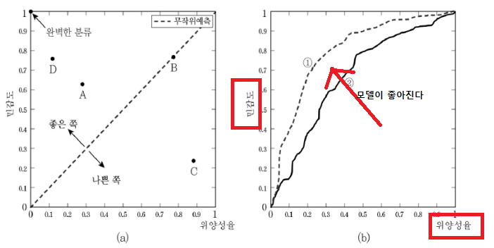
ROC 커브 밑 면적을 AUC라 하는데 AUC가 높을수록 좋은 모델이다.

### 회귀
출력값이 실수인 **함수** 를 찾는 문제

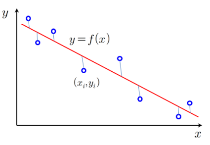

목적함수로 **평균제곱근** 을 사용한다.(성능)

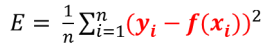

#### 회귀의 과적합 대응방법
모델이 깊어질수록 잘맞출수 있으나 오버피팅 문제가 발생할수도 있다 
이러한 모델의 복잡도를 성능 평가에 반영한다 
목적함수 (cost, Err function) = 오차의 합 + 가중치 * 모델의 복잡도를

#### 로지스틱 회귀
분류 문제에서 결정경계를 찾을때 사용한다.(0,1)

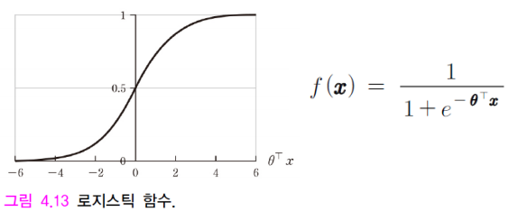

로지스틱 함수에서 간단히 Θ와x의 shape을 (1,n)이라고 보자.(Θ는 가중치 파라미터)
Θ의 전치 행렬과 x 곱은 행렬의 내적을 뜻한다 (선형 결합, Θ1x1 + Θ2x2 +..+ Θnxn)
이에 따라 로지스틱 함수는 [0,1] 사이 값을 리턴하고

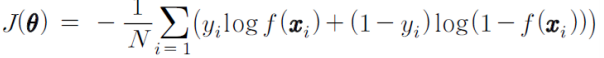

목적함수를 위의 식으로 씀으로써 실제y값이 1일경우 ylogf(x) 0일경우 (1-y)log(1-f(x))로
계산된다.(크로스 엔트로피)

## 2. 비지도학습
결과정보가 없는 데이터로부터 **패턴** 을 찾아내는것(데이터 잠재구조, 계층구조, 문서 주제, 사용패턴) 
대표적으로 군집화(clustering) 밀도추정(density estimation) 자원축소(dimensionality reduction)

### 군집화
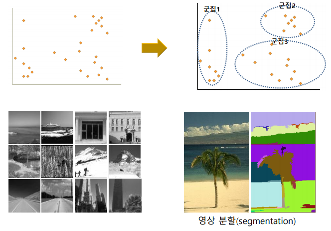

데이터를 유사성에 따라 분할한다. 
영상분할경우 픽셀은 rgb 3차원 값으로 되어있고 이를 공간상에 찍어두면 비슷한 색들은
데이터가 뭉쳐 있다. 이를 군집화

군집화는 두가지로 나뉨
1. 일반 군집화 : 데이터가 하나의 군집에만 속함
2. 퍼지 군집화 : 데이터가 여러 군집에 부분적으로 속함 (소속정도의 합은 1)

용도 : 전반적 데이터 구조파악, 이상치 감지, 데이터압축(rgb영상 군집별 같은값), 전처리 
성능 : 군집내의 분산과 군집간 거리

### 밀도추정
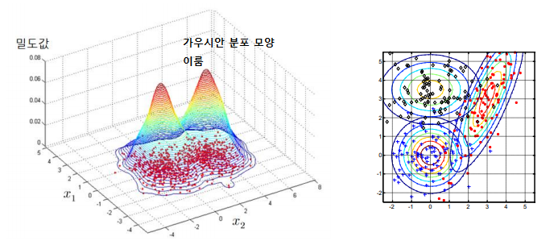
class별 데이터 분포는 가우시안 분포를 가질것이다. 이 확률 분포를 찾는것.
이러한 확률 분포를 찾고 데이터가 들어올때 각 class 분포별 확률을 계산하여
확률이 높은 쪽 class로 판단.

밀도추정은 두가지로 나뉨
1. 모수적 밀도 추정 : 분포가 수학의함수(ex 가우시안)를 가질것이다 **가정후**
학습을 통해 함수를 알아 내는것 (mixture of gaussian)

2. 비모수적 밀도 추정 : 주어진 데이터로 부터 밀도함수 형태 표현 (히스토그램)

### 차원축소

시각화를 통해 직관적 데이터 분석위해 사용. 
고차원 데이터를 저차원으로 변환 (정보손실 최소화하며) 
차원의 저주 문제 완화

차원의 저주
1. 차원이 커질수록 거리분포 일정해 뭉치는 현상
2. 차원이 커질수록 부분공간의 개수가 기하 급수적 증가

**주성분 분석** : 분산이 큰 축으로 데이터를 projection하여 저차원으로 변환(정보손실 최소화)
데이터의 공분산행렬에 대한 고유값이 큰 소수의 고유벡터를 축으로.
(Principle Component Analysis, PCA)

### 이상치 탐지
**이상치** : 다른데이터와 크게달라 다른 메커니즘에서 생성된건지 의심받는 데이터 (관심대상) 
**잡읍** : 관측 오류,오차에의한것 관심대상 x

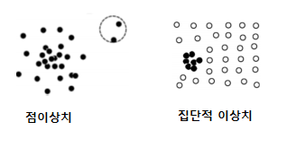

3가지 종류
1. 점 이상치 : 다른데이터와 비교해 큰차이 보이는
2. 상황적 이상치 : 상황에 맞지 않는 데이터 (겨울철 30도)
3. 집단적 이상치 : 데이터 모아보면 비정상으로 보이는

활용 : 부정사용감지, 침입감지, 시스템 고장, 임상 모니터링, 유행병 탐지, 관측오류 탐지

## 3. 반지도학습
미분류 데이터를 지도학습에 사용하는 방법 (데이터 획득 비용 과정으로 인해)

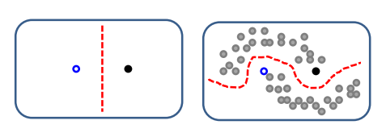

같은 군집에 속하는것은 같은 class로 분류

가정
1. 평활성 가정 : 가까이 있는 점들은 서로 같은 class
2. 군집 가정 : 같은 군집 데이터는 class 같음
3. 매니폴드 가정 : 원래보다 낮은 차원의 매니폴드에 데이터가 분포할 가능성

---

## 4. 결정트리
의사결정을 트리형태로 표현한것.
- 내부 노드 : 속성
- 간선 : 속성값
- 단말 노드 : class

**PlayTennis 문제** 를 예로 들어보자
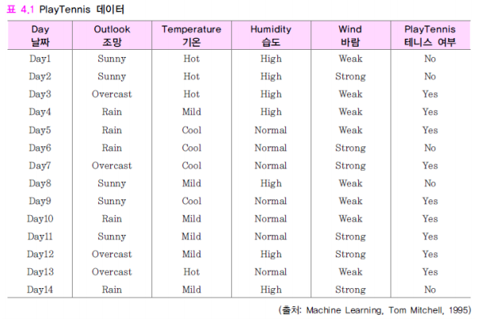
위 사진은 학습데이터이다(경험)  이름 통해서 아래 사진과 같이 결정트리를 만든다
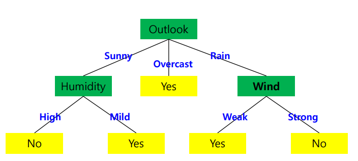

### 어떻게 결정트리를 만드는가?
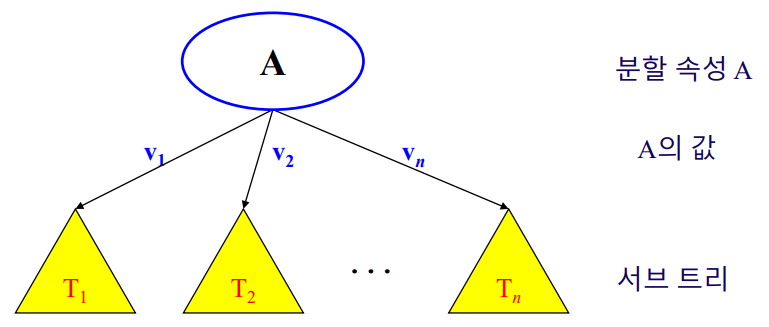

1. 처음에 루트노드에 모든 데이터가 있다.
2. 분할 속성 선택
3. 분할속성 값 갯수에 따라 서브트리를 만들고 서브트리로 데이터 분류
이 과정을 반복 .

**하지만 어떤 분할속성을 택하느냐에 따라 트리가 복잡해 질수 있다** 
오컴의 면도날에 따라 간단한 트리를 만들어야함.

### 그럼 어떻게 간단한 트리를 만들것인가?
최대한 빠르게 단말노드를 뽑아내야한다. 
**엔트로피를 이용한다** : 데이터가 섞여 있는정도를 의미. (데이터가 넓게 분포하고 있다.)
class(!)별 확률에 대한 식 
**분류전 A에서 엔트로피 계산**

**정보이득** : I-I_res(분류전 엔트로피, 분류후 각 서브트리 엔트로피 가중평균) 
**정보이득이 우수한 분할속성, 좋다**

### 예제
**학습데이터**

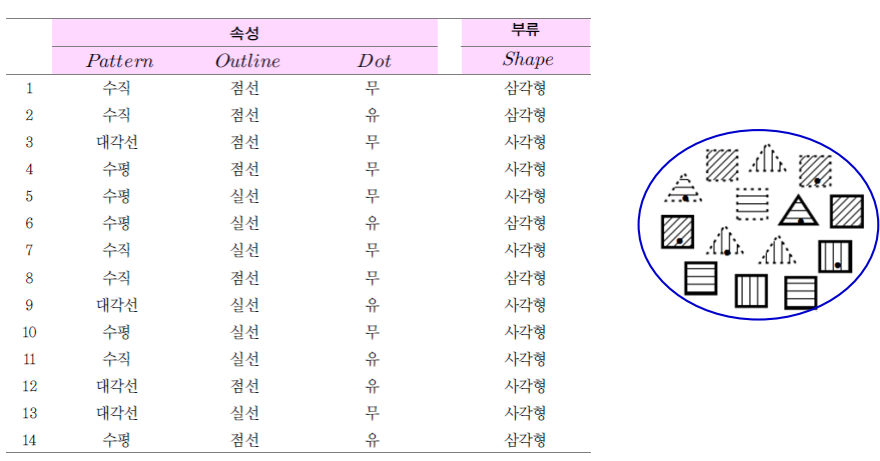

**루트노드에서 엔트로피 계산**

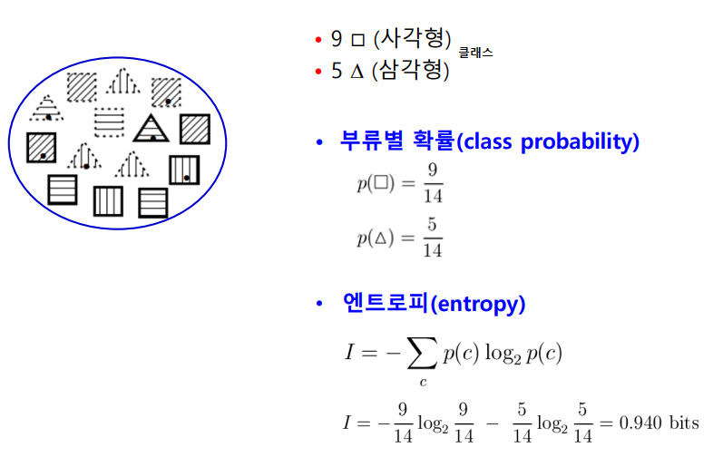

**속성에 따른 엔트로피 계산**

**속성별 정보이득 계산 다하면 그 결과**

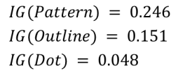

를 얻는다.
정보이득이 패턴이 가장 높으므로 분류를 패턴으로 한다.
