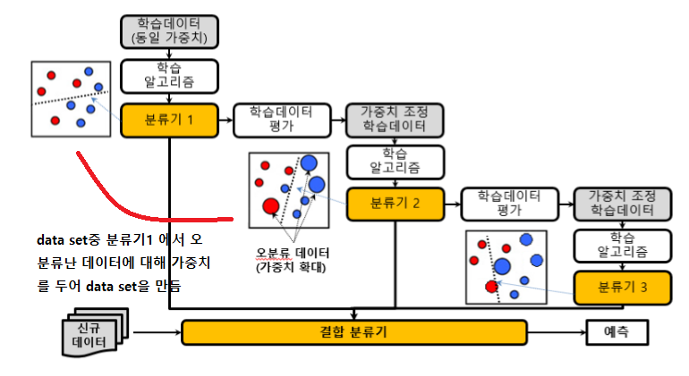
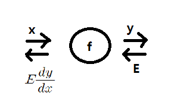
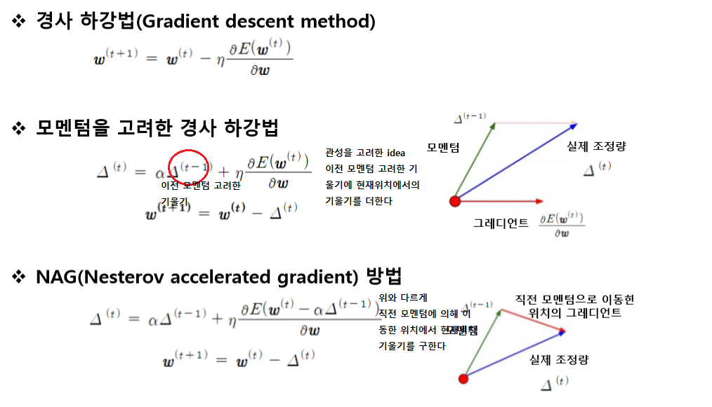

# 기계 학습

## 결정트리

이전의 머신러닝 정보이득을 이용한 결정트리 이어서.. 
이러한 방식은 속성값이 많은 것으로 나누는것을 선호하게된다 이로 인해 많은 부분집합이 발생. 
**나눠지는 부분집합이 동질적인 경향이 있다.**

이를 개선하는 다른 방식은 아래와 같다
1. 정보 이득비
2. 지니지수

### 정보 이득비

* 엔트로피 계산은 해당 집합에서 class를 기준으로 한다.

I(A)는 A속성(pattern)의 속성값(수평, 대각선, 수직)이 많을수록 커진다.
(class가 여러 종류일 수록 데이터가 많이 흩어짐 -> 엔트로피 값 큼) 
**(I(A)는 속성값을 class로 간주 & 부모노드에서 계산)**

### 지니 지수

해당 집합에서 class별 각 확률의 곱.

이후 결정트리 알고리즘으로 ID3알고리즘(범주형, class와 같이 딱 소속있는),
C4.5(범주형 속성값과 수치형 속성값 - weka에선 j48), c5.0, CART(Classification And Regression TTree, 수치형, 회귀)

### 회귀의 결정트리

* 뇌피) 결정트리를 만들때는 입력이 범주형 인듯, 출력값의 형태에 따라 특정 기준을 가지고 트리를 만든다.

**기준 : SDR(표준편차 축소) 이다. SDR이 최대로 되는 속성 선택**

SD(A)또한 갯수비 가중편균으로 구해진다.

이렇게 만들어진 단말노드의 수치는 대푯값(부분집합의 평균)으로 나타낸다

### 앙상블 분류기

data set에 대하여 **여러개 다른 분류기를 만들어** 이를 투표 or 가중치 투표 방식을 통해 
**분류기 결합** 한다.
때문에 여러개 여러 분류기를 만들때 같은 data set 이용하면 비슷한 분류기가 만들어지겠지? 
**부트스트랩** (주어진 data set에서 복원추출하여 다른 data set 여러개를 준비하는 것) 을 이용한다

1. 배깅 (Bootstrap AGGregating)

병렬적으로 판단해 한 결과를 뱉는다. 
ex) 랜덤포레스트 : 분류기로 결정트리를 사용하는 배깅 기법
여러 랜덤 트리(랜덤트리는 전체속성을 사용하지 않고 일부만 랜덤하게 해서 만든 트리) 가 있다.

2. 부스팅

순차적, 분류기1의 오분류에 의해 만들어진 data set2를 통해 분류가2가 학습힌다.

ex) 에이다부스팅

### K-근접이웃 알고리즘 (K-nearest neighbor, KNN)

(입력, 결과) 쌍의 데이터에 대해 그냥 메모리에 저장 -> 메모리 문제 발생 할 수 있음.

새로운 입력에 대해 저장된 데이터를 이용해 결과를 추정한다.

**How?**

1. 새로운 입력과 다른 데이터간 거리 계산한다 (입력이 수치데이터 경우 유클리디어 거리, 범주형 경우 특정 기준을 정해서)
2. 근접 이웃 탐색 (효율을 위해 색인 알고리즘 R-트리, k-d트리 이용)
3. 근접이웃 k개로 부터 결과 추정 (분류 : 다수결  회귀 : 거리에 반비례하는 가중합 or 평균)

### 클러스터링 알고리즘 (clustering)

데이터가 유사한 것들 끼리 모으는것.

1. K개 중심위치 무작위 선정 (첫 위치가 중요하다)
2. 중심위치 중심으로 데이터들 소속시킴 (군집 재구성)
3. 군집별 평균위치 계산
4. 평균위치로 중심위치 이동

2-4과정을 k개 군집 분산의 합이 최소가 될 때 까지 한다.

### 단순 베이즈 분류기

class를 조건부확률로 결정한다.

# 딥러닝

1. 퍼셉트론 -> and 나 or 같은 **선형 분리 문제 해결 가능하다.**
(선형 결합을 표현하기 때문에)
그러나 **선형 분리 불가 문제(XOR) 해결 못 한다.**

2. **다층 퍼셉트론 이용해 선형 분리 불가 문제 해결한다**

그러나 **자동으로 가중치를 학습 못한다**
학습을 위해선 역전파를 통해 이뤄 지며 결합된 모든 연산이 chain rule에 의해 미분이 가능해야 한다.

cf) chain rule

앞에서 오차 E가 전파 될때 f노드를 거쳐 y를 x에대해 편미분한 결과가
곱해져 전해진다. 편미분 값은 a만큼 해당 노드에서 입력값이 바뀔떄
E값이 얼마나 변할지를 의미한다.

TIP) +연산에 대해선 그대로 흐르고 곱 연산에선 두 입력이 들어간다 할때 오차는 반대방향의 입력값과 오차의 곱이 전달된다.

#### 3. 활성화 함수를 계단함수에서 sigmoid 함수로 변경하여 미분을 가능케 한다

**하지만 sigmoid 전 범위에 대해 미분값이 항상 1보다 작기에 기울기 손실 문제가 발생하여 층을 깊게 쌓을수 없다**

####  4. 활성화 함수를 RELU로 변경하여 층을 깊게 쌓는다.

## 목적함수

목적함수를 최소화 하기 위해 역전파를 통해서 가중치를 갱신한다.

### 회귀 문제의 목적함수

**평균 제곱 오차법 사용**

### 분류 문제의 목적함수

**softmax를 이용해 확률값으로 나타내고 cross-entropy를 사용해 목적함수를 만든다.**

- softmax

- cross-entropy

## 여러가지 테크닉

아래 테크닉을 사용하여 실험에 의해 성능을 향상 시킨다.

### 가중치 초기화

가중치의 초기값이 신경망 성능에 큰 영향을 준다. 보통 0에 가까운 무작위 값을 사용한다.

**제한된 볼츠만 머신**

입력데이터에 대해 제한전 볼츠만 머신을 학습시킨 결과의 가중치를
초기값으로 사용한다.

**인접 층간의 가중치를 직교하는 벡터로 초기화**

가중치행렬 W를 N(0,1)에서 무작위 추출하여 채움
W을 특이값분해하여 직교하는 벡터를 초기 가중치로 사용

### 오버피팅 방지

#### 1. 규제화

목적함수에 모델의 복잡도를 추가한다. (복잡할수록 오버피팅 될 수 있다.)
목적함수 = 오차식 + a*모델의 복잡도
모델의 복잡도는 가중치를 이용하며 큰 가중치에는 큰 패널티를 준다.

#### 2. 드롭아웃
일정확률로 노드를 무작위 선택하여 선택된 노드의 앞뒤 연결 edge를 없앰

미니배치나 학습주기 마다 드롭아웃 할 노드를 새롭게 선택한다.

cf) **미니배치란?**

mini-batch의 평균 gradient를 계산한다.
예를들어 batch-size가 10이면 10개의 데이터에 대한 gradient의 평균을 이용

미니배치를 사용하여 데이터 포함된 오류에 둔감한 효과 -> 과적합 문제 완화에 도움

#### 3. 배치정규화 블록을 단마다 둔다.
기존 역전파 생각하면 **내부 공변량 이동 문제 발생한다** 앞 층들에서 학습에 의해 가중치가 바뀌면 현재 층에 전달되는 데이터의 분포가 현재층이 학습했던 시점의 분포와 차이가 발생하여 학습속도가 저하된다.

### 학습법

#### Gradient

#### learning rate

**가중치별로 별도의 학습율을 이용한다.**

**뭐가 제일 좋다는 학습법이란 없다! 실험에의해서 내가 만든 모델이
어떤 학습법이 좋은지 판단한다.**

## CNN (Convolutional Neural Network)

시각피질(특정영역에 대한 자극 수용)의 신경세포에서 영감받아 만들어졌다.

앞에서 설명한거와 같이 가중치와 데이터의 선형결합 값은 유사도를 의미한다. 즉 필터(가중치)러 이미지를 살펴 보면서 그 결과값으로 feature map이 나온다.

- feature 크기(가로) = ((img(가로) - filter(가로)) / stride) + 1
- 채널수 만큼 필터가 필요
- k개의 필터를 사용하면 k개 feature map이 생성된다.

#### 패딩의 역할

 단순히 feature map의 size를 원하는 방향으로 하기 위해

#### 풀링의 역할

 대푯값을 뽑는것 평균값풀링, 최대값풀링, 확률적 풀링(원소값의 크기에 비례하여)

풀링의 역할은 feature map을 줄여 메모리크기와 계산량 감소
일정영역내 나타나는 특징들을 결합하거나, 위치변화에 강건한 특징 선택

cnn(특징추출)의 구조는 보통 Conv층(컨볼루션 연산)-RELU-POOL 순서로 이뤄지며 RELU와 POOL은 선택, 끝으로 FC와 SM연산.

- 지역적 연결 : 이전층의 일부 뉴런에 대해서만 연결
- 가중치 공유 : 같은층에서 같은 필터 사용
- 풀링 사용 : 위치가 다른 부분에서 나온 유사한 특징 결합, 특징공간 축소
- 다층 사용

## 메모리 요구량

## CNN history

### LeNet

1998, 5계층 구조(CPCPC FF), 32x32 mnist, 시그모이드, 오차율 0.95

### AlexNet

cf) ILSVRC대회 : ImageNet이라는 1000개 부류, 1,200,000개 데이터 상위-5 오류를 평가하는 대회

2012, **가장 큰 정확도 향상 (9.4%)**, 8계층, RELU 첫 적용, 드롭아웃, max pooling, **Norm 사용**(국소 반응 정규화 연산 층, 인접한 여러 층의 출력값들을 이용하여 출력값 조정)

### VGGNet

2014, 2위지만 **간단한 구조**

### GoogleNet

2014, 22개층, **인셉션 모듈** : 직전층 처리결과에 1x1, 3x3, 5x5 컨볼루션을 적용, 여러 크기의 수용장에 있는 특징들을 동시에 추출.

4번째, 7번째 계층에 보조 분류기를 달아 이를 통해 그레디언트 정보
제공 함으로써 기울기 소멸 문제를 완화한다.

### ResNet

2015, 125개의 다수 층사용 -> 상위 계층에서 의미있는 특징 추출 가능 but 기울기 소멸 문제.

샛길 빼두어
- gradient가 전파 될 수 있도록 도움
- 기대하는 출력과 유사한 입력이 들어오면 영벡터에 가까운 값을 학습
 -> 입력의 작은 변화에 민감 -> 잔차학습
- 다양한 경로를 통해 복합적인 특징 추출 (필요한 출력이 얻어지면 conv층 건너뜀)

### DenseNet

2016, ResNet은 전 층에서 지름길 연결과 달리 DenseNet은 앞에 있는 모든 층들과 지름길이 연결된다.

### DPN (Dual Path Network)

ResNet과 DenseNet을 결합한 모델
- ResNet
이전 단계의 동일한 특징 정보가 각 단계에 전달되어 이들 특징 을 재사용
상대적으로 이전 단계의 특징으로 부터 새로운 특징을 만드는 것에 소극적

- DenseNet
새로운 특징이 추출될 가능성이 높음
이전에 추출된 특징이 다시 추출될 가능성 높음

ps.
1. 가중치 w와 입력 x 의 선형결합 - w와x의 내적 - 유사도 - 내적값이 클수록 w 벡터와 x 벡터가 유사하다 (w의 특징과 유사하다)

2. 전이학습 : 공개된 모델을(헉습된) 가져다가 자신의 문제에 적용
