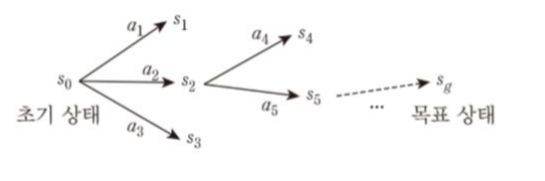

# 계획수립

초기상태에서 목표상태로 도달하는 일련의 행동/연산자를 생성 하는것.

ex) 로봇의 계획수립
- 움직임 계획수립 : 제약조건을 만족하며 원하는 움직임 수행하도록 최소의 비용으로 일련의 움직임 찾는일
- 경로 계획수립 : 목적지 가기위해 순차적인 위치를 결정하는일
- 궤적 계획수립 : 제약조건 등 고려 매시점 관절,위치, 속도 가속도 등 결정하는일

**구성요소** : 초기상태, 목표상태, 가능한 행동  이 3가지에 대한 명세 
**에이전트** : 위임받은 일을 자율적,지능적으로 처리하는 개체 
**에이전트와 계획수립** : How를 말하지 않고 goal만 말하면 알아서 처리하는 능력 필요

## 계획수립 문제형태

### 고전적 계획수립

- 초기상태 1개만 주어진다
- 행동의 지속시간이 없다(바로 결과 일어남)
- 행동 결과가 결정적이다. (명확하게 일어난다.)
- agent는 하나이다.
-> 행동이 일어난 후 어떠한 상태인지 예측가능
-> 그래서 목표상태 도달하기위해 어떤 행동들을 해야할지 미리 결정가능

### 마르코프 결정과정 문제 (MDP)

- 행동 지속시간 없다
- **행동결과 비결정적 (a라는 행동 했을때 결과가 확률적으로 일어난다)**
- **행동의 결과는 관측 가능하다(상태 어찌된지 알수있음)**
- **보상함수를 최대화 하는것이 목적** (그러기 위해 각 state에서 취할 행동 policy 결정)
- agent는 하나이다.
-> 강화학습에서 다루는 문제

### 부분관측 마르코프 결정과정 (POMDP)

- 행동결과 비결정적
- **행동결과 간접적으로 관측** (현재상태를 확률적인분포로(믿음)만 추정한다)
- 행동을 하며 이러한 믿음을 계속 갱신한다.

### 다중 에이전트 계획수립 문제

- 여러 agent가 있다
- 하나의 공동목표가지고 각각 계획수립
- 작업 및 자원에 대해 협상(중간중간 정보를 받아)을 통해 계획수정

## 계획수립기

주어진 문제에 대한 계획을 생성하는 프로그램.

### 특정 영역 계획수립기

특정영역에 특화된 계획수립기 -> 다른 분야 적용불가
ex) 강판 벤딩하는 기계

### 영역 독립 계획수립기

영역 상관 없는 범용 계획 수립기 but 실제로 모든 영역에 적용될 수 있는 계획수립기 개발 곤란하다 so 적용영역 제한을 가정
(ex.상태공간 계획수립, 계획공간 계획수립)

### 설정가능 계획수립기

영역 독립 계획수립기가 특정 영역 계획수립기에 비해 너무 느려 이걸 완화하기위해 영역 독립 계획수립기를 사용하며 해당 영역의 문제를 해결하는 방법을 추가적으로 준다.
ex) 계층적 태스크 네트워크 계획수립

## 계획수립 언어

이러한 계획수립 문제를 풀기위해 만들어진 언어로 고전적 계획수립 문제를 표현하는 언어이다.
- 리터럴(명제)를 이용해 상태를 표현(상태변수)
- 세계의 상태는 상태변수를 이용해 표현 (논리곱)
- 행동은 행동전후 상태변수 값의 변화 내용을 기술
-> 상태변수가 많아지면 상태공간 크기가 기하급수적 증가한다.

### STRIPS

- 상태와 행동을 술어논리로 표현
- 상태 : 변수와 함수를 포함하지 않는 **긍정리터럴** 들의 논리곱으로 표현
- 목표상태 : 리터럴들의 논리곱으로 표현하는데 부정리터럴 및 존재한정사가 붙은것으로 간주하는 변수 사용가능

- 행동

### PDDL

계획수립 문제를 두개의 파일에 나눠서 저장한다
- domain 파일 - 술어, 행동
- problem 파일 - 객체, 초기상태, 목표를 저장한다.

예시)

## 고적전 계획수립 방법

문제에대해 표현하는것을 완료했으니 문제 풀어가는 알고리즘을 알아보자

### 상태공간 계획 수립

상태공간내 초기상태에서 목표상태로 가는 경로를 탐색한다. 
노드 = 상태, 간선 =연산자

#### 전향 탐색

초기 상태에서 시작해서 적용가능한 연산자를 목표상태에 도달할때 까지 적용한다.
(ex. BFS, DFS, A*)

#### 후향 탐색

목표 상태에서 시작해서 해당 노드로 될수 있는 연산자를 택해 나아가 초기상태까지 간다.

#### STRIPS 알고리즘

기본적으로 후향 탐색 방법.
1. 목표상태에서 시작하여 목표상태로 되게하는 effect를 가진 행동을 선택
2. 그 연산자의 매개변수를 설정
3. 그 연산자의 사전조건이 만족하는지
4. 3번을 계속 타고 넘어가 초기상태에 도달하면 완료

## 계획수립 그래프 방법

후향탐색의 경우 초기상태에 도달할수없는 행동까지 탐색하게 되는데
Graphplan 알고리즘은 이를 축소 한다.

### GraphPlan 알고리즘

- 변수가 없는 연산자들로 구성한다. -> 매우 빠른 속도
- 변수 바인딩 조합 만큼 연산자가 늘어나는 단점
- but 변수를 사용하지않아 매칭연산 용이

명제단계와 행동단계가 번갈아 이뤄진다. 명제단계0에 초기상태 나타내는
리터럴들을 모두 표현하고 행동단계에서 사전조건에 해당하는 이전 명제단계 명제와 effect로 나타나는 명제를 다음 명제 단계에 적는다
**이때 사전조건에 해당 안하는 명제는 그대로 다음 명제단계로 이어진다**

#### 상호배제 링크

동시에 실행되거나 만족될수 없는 동일단계의 노드 사이를 연결

1. 상충되는 결과 도출 : 한행동의 effect가 다른 행동의 effect가 만드는 명제를 지우는 경우 (부정 리터럴 만드는 경우)
2. 간섭 : 한 행동이 다른행동의 사전조건에서 사용되는 명제를 제거하는경우
3. 경쟁관계 사전조건 : 두행동이 바로 이전 단계에서 상호배제관계에 있는 명제들을 사전조건으로 사용하는 경우
4. 상충되는 지지 : 대응되는 두 명제를 만들어내는 이전단계의 모든 행동 들이 서로 상호 배제 관계에 있는경우

여기서 목표 상태 ㄱgrab, ㄱdinner, present 인데
모든 경우가 충돌되면 그래프를 확장한다

### 계획공간 계획수립

탐색공간이 부분계획들로 구성. 부분적으로 값이 결정된 행동의 집합.
제약조건의 집합 : 선행, 바인딩, 인과연결

**위협** : 행동 a가 행동b의 사전조건 p를 생성하는 인과연결 관계에서
행동c가 p를 삭제하는 effect를 보유 -> c가 인과관계를 위협하는상황

제약조건(실선), 인과관계(점선), 위협관계(가늘고 조밀한 점선)

### 계층적 계획수립

복잡한 태스크를 분할하여 더 단순한 태스크로 분할

#### 계층적 태스크 네트워크 (HTN)

메소드를 사용하여 더작은 부분태스크들로 분할 
**태스크(travel)에대한 메소드의 표현 예**

