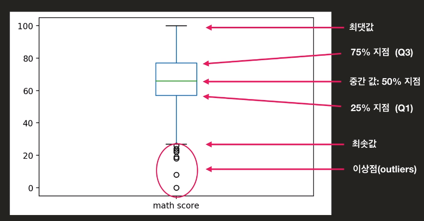
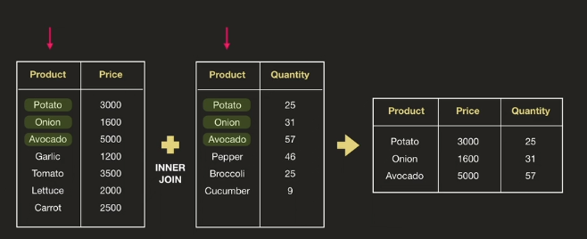
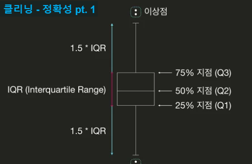

**값은 무조건 인덱스로 접근**

# Numpy

-  python list와 달리 연산시 각 element 끼리.
ex) [1,2,3] * 3, [1,2,3] * [1, 2, 3]
-> 와 같이 리스트와 상수연산, 리스트와 리스트연산이 가능하다, 물론 비교연산자도 가능

- ndarr.shape  //shape리턴, shape[0]  == len(ndarr) -> 길이 의미

- 조회

 idx물론 한번에 접근 가능하다
-> a : b : c, a부터 b-1까지 구간에서 c단계 별로 접근한다, c는 안쓰면 default 1

idx대신해 리스트(bool, idx)를 넘겨도 동시에 접근 가능하므로 반복문을 통해
접근을 안해도 된다.
기령 condition = 리스트 > 100 통해 bool 리스트 얻은후 ndarr[condition] 으로
True부분만 접근.

: 범위기반, 리스트는 특정 값만

- 통계 메소드

ndarr.max(), ndarr.min(), ndarr.std() (표준편차), ndarr.var() (분산)  
np.median(ndarr)(중앙값)

---

# Pandas

**기본적으로 함수로 값건드릴때 return만 되고 안바뀜, 바꾸려면 inplace=True arg 넣기**
**기본적으로 np를 이용해 만든 라이브러리**

- df = pd.read_csv("경로", index_col = 0)
-> 기본적으로 엑설 첫줄을 헤더로 사용한다.  
-> csv에 헤더가 없을 경우 header=None을 쓴다.  
-> index_col=0 은 헤더0번째를 인덱스로 쓰며 헤더의 값들이 index, 헤더이름이 name이된다.

## DataFrame 과 Series공통

- .index, .columns 접근시 리스트로 반환  

- .describe()는 통계 정보  

- .sort_values(by = 'age', ascending =False)  

  df일경우 by로 col 이름을 넘기고, s경우 그냥하면된다.  

## DataFrame

### 조회

-  df.loc[row, col]  
row와 col은 보통 string -> string 데이터 접근 가능   
**보통은 df.loc[condition,'age']로 ~를 만족하는 age를 조회를 많이함**  

- df.columns 와 df.index로 헤더/인덱스 내용확인 가능하다.

-  df.iloc[row, col] //idx로 접근할때

### 값 수정/추가

값수정은 일반 프밍과 동일하며 추가는 map 자료형과 동일한 느낌  
df.loc[:,'name'] = list -> name이 없으면 list가 추가, 있으면 수정  

### 삭제

df.drop(21, axis = 'index') or df.drop('age', axis = 'columns')  
와 같이 1번째 arg에는 원하는곳, 2번째는 그게 index인지 col인지 명시해주어  
해당 index/col을 다 지워 버린다.

### 기타.

- df.rename(columns = {'A' : 'B', 'c' : 'D'}), index나 col의 특정 이름을 바꿔준다

- df.set_index('col_name'), 해당 col전체가 index가 되며 기존 index는 사라진다.

- df.corr(), 모든 col간 상관계수를 return한다

## Series

1차 배열이지만 인덱스가 엄연히 존재한다

- s.unique(), 해당 시리즈내 중복제거하여 종류를 반환
- s.value_counts(), 해당 시리즈내 종류별로 몇개씩 있는지 반환

---

# 시각화, matplotlib

매개변수 틀만 알고, 그래프의 특성을 파악해서 어떠한 type의 col_name을 넘겨야겠다 파악

%matplotlib inline
1. 보통 index를 x축, 특정 col의 값들을 y로 이용된다.
2. x='col_name', y='col_name' 직접 arg넘겨도 편함. (인종에따른 나이)  
->x가 index면 default로 안넘김

원하는 정보들만 df로 추리고 그다음 plot으로 해당 col을 x, y로 사용

## 선 그래프

변화를 보여주기에 유용

- df.plot() 하면 x축은 index, y축은 각 헤더의 값들이 들어고  
여러개가 그려진다.

- df.plot(kind = 'line', y=['kbs', 'sbs',..])    
 한 헤더 or 특정 여러 헤더를 그리려면 y 값에 헤더를 넘긴다.

## 막대 그래프

kind = 'bar'  
카테고리(종류간, index)  비교를 보여주기 위해, index 별로 값들을 막대로 그림

## 파이 그래프

kind = 'pie'  
카테고리(종류간, index)  비율/비교를 보여주기 위해  
파이그래프에는 x축이 없으므로 원하는것을 set_index를 통해 바꾼후 y로 보려는 col의 이름을  
넘겨야 한다.

## 히스토그램

kind = 'hist'  
연속 (-00 , 00) 특성을 가진 데이터를 일정 구간별로 묶어서 분포를 나타낸다  
묶어서 막대로 나오는게 많을수록(bins) 정규분포를 따름  

- df.plot(kind='hist', y='col_name', bins =15)  
여기는 y축을 넘겨도 y축이 해당 값들이아니라 x축이고 y는 빈도가 된다

## 박스플롯

data의 통계정보를 시각적으로 잘 보여준다  
이를 통해 data를 분석할때 어느 한 수치(평균값 같은)만 가지고 판단하면 안된다.

## 산점도

kind = 'scatter'  
두 col의 상관관계를 보여주기에 적합하다.  
(수학점수 - 영어점수)  

---

# 시각화, seaborn

import seaborn as sns  
matplot과 달리 통계를 기반으로한 시각화, 데이터 분포를 보여주기 유용하다.

## KDE plot

Kenel Density Estimation -> 가지고 있는 데이터로 어느정도 추측하여 분포를 그린다.  

- sns.kdeplot(df.loc[:, 'height'])  
알아서 height 헤더의 값들로 확률변수가 되고 그려진다 (y축은 빈도!, 갯수느낌)

- sns.kdeplot(df['height'], df['weight'])  
산점도와같이 상관정도와 좌우로 각 헤더의 분포정도를 알 수 있다.

## sns.violinplot(y=df['col_name'])

box는 요약본을 보여주는 대신 violinplot은 box와 모양 비슷하나 데이터의 분포 또한 보여준다

## sns.distplot(df['col_name'], bins=15)

히스토그램과 함께 pdf도 같이 그려줌

## LM plot

- sns.lmplot(data = df, x='col_name', y='col_name')  
x,y 상관관계 산점도와 함께 회귀선도 그려줌

## 카테고리별 시각화

카테고리(종류)별로 특정 col을 비교할때 자주 사용한다

- sns.catplot(data =df, x='col_name', y='col_name', kind='box')  
x의 값들은 알아서 중복을 제거한다(df[x_col_name].unique()와 같이)  
y는 x의 카테고리별로 알고싶은 특성을 넣어준다  
kind는 어떤 특성으로 보고 싶냐인데 box일경우 각 카테고리를 box로 그려줌(통계값)  
kind - violin, box, strip(데이터 하나하나 찍어줌) -> 레퍼런스 보기  

## sns.heatmap(df.corr())

상관계수에 따른 값들을 시각화 해준다 이때,  
sns.clustermap(df.corr())을 하면 상관계수가 높은거 끼리 묶이는 시각화

## 통계 개념

- 평균값 : 데이터함/데이터수  

- 중간값 : 데이터 갯수의 중간에 있는 값으로 데이터 수가 짝수일 경우 중간의 두수의 평균.

- 상관계수 : 두데이터 간 연관성

- pdf(확률밀도함수) : 값들이 어떻게 분포하는지 나타내며 y축은 빈도, x축은 확률변수값.  
-> 아래 면적이 확률값이다

세상의 모든 데이터는 비슷한 분포를 가진다.

평균값 vs 중간값에서 데이터 분석은 중간값이중요, 잘못된 data의 영향을 덜받기에  
평균값은 이상치가 없을때 좋다

---

## EDA, 새로운 인사이트 도출

### 문자열 처리

- 문자 필터링 : col의 값들 내 특정 문자 있는지 bool 리턴  
filter = df['col_name'].str.contains('특정문자')  
filter = df['col_name'].str.startswitch('특정문자') -> 이경우 특정문자가 앞에 있어야  

- 문자열 분리 : col의 값들 내 문자열을 나눠 나눠진 문자열에 대한 새로운 df 리턴  
newDf =  df['col_name'].str.split(pat = '-', n=1, expand=True)  
-> pat은 나눈 문자기준(default는 띄어쓰기), n은 몇번 나눌지, expand는 새로운 df 리턴할지  

### 시리즈(col 값들)의 값들을 dic처럼 쌍을 지어 다른 것으로 바꿀때

ex) 지역번호를 가지고 지역명으로 바꿀때  
dic = {}를 만들고 (바꾸고자하는거), df['col_name'].map(dic) 하면 바뀐게 return  

###  Groupby

카테고리별(col에 존재) 분석을 편하게 해준다   

Groupby = df.groupby('col_name') 하게되면 col_name에 종류별로 묶이는 groupby형식의 데이터가 리턴 되고 (index로 갔다 생각)  
Groupby.count() -> 각 헤더별 각각 몇개의 종류의 값이 있는지, 예를 들어 브랜드로 그룹했을때 각 그룹별 ram은 몇종류 있는지?  

Groupby.max(), Groupby.min(), Groupby.mean(), Groupby.plot(kind = '', y='col_num')

### 데이터 합치기

1. inner join -> 두 df의 기준 col에서 둘다 있는 값들만 합침

2. left outer join -> 왼쪽 df기준으로 오른쪽 df 에서 왼쪽에 있는 값들에 나머지 정보 붙이는 느낌-> 왼쪽의 df는 순서가 바뀌지 않는다

3. right outer join

4. full outer join

df.merge(df1, df2, on = 'col_name', how = 'left')  
-> how에 left, right, outer 있으면 안쓰면 inner

### 데이터 클리닝

- df.isnull().sum() -> isnull하면 bool df나오고 sum하면 헤더별 nan수가 나온다

- df.fillna(df.median()) -> null에 각 col의 중앙값이 채워짐, 0 or df.mean()가능

- df.dropna( axis='columns')  axis 안쓰면 row, nan가 포함된 axis 지움  
-> 데이터 완결성

- df.drop_duplicates() / df.T.drop_duplicates().T -> 아예 전체 값이 같은 시리즈 제거  
-> 유일성

- 정확성 -> 이상점을 제거한다

q1 = df['col_name'].quantile(0.25) -> 데이터 분포에서 25% 까지인 지점의 값을 리턴  
q3 = df['col_name'].quantile(0.75)  
iqr = q3-q1  
condition = ((q1 - 1.5*iqr) > df[col_name]) |((q3 + 1.5*iqr) < df[col_name])  
df.drop(df.loc[condition, 'col_name'].index)  

---

# 참고

- 조건을통해 condtion을 만들면 그건 row로 생각, row의 범위라 생각

- pandas 연산시  표를 머리에 상상하면서 하면 편한듯

- dic= {key:vlaue, ..} key는 무적권 1개,  value는 list가능  
-> 이걸로 DataFrame만들수 있는데 key가헤더, value가 값들이 된다.

- cell마다 print 찍어봐서 확인해가며 코딩

- 전체 데이터를 ...없이 보려면 어떻게 해야하나?
