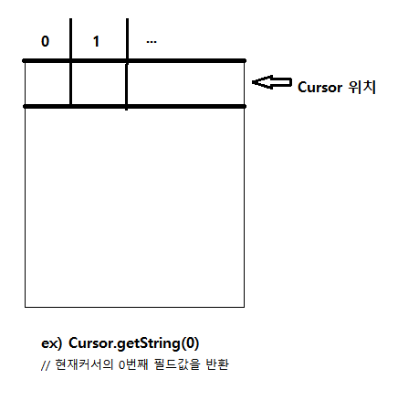

# 안드로이드 기능

## Thread

**쓰레드 코드**
~~~
// 쓰레드 시작이 필요한 부분에 해당 코드를 작성하면 된다.
new Thread(){
  public void run(){
    // 실행하고자 하는 코드 작성
  }
}.start();
~~~

위와같은 코드는 연산을 할때만 사용하며 UI위젯의 내용을 변경코자 할때는 UI쓰레드를  
사용해야한다.(안그러면 앱중지)  
~~~
new Thread(){
  public void run(){
        ...
        //UI를 변경하는 부분에 해당 코드 첨가
        runOnUiThread(new Runnable(){
            public void run(){
                //UI 내용 set하는 부분
            };
        });
  }
}.start();
~~~
---
## Database

**기초개념**  
- 기본키 : 테이블의 레코드 식별자, 기본키 컬럼내 값은 중복불가  
- 외래키 : 다른 테이블 참조를 위해 사용된다.(중복가능)   
 -> ex) 사람테이블(기본키), 주문내역테이블(외래키)    
- 무결성  
 데이터의 일관성과 정확성을 지켜주기위해 기본키의 컬럼값들은 중복이 불가능하며  
 외래키의 경우 중복은 가능하나 기본키 범주에 없는 값인 레코드를 삽입할때 거부난다.  
 부모(기본키있는)테이블의 레코드 삭제경우 옵션에 따라 달라지는데 거절되거나  
 해당키를 가지는 자식테이블 레코드도 연쇄적으로 지워지거나, null값으로 변하거나, default값으로 된다.

- 데이터타입

|type|설명|
|---|---|
|null|null값|
|integer|정수|
|real|소수|
|text|문자열|
|blob|binary large object, 입력데이터를 그대로 저장|

### CRUD
#### 테이블생성

~~~
create table 테이블명(
    필드명 데이터타입 제약조건      // not null, null불가
          ...                     // unique, 중복값불가
    primary key(필드명),
    foregin key(해당필드명) references 타테이블명(타필드명)
);
~~~

#### 조회

~~~
select 필드명1, 필드명2 from 테이블명       // 기본 조회법
where()                                   // 추가적으로 필요에의해
group by()
having()
~~~

#### 삽입

~~~
insert into 테이블명 values(arg, ...)                                // 완전한 record가 들어감
insert into 테이블명(원하는필드명1, 필드명2,..) values(arg1, arg2,..)  // 생략된 부분은 null로 들어감
~~~

#### 삭제

~~~
delete from 테이블명 where(조건)      // where 없으면 테이블 전체 데이터가 날라감
                                     // 단, 테이블 구조는 그대로
~~~

### 추가

- group by 필드명  
//해당 필드로 그룹핑됨, 집계함수 사용시 자주이용
~~~
select sum(필드명) as 별칭
from 테이블명
group by(필드명)
~~~

- 집계함수  
 -> sum(), min(), avg(), count(), max()  
 -> select문에서만 사용가능하다

- having   
 -> 조건문 내용으로 통계함수를 사용하고 싶을때 where을 사용할수 없기에  
 having을 where처럼 사용하며 물론 where과 함께 쓸수있다.
~~~
select 필드명, count(*)
from 테이블명
group by 필드명
having count(*) >= 2
~~~

- 조인  
두테이블을 합치는 개념으로  
1번 테이블 기준 필드와 2번 테이블 기준필드를 가지고 합친다.

**Inner Join**
~~~
// 기준필드별 두 테이블을 서로 매칭시켜 합침
// 기준필드 값중 서로 테이블에서 상대 테이블에 없는 필드값이 있는 레코드는 누락시킨다.
select * from A
innerjoin b
on a.필드명 = b.필드명
~~~

**Outer Join**
~~~
// 어떠한 기준 테이블을 정하고 그 테이블에 다른 테이블의 레코드를 붙이는 느낌
// 이때 A가 왼쪽테이블로 본다
select * from A
left outer join B
on A.필드명 = b.필드명
~~~

### 안드로이드에서 DB사용

**DB관련 클래스 및 인터페이스**

|클래스 또는 인터페이스|메소드|설명|
|---|---|---|
|SQLiteOpenHelper 클래스|생성자|DB생성|
|(DB파일과 테이블 관련)|onCreate()| 테이블생성(오버라이드)|
||onUpgrade()| 테이블 존재경우 삭제 후 다시 생성(오버라이드)|
||getReadableDatabase()|읽기전용 DB열기, SQLiteDatabase 객체반환|
||getWritableDatabase()|읽기쓰기전용 DB열기, SQLiteDatabase 객체반환|
|SQLiteDatabase 클래스|exexSQL()|쿼리문|
|(db객체를 가지고 실직적쿼리)|close()|DB닫기|
||query()|select를 실행후 데이터 커서반환|
|Cursor 인터페이스|moveToFirst()|커서의 제일 첫 행으로 이동|
||moveToLast()|커서의 제일 마지막 행으로 이동|
||moveToNext()|현재 커서의 다음 행으로 이동|

**SQLite DB파일생성 및 테이블생성**
~~~
// mainActivity onCreate 메소드밖에 SQLiteOpenHelper 상속받아 정의
public class myDBHelper extends SQLiteOpenHelper{
  public mydb(Context contex){              // 생성자 정의
    super(conetxt, "groupDB", null, 1);     // arg2 : 생성될 DB파일명, arg4 : 버전
  }

  @Override
  public void onCreate(SQLiteDatabase db){  // 테이블 생성
    db.execSQL("                            
      create table 테이블명(
        필드명 타입
        ...
      );
    ");
  }

  @Override
  public void onUpgrade(SQLiteDatabase db, int oldVersion, int newVersion)
  {
    db.execSQL("DROP TABLE IF EXISTS 테이블명")  // 존재하면 삭제후 재생성
    onCreate(db)
  }
}
~~~

**mainActivity db사용 부분**
~~~
// 위에 코드와 같은 파일
myDBHelper myHelper;
SQLiteDatabase db;
@Override
public void onCreate(...){
  myHelper = new myDBHelper(this);                    // DB헬퍼 객체생성

  //DB초기화 버튼
  클릭이벤트처리 코드{                     
      db = myHelper.getWritableDatabase();            // DB파일을 오픈하여 리턴
      myHelper.onUpgrade(db, 1 ,2);                   // 테이블이 존재하면 삭제후 재생성
      db.close();
  }

  //Insert코드
  클릭이벤트처리 코드{
    db = myHelper.getWritableDatabase();               // DB파일을 오픈하여 리턴
    db.execSQL("insert into 테이블이름 values(...)"); //쿼리문작성.
    db.close();
  }

  //db 조회코드
  클릭이벤트처리 코드{
    db = myHelper.getWritableDatabase();          
    Cursor cursor = db.rawQuery(조회 커리문 작성, null)  //조회쿼리문 작성후 커서반환

    while(cursor.moveToNext())                          // 0번째 필드에 있는 값들을 string A에 저장한다
    {
        A += cursor.getString(0) + "\r\n";
    }
  }
}
~~~

---
# 나중에 다시

- 핸들러
