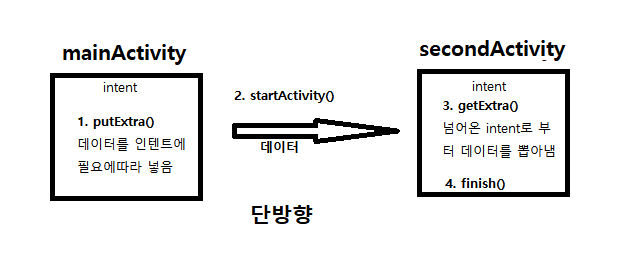
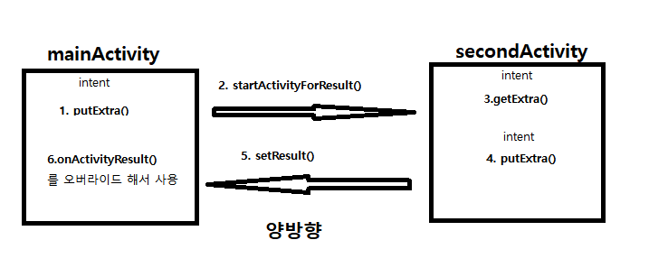
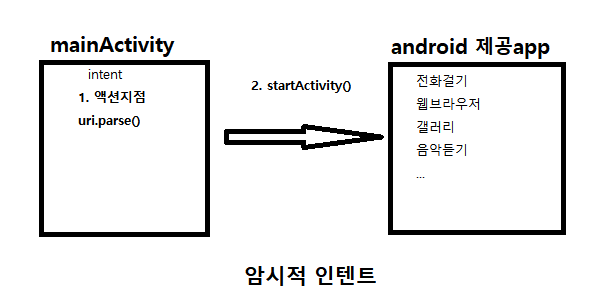
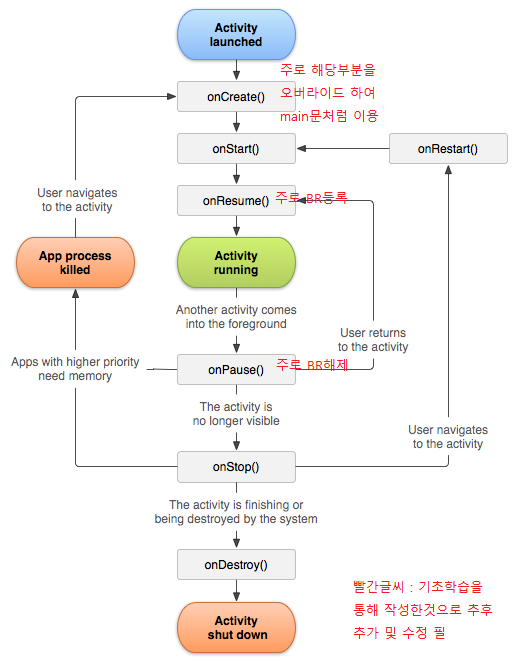
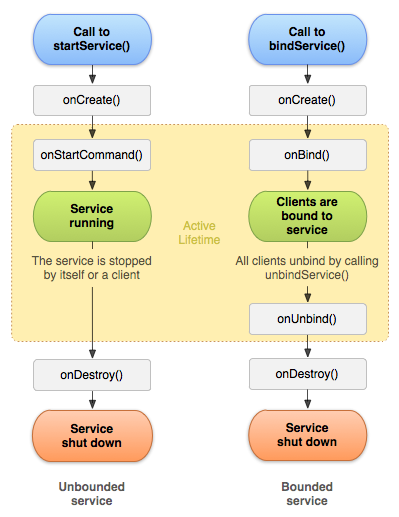
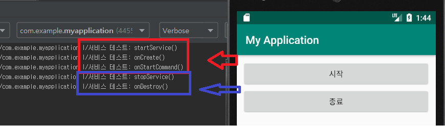
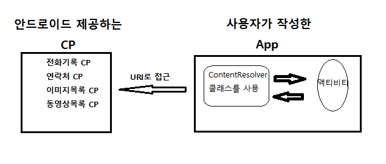

# 안드로이드 4대 Componenet

**생명주기에 따라 코드를 Override필요시 Ctrl+O 단축기를 통하여 선택**

- startActivity()나 startService()와 같은 함수에 intent  
(다음실행할 안드로이드 구성요소와 개발자가 넘기기원하는 데이터를 담을 수 있음)를 넘겨준다.

---

## intent

안드로이드 Componenet는 아니지만 A java class(구성요소)에서 B java class(구성요소)로 실행   
하기 위해선 필요함.  
intent에 필요에따라 데이터를 넣어주고 다음 실행할 Componenet(= java class, Componenet)  
(ex. 다른화면, 서비스시작) 생명주기 요청.

1. Intent intent = new Intent(this, secondActivity.class);  
arg1 : 현재 컨택스트  
arg2 : 다음 Componenet

2. startActivity(intent); (or startService())  
다음 Componenet 생명주기 요청

### 명시적 인텐트

위와 같이 명확히 Componenet를 지정하여(secondActivity.class) 인텐트를 생성한 경우.  

#### 컴포넌트간 데이터 전송

~~~
//보내는쪽(보통 리스너)
int[] voteCount;
string[] names;

Intent intent = new intent(getApplicationContext(), secondActivity.class); //인텐트 객체생성
intent.putExtra("voteCount", voteCount); // voteCount란 이름으로 int arr를 넘겨준다
intent.putExtra("namest", names); // voteCount란 이름으로 int arr를 넘겨준다
startActivity(intent); //다음 Activity 요청
~~~

~~~
//받는쪽 (onCreate)
Intent intent = getIntent(); //넘어온 intent반환
int[] counts = intent.getIntArrayExtra("voteCount"); //인텐트로 부터 정수arr 추출
String[] names = intent.getStringArrayExtra("names"); //인텐트로 부터 문자열arr 추출
~~~

단방향과 개념은 같으면 흐름을 기억해두고 arg는 필요할때 찾아 이용

### 암시적 인텐트

약속된 액션을 지정하여 안드로이드에서 제공하는 기존 응용프로그램 실행

~~~
Intent intent = new intent(Intent.ACTION_DIAL, uri.parse("tel "/911""));
startActivity(intent);

/*
manifest에 권한추가필요하다.
<uses_permission android:name= "android.permission.call_phone/">
*/
~~~

---

## Activity

안드로이드 폰에 나타나는 화면 하나하나를 나타내며 일반적으로 한개의 Activity에  
한개의 xml 쌍으로 존재한다.

Activity를 Class 작성시 Activity를 상속받아 작성.

### 생명주기

생명주기에 따라 생성한 Activity의 함수가 호출된다.

---

## Service

Background에서 동작하는것으로 백신프로그램처럼 눈에 보이지 않지만 생명주기에 따라 동작한다.  
(ex. 음악플레이어 화면에 보이지 않아도 음악이 재생)  
(=데몬 = 백그라운드 프로세스)

### 생명주기

~~~
//Service 예시
public class MusicService extends Service {
    MediaPlayer mp;

    @Nullable
    @Override
    public IBinder onBind(Intent intent) {  // ctrl+i 통해
        return null;
    }

    // 생명주기에 따라 실행되며 ctrl+o를 통해 오버라이드
    @Override
    public void onCreate() {
        android.util.Log.i("서비스 테스트", "onCreate()");
        super.onCreate();
    }

    @Override
    public int onStartCommand(Intent intent, int flags, int startId) {
        android.util.Log.i("서비스 테스트", "onStartCommand()");

        //mp3 작동
        mp = MediaPlayer.create(this, R.raw.song1);
        mp.setLooping(true);
        mp.start();
        return super.onStartCommand(intent, flags, startId);
    }

    @Override
    public void onDestroy() {
        android.util.Log.i("서비스 테스트", "onDestroy()");
        mp.stop();
        super.onDestroy();
    }
}
~~~

~~~
// MainActivity
public class MainActivity extends AppCompatActivity {

    Button startBtn, endBtn;
    Intent intent;
    @Override
    protected void onCreate(Bundle savedInstanceState) {
        super.onCreate(savedInstanceState);
        setContentView(R.layout.activity_main); //main xml을 화면에 띄우는

        //객체
        startBtn = (Button)findViewById(R.id.start);
        endBtn = (Button)findViewById(R.id.end);
        intent = new Intent(this, MusicService.class);

        //이벤트처리 -> 자주사용됨.
        startBtn.setOnClickListener(new View.OnClickListener(){
            @Override
            public void onClick(View v) {
                android.util.Log.i("서비스 테스트", "startService()"); // 태그와 메세지
                startService(intent); // Service시작, onStartService();
            }
        });

        endBtn.setOnClickListener(new View.OnClickListener(){
            @Override
            public void onClick(View v) {
                android.util.Log.i("서비스 테스트", "stopService()");
                stopService(intent);
            }
        });

    }
}
~~~

해당 음악 어플리케이션을 살펴보자.  
서비스는 생명주기에서 onCreate()와 onDestroy()를 한번씩만 호출하게된다.  
처음 음악플레이를 하고(서비스 시작) 종료이전에 또 음악플레이를 하면  
onCreate()없이 onStartCommand()가 실행되고(mp는 쓰레드로 생성)  
종료 버튼을 누르면 한개는 onDestroy()되고 또 종료를 누르면 onDestroy()이 안됨..  
한개 mp가 app상에 떠돌?

---

## BroadCast Receiver

안드로이드 OS가 배터리 방전, 문자도착, 네트워크 환경 변경과 같은 이벤트 발생시   
App에 BroadCast하는데 Receiver는 이러한 메세지에 반응을한다.  
(OS?는 이벤트에대해 수신등록한 app에게 BroadCast한다)  

ex) 배터리관련 이벤트  

|액션|설명|
|---|---|
|ACTION_BATTERY_CHANGED|배터리 상태의 변경|
|ACTION_BATTERY_LOW|거의 방전|
|ACTION_BATTERY_OKAY|방전상태에서 정상수준으로 올라왔을때|

~~~
//Activity
public class MainActivity extends Activity{
  ...
  public void onCreate(){
    ...
  }

  // BR 객체생성(create밖에서)
  BroadCastReceiver br = new BroadCastReceiver(){
    @Override
    // onResume에 등록한 특정액션이 수신되면 onReceive() 자동호출
    public void onReceive(Context context, Intent intent){
      String action = intent.getAction();                               // BroadCast된 intent 내용리턴
                                                                        // 하단에 코드
      if(action.equals(Intent.ACTION_BATTERY_CHANGED)){                 // action 내용이 배터리 상태변화이면
        int remain = intent.getIntExtra(BatteryManager.EXTRA_LEVEL, 0); // intent로 부터 잔량 정보추출
      }
      ...
    }
  };

  // onResume(), 생명주기 따라 실행
  @Override
  protected void onResume(){
    ...
    IntentFilter ifilter = new IntentFilter();        // 필터 객체생성
    ifilter.addAction(Intent.ACTION_BATTERY_CHANGED); // 액션 추가
    registerReceiver(br, ifilter);                    // 특정 이벤트 BR 등록
  }

  // onPause(), 생명주기 따라 실행
  @Override
  protected void onPause(){
    ...
    unregisterReceiver(br);                          // BR 해제
  }
}
~~~

---

## Content Provider

App간에 데이터를 상호공유하기위한 것. 보안상 안드로이드 App은 자신의 데이터만 접근가능하며  
자신의 데이터를 외부에 공개하려면 CP가 필요하다.

직접 작성한 App에서 CP를 작성하고 제공하는 방법도 있지만 실제 사용이나 구성이 조금 복잡  
-> 나중에

### 안드로이드 제공 CP

코드내 getContentResolver() -> ContentResolver 반환 -> query문 날릴수있음

---

- 항상 작성된 java class(구성요소)는 Androidmanifest.xml에 등록되어야한다.  
안할시 os에서 app에 lock을 걸어 중지시킨다.  
<activity(service) android:name =".Class이름"></activity> 태그 등록  
