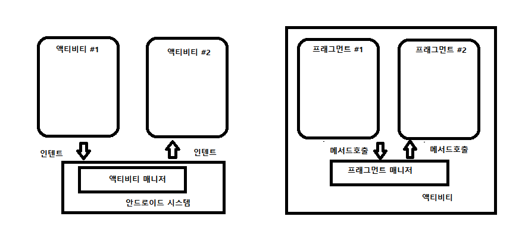
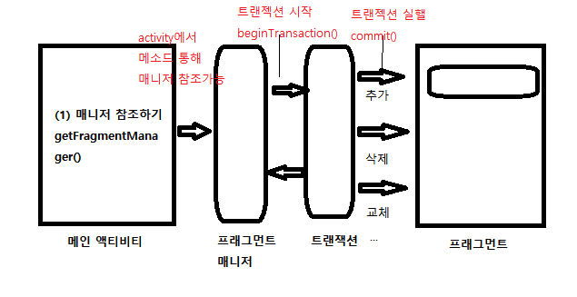
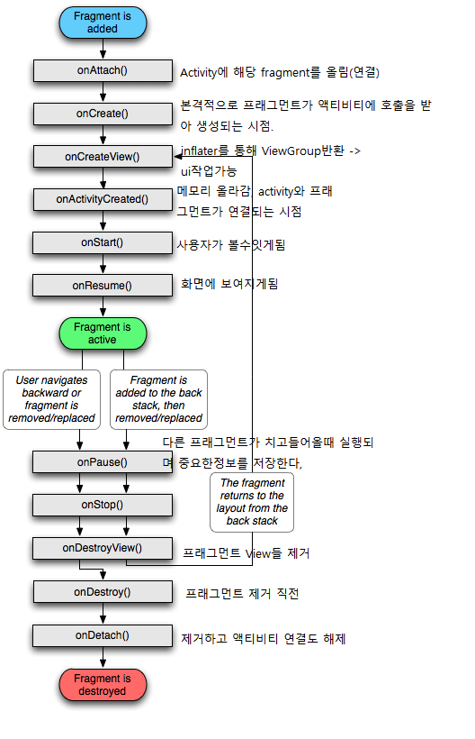
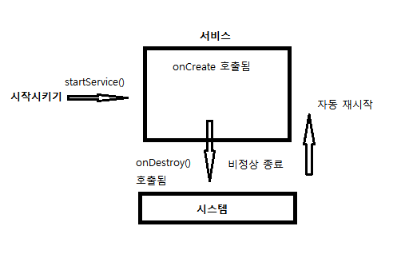
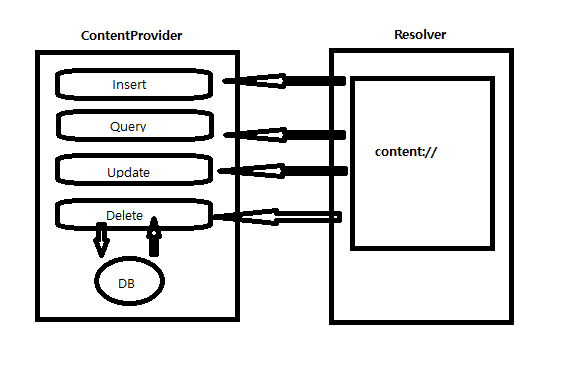
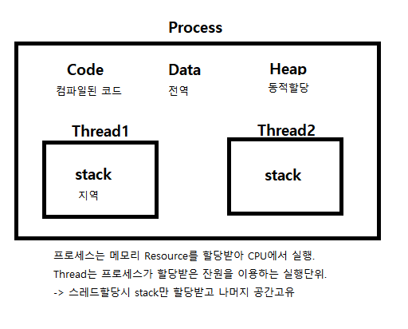
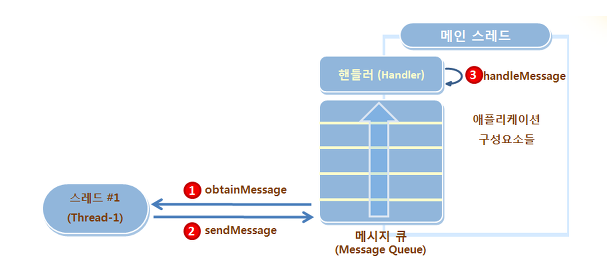
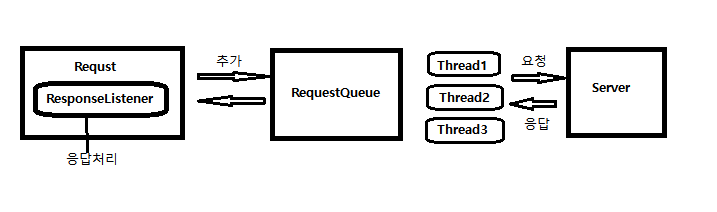
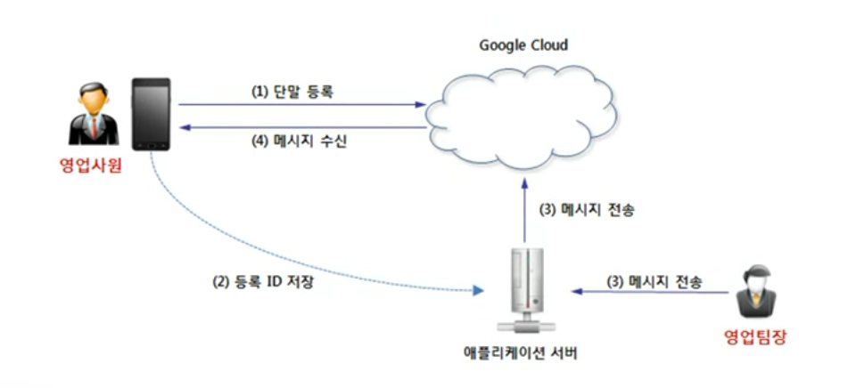

# 안드로이드 개념 2

기본적으로 API가 너무 많다. 저장한 코드보고 필요에 따라 사용하기.  
아래 내용에서는 **전체적 흐름과 개념에** 대해서만 이해

## Fragment

구성 : Fragment java, xml쌍
조그마한 변화로 화면전환을 하기위해 또다른 Activity를 만드는것는 비효율적이므로 하나의 Activity의 **부분화면** 으로써 올라간것  
-> 때문에 Activity의 화면전환보다 훨씬 가볍게 전환효과를 볼수있다.  
**Fragment는 Activity를 본떠 만들었다 -> 독립적 동작**  

  

### 프래그먼트 관리

  

Activity안에서 매니저의 트랜잭션에 의해 Fragment과 관리.  
추가(add), 삭제(remove), Activity에올리기(attach), 변경(replace) 하는데 사용된다.  
-> 즉 트랜잭션이 화면을 관리한다.

### 구현Flow
#### 프래그먼트와 main xml fragment 태그와 연동?
1. main xml에 flagment 사이즈, name(해당 코드에선 name이 해당 플래그 자바 파일과 일치), id지정
2. main acitivity에서 프래그먼트 객체생성  
 ->(manager.findFragmentById, main xml fragment 태그에 대한 정보담긴 객체)

main xml fragment정보가 담긴 객체를 개발자가 작성한 플래그먼트 객체변수에 담는다.  
 -> 그 태그정보와 우리가 지정한 메소드(생명주기)에 따라 Activity의 부분화면으로써 활동.

참고) Activity의 onCreate안에  setContentView와 처럼 fragment는 onCreatView안에 inflate가 되어야 화면에나타나게 된다.  
 inflate.inflate(R.layout.xml파일, container, fasle)하면 ViewGroup(뷰들의 그룹, 한개의 화면이라 생각)  
객체가 리턴되어 각 뷰들에대해 findViewById로 각 뷰들에 대해 접근이 가능하다.

#### fragment 태그안 다른 Fragment 객체 구성으로 변경
위와 같은 방식으로 프래그먼트 태그와 프래그먼트 자바파일을 연결하고,  
원하는 상황에 따라 **트랜잭션** 을 통해 변경한다.  
getSupportFragmentManager().beginTransaction().replace(R.id.mainFragment, menuFragment).commit();

arg1 -> R.id.A  
arg2 -> fragment 객체  
해당 태그의 화면을 fragment 화면구성으로 바꾼다.

### 생명주기
  

프래그먼트는 꼭 Activity위에 올려져있어야하며(attach가 되어야 하며)  
때문에 fragment 객체 생성했다고 onCreate가 호출되는것은 아니다.  
->? 여기서 객체생성의 의미가 new에의한건지 매니저에의해 findFragmentById 된건지?

### Question

- 메인자바에서 매니저에 의해 생명주기 호출?, 어떻게 액티비티에서 프래그먼트를 호출시킬까?
- 각 fragment 마다 메인xml에 태그필요? 크기와 위치만 정할뿐인데 그냥 대체로 못하나?
- main xml의 name과 manager.findFragmentById(R.id.) 객체생성과 차이는 뭘까 저건 객체생성임을 아는데
객체생성과 동시에 onCreate가 실행될까?  name의 역할은 무엇일까?
- replace의 첫번째 arg는 어떤것이 가능하며 이 함수가 이뤄지면 첫번째 arg의 태그 안은 어떻게 바뀌는건가?(프래그먼트 의 xml구성으로 이뤄지는것인가?)

---

## BR, Service, CP

### BroadCast Receiver
시스템이 브로드캐스트하는 메세지를 수신자등록하여 발생시 처리한다.

#### Flow
1. 수신자등록(Manifest)
~~~
<!--리시버 등록-->
      <receiver
          android:name=".SmsReceiver"
          android:enabled="true"
          android:exported="true">
          <intent-filter>
              <action android:name="android.provider.Telephony.SMS_RECEIVED" />
          </intent-filter>
      </receiver>
~~~

2. 이벤트 발생  
시스템은 이벤트 발생시 해당 이벤트에 등록된리시버에게 보내고 해당리시버에서는 onReceive가 호출된다.  
  -> 인텐트가 전달받는데 Intent안 bundle안 String배열로 데이터가 있음 sms경우

3. BR이 처리한것 데이터를 보여주기  
 -> 또 다른 보여줄화면인 Activity를 만들어 BR에서 StartActivity

참고) SMS파싱 코드는 안바뀌므로 저장해서 사용  
또한 SMS수신 같은경우 권한부여가 필요하다!  

**주의!**
- 앱A가 실행되어있지 않아도 BR 도착이 다른 B실행도중 A가 실행될 수 있다.   
 -> BR의 특징이며 어떤 특정상황에서 필요한 작업을 하게한다.
- BR을 포함하는 앱은 반드시 적어도 mainActivity가 한번은 실행 되어야 BR이 작동한다.

#### Question

- 권한에대해서 등록하고 코딩하여 사용하잖슴? 이 코드 없이 접근은 불가?  
 -> 권한을 부여받지 못하면 해당 기능을 수행할수없다.

### Service
백그라운드에서 화면없이 실행되는 요소로 시작하기위해 startService메소드를 이용한다.  

#### 실행원리
  

- 만약 서비스가 이미 실행중이면? Activity에서 startService호출시 서비스는  
이미 메모리상에 올라가 있고 액티비티는 인텐트만 전달할뿐이기에  
onCreate함수는 호출되지 않고 바로 onStartCommand가 호출(-> so 인텐트 처리 코드는 여기에)

- Intene가 null이면? onStartCommand에서 Service.START_STICKY가 반환   
=> 서비스가 비정상 종료의미하며 시스템 자동으로 재시작

### ContentProvider
provider구성 : onCreat, query, insert, delete, update, getType  
앱의 보안 때문에 다른앱의 데이터에 접근할수없다.  
CP는 데이터에 접근통로를 열어주며 DB에 접근하는게 일반적이다.  
**내부 DB를** 다루는 애라고 생각! DB + URI라고

#### CP Flow
1. onCreate부터 시작되므로 여기에 DB파일을 읽어오기
2. 각 CRUD 오버라이드  
 -> switch 속에 URI매처를 이용해 테이블을 접근하고 일반적인 쿼리문 작성하듯이 여기서 정의한다.
3. 수정후 수정된 사항을 알린다.  
 getContext().getContentResolver().notifyChange(uri, null);  
=> ContentValue 객체를 통해 태이블의 속성과 속성값을 한번에 전달

~~~
//key-value로 map에 비하여 유연하 데이터형식을 넣을수있다.
ContentValue values = new ContentValue();
vlaues.put("속성명", "값");
vlaues.put("속성명", 1);
~~~

     

참고) **외부에서** 사용할때는 getContentResolver()를통해
리졸버를 참조하여 외부DB를 조작한다.

#### URI
CP를 만들기 위해선 DB에 접근할수있는 고유값인 uri가 필요  
=> content://Authority(패키지이름)/BasePath(테이블이름)/id(요청할레코드)

~~~
//경로
    private static final String AUTHORITY = "com.example.sampleprovider";
    private static final String BASE_PATH = "person";
    // uri생성
    public static final Uri CONTENT_URI = Uri.parse("content://" + AUTHORITY + "/" + BASE_PATH);

    private static final int PERSONS = 1;
    private  static final int PERSON_ID = 2;

    // URI를 매칭하는데 사용. 메소드인 matcher를 호출하면 addURI중 추가된 URI에서 실행가능한게 있는지 확인
    private static final UriMatcher uriMatcher = new UriMatcher(UriMatcher.NO_MATCH);
    static {
        uriMatcher.addURI(AUTHORITY, BASE_PATH, PERSONS);
        uriMatcher.addURI(AUTHORITY, BASE_PATH + "/#", PERSON_ID );
    }
    ...
    // add된 애들꺼랑 확인, 끝에머리가 반환
    switch(uriMatcher.match(uri)){
      case PERSONs:
        ...
    }
~~~
외부에서 uri가 들어오면 CP에서 uri따른 테이블에 접근하여 수정한다.  

---
## 권한부여

1. 일반권한 : 설치시 물어봄.
2. 위험권한 : 실행시점에서 물어봄.  
-> 권한을 부여 받지 못하면 해당기능 동작안하며 위험권한같은 경우 추가적인 코드가 필요.

권한부여방법은 2가지가있다.
1. 기본적인 방법
2. 외부라이브러리를 이용.  
-> 1번 방법은 코드양이 많기에 외부라이브러리를 사용한다.  
-> 물론 두코드 둘다 저장되어있음.

### 외부라이브러리 Flow
1. 앱수준 GRADLE에 외부라이브러리 추가  
-> implementation 'com.github.pedroSG94:AutoPermissions:1.0.3'

2. Manifest  <uses-permission name /> 을통해 원하는 권한등록
3. main java에 AutoPermissionsListener을 implements하여  
onRequestPermissionsResult, onDeined, onGranted 오버라이드
4. 권한여부 사용 시점에 AutoPermissions.Companion.loadAllPermissions 호출
-> AutoPermissions.Companion.loadAllPermissions -> onRequestPermissionsResult,  -> parsePermission(내부적으로 처리) ->권한부여 결과 따라 onDeined || onGranted 호출

---

## AsyncTask, 그외 쓰레드핸들러

### 스레드와 핸들러의 이해

     

 APP은 단일프로세스로 코드가 순서대로 진행되기에 오래걸리는 부분코드에 의해 UI 멈춤현상이 발생한다  
 -> so 오래걸리는 부분을 스레드로 만든다.

**이때** UI는 메인스레드(UI스레드)가 이미 접근중이여서 다른 스레드가 UI를 건드려면 동기화 문제때문에 오류발생.  
-> 핸들러 객체를 이용하여 스레드가 메인스레드에 메세지를 전달하여 **메인스레드가 처리** 하도록 한다.

### Thread 사용법

    

1. 스레드 클래스 정의(Thread 상속)하여 run함수에 처리할 코드 작성
2. 처리가 완료된 데이터는 메세지큐에 넣어 핸들러가 메인스레드에 전달.
3. 스레드 객체 생성하여 객체.start();

~~~
Message message = handler.obtainMessage(); // 핸들러의 obtainMessage메소드를 이용하여 메세지큐객체를 받고
Bundle bundle = new Bundle();              // 번들을 생성하여
bundle.putInt("value", value);             // 번들에 전하고픈 데이터를 넣음
message.setData(bundle);   
handler.sendMessage(message);              // 핸들러는 메인스레드에 전달
~~~
~~~
class MainHandler extends Handler{                  // 핸들러 클래스 상속받아 재정의
  @Override
  public void handleMessage(@NonNull Message msg) { // handlemessage를 오버라이드
    super.handleMessage(msg);

    Bundle bundle = msg.getData();                  // 넘어온 번들을 가져오고
    int value = bundle.getInt("value");             // 정보를 뽑아와
    text.setText("value 값 : " + value);            // 메인 스레드에서 처리할 내용 작성
  }
}
~~~

**Thread와 Handler 재정의 없이 바로 코드에서 작성법**
~~~
...
Thread(new Runnable{
    //쓰레드 처리 코드
    ...
    Handler.post(new Runnable(){
       // 메인스레드가 처리할부분
       ...
    });
  }).start();
...
~~~
Thread나 Handler를 상속하여 정의할 필요없이 사용.
Handler.post()를 핸들러 역할하여 메인스레드가 처리하게끔하고 new Runnable(){} 객체는 처리할 코드라 생각.

### Looper
메인스레드에서 스레드로 메세지 전달이 가능케한다. -> 핸들러를 이용하는 통로라 생각.  
1. 메인에서 Message객체를 만들어 데이터를 넣고 '핸들러'(클래스정의필요)를 통해 스레드로 전달  
(m.sendMessage 호출시 핸들러클래스에 handleMessage가 호출)
2. 내가만든 스레드 run부분에 Looper.prepare()과 Looper.loop()가 돌고있다.
**약간 코드순서가 헷갈리게 되어있으며 다음에 이어지는 AsyncTask를 통해 쉽게 구현가능, 또한 루퍼 코드 저장되어있음**

### AsyncTask
 핸들러와 쓰레드를 통합하여 만든 클래스라 생각하면 되고  
 스레드를 위한코드 UI접근을 위한코드 부분이 나뉘어 있어 관리와 이해가 편하다.

스레드를 사용하고싶은 부분에서 AsyncTask객체.execute(arg)를 호출하면 실행된다  
이때 arg를 전달할시에 메인의데이터를 스레드로 전달이 가능하다

1.  스레드를 위한코드
- doInBackground -> 내부에서 publishProgress 통해 onProgressUpdate가 수행,
2. UI접근코드
- onProgressUpdate
- onPostExecute
- onPreExecute  //초기화 단계
- onCancelled -> 외부에서 cancel호출시

<doInBackground, onProgressUpdate, onPostExecute>의 arg 자료형

#### Question
- Bundle과 ContentValue의 차이는 뭘까? 둘다 똑같이 key-value같은데 용도가 다른가? 인턴트도 비슷하자나?

---
## Volley, 네트워크
- 2-tier c/s ---서버에 DB를 따로떼어 좀더 유연하게 운용 ---> 3-tier c/s  
- 소켓연결은 UDP, TCP가 있는데 일반적인 프로그래밍에서는 대부분 TCP 사용  
- HTTP 비연결성 -> handshaking이후 한객체 통신이 끝나면 연결을 끊는다.  

**네트워크 사용은 무조건 쓰레드에서 구현되어야함 => 강제성**

### 소켓 통신
소켓에 인풋, 아웃풋스트림객체를 통해 오간다 생각하며 해당
c/s입장에서 인/아웃풋을 판단.

#### Client flow
1. 소켓생성 (IP, 서버포트)
2. ObjectOutputStream(sock.getOutputStream()) 객체 생성 -> 아웃풋이므로 나가는 스트림
3. 아웃풋스트림객체.writeObject(data) 데이터를 넣고
4. 아웃풋스트림객체.flush(); 보냄
5. sock.close();

#### Serverflow
1. ServerSocket이라는 객체 생성 -> client로 부터 통신요청 처리함
2. while안에서 서버소켓.aceept(); -> 받는 소켓 생성
3. ObjectInputStream(sock.getInputStream()) 객체생성 -> 인풋이므로 들어오는 스트림
4. 인풋스트림객체.readObject()

### HTTP 통신
1. url객체 생성
2. (HttpURLConnection)url.openConnection(); ->  HTTPURL객체 생성
3. conn.setRequestMethod("GET"); -> 통신방식설정
4. conn.getResponseCode() -> 요청, 요청응답코드 리턴
5. reader = new BufferReader(new InputStreamReader(conn.getInputStream())); -> 입력데이터를 받기위한 리더 생성
6. 반복문안 String인 ,  line = reader.readLine(); -> 한줄씩읽어와 추가하는듯
7. 연결해제 reader.closer(), conn.disconnect();

### Volley

Http 통신을 하는외부라이브러리를 통해 스레드 관리를 대신한다. -> 쓰레드를 신경쓰지 않아도 되는 장점.
-> 어떻게 보면 더 불편해보이지만 응답으로오는 Json을 Gson을통해 간단히 객체로 변경할수있는 장점이있다.

~~~
StringRequest request = new StringRequest(Request.Method.GET, url, 전송데이터
  new Response.Listener<String>() {   // 반응 성공시 처리코드
    @Override
    public void onResponse(String response) {}
  },
  new Response.ErrorListener() {      // 실패시 처리코드
    @Override
    public void onErrorResponse(VolleyError error) {}
  }){
      //http통신의 헤더나 그런거 넘겨주는거
       @Override
       getParams() //요청 파라미터 설정
       getHeaders() // 헤더에 값을 넣으면 http요청시 헤더가됨
       getBodyContentType
      }
    };
~~~

응답성공시 처리하는 코드에서 arg로 넘어온 response는 json응답으로 이를 Gson() 외부라이브러리를 통해
처리한다
~~~
Gson gson = new Gson();
MovieList movieList = gson.fromJson(response, MovieList.class); // json을 객체로 변환시켜줌
~~~

MovieList클래스는 따로 파일로 class정의가 필요하며 json 속성이름이 변수이름 값의 자료형의 변수의 자료형이 되어야한다.
만약 값이 객체면 이또한 객체로 만들어야한다.  
-> 대괄호 하나당 한개 class라 생각
{boxofficeResult : {boxofficeType, ...}} 두개 클래스론

### Question

Q1. Async도 스레드 두번 시키면
하나 종료후 하나는 종료 못하네?
->전역변수하나

Q2. RelativeLayout 두개는 못쓰나?

Q3. 쓰레드(따로 상속받지 않고 바로) 객체생성시 매개변수로 new Runnable()과
->이건 쓰레드가 처리할내용
Handler.post(new Runnable)의 차이는?
-> 이건 메인쓰레드가 처리할 내용

핸들러 포스트 뉴 런네이블은
핸들러 클래스를 정의안해줘도 되고
또 메세지큐로 담고 빼는 과정 필요없으며
러네이블이 메인스레드에서 작동하는걸로 알고있음
---
## 푸시알림

### 알림 Flow
-> 구성 : 매니저, 빌더, 인텐트, 펜딩인텐트
1. NotificationManager manager = (..) getSystemService(NOTIFICATION_SERVICE); // 매니저 객체
2. NotificationCompat.Builder builder = new NotificationCompat.Builder(context); // OS따른 빌더생성필
3. 인텐트 생성
4. PendingIntent pendingintent = PendingIntent.getActivity(this, 101, intent, PendingIntent.FLAG_UPDATE_CURRENT);  
 -> 인텐트와 유사하지만 원하는 상황이 만들어졌을떄 시스템에 의해 해석되고 처리됨
5. builder.setContentIntent(pendingintent), builder.setAutoCancel(true); 등 빌더 설정
6. Notification noti = builder.build() // 빌드
7. manager.notify(id, noti);  // 알림
** 알림 스타일은 여러개 있으니 그때그떄참조해서 사용

### FCM PUSH 알림

1. 수신단말 cloud에 등록ID 얻어 앱서버에 알림
2. 앱서버, 메세지를 보낼때 등록ID들의 정보가져와 구글cloud(이때 앱서버는 구글의 key를 알아야한다)와 http 통신(volley)
3. 구글서버가 수신단말에 메세지 보냄

#### 수신 단말 flow
**수신단말 설정주의!!**  
->인텐트필터를 잘못넣어서 헤맴  

1. 홈페이지에 나온 설정그대로 해주고
2. 내가 사용하는거 gradle에 외부라이브러리 추가. 메세지와 같은..
3. FirebaseMessagingService 상속한자바  
 2가지 오버라이드  
 - onToken(Sring token) // 앱이 구글에 등록될때 호출, 토큰(이미 만들어져있으면 ㄴ)
 - onMessageReceived(메세지) // 메세지를 받을때 호출되는 함수
4. main 자바 작성  
// 등록id확인후 리스너설정  
FirebaseInstanceId.getInstance().getInstanceId().addOnSuccessListener(this, 리스너 오버라이드)  
 -> OnSuccess가(오버라이드) 실행된다.

#### 앱서버(어플이라가정)
**Volley를 이용한 http post방식 통신(헤더에 cloud 키가 들어감)**  
1. request를 만들고
2. 이 request를 RequestQueue에 넣으면 통신완료.

#### Question
- uri를 알면 아무나 이러한 데이터 조작을 할수있음?
- 서비스가 있는 어플을 종료시키면 어떻게 살아있을까?
- 디버깅은 log찍어서만 하나 ? -> 로그캣하고 세부적인거는 중단점 찍어서 shift + f9
- gradle같은거 변경되면 재설치 필요.

---
## Tip

- id, @+id/ddd R class에 ddd가 등록된다  
- res/values에 strings.xml에 text 등록후  레이아웃 text 쓸때 @string/을 이용해서 사용  
- interface class가 정의되면(추상메소드집합) 이걸사용하는 클래스에선 메소드를 정의해야함, instancof는 조건문에 주로 사용되며 연산결과로
true를 얻었다는것은 참조변수가 검사한타입으로 형변환이 가능하다는것을 뜻한다.
- manifest : 앱의 구성요소, 권한 등 시스템에 알려줌
- 리소스 갱신되면 그때마다 R.java파일에 등록되며 리소스에대한 내부적 포인터 정보를 가지고있다.
- 그래들 : 빌드 및 배포도구
=> apllicationId : 앱의 id값(앱은 id로 구분되므로 전세계에서 유일한 id필요)
     compileSdkVersion : 어떤 sdk버전?
     minSdkVersion : 최소
     targetSdkVersion : 검증된 sdk버전
     dependencies : 외부라이브러리를 implementation으로 추가
- 인텐트보낼때 액티비티가 이미 올라가있을때
~~~
// activity가 이미 활성화 되어있을때 인텐트를 전달받을경우 처리방식
// activity 코드
@Override
protected void onNewIntent(Intent intent) {
    processIntent(intent);
    super.onNewIntent(intent);
}
// 보내는 Intent쪽에서는
// 캐스트 수신자는 화면이 없으므로 인텐트 플래그로 FLAG_ACTIVITY_NEW_TASK를 꼭 추가 해야한다
// SMS액티비티가 이미 메모리에 올라가 있을때 액티비티를 중복생성하지 않도록 FLAG_ACTIVITY_SINGLE_TOP이 있어야한다.
myIntent.addFlags(Intent.FLAG_ACTIVITY_NEW_TASK | Intent.FLAG_ACTIVITY_SINGLE_TOP | Intent.FLAG_ACTIVITY_CLEAR_TOP);
~~~
