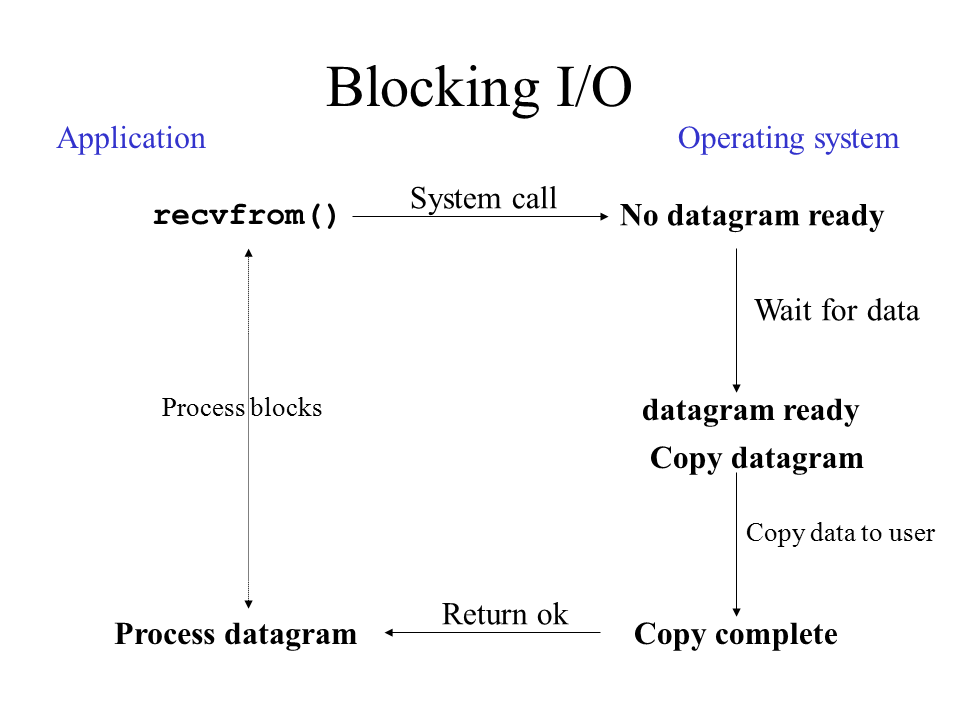
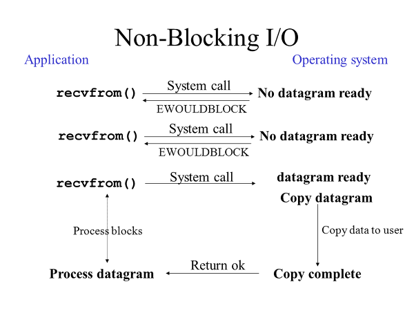

# 네트워크 프로그래밍

## 1. 소켓

네트워크 프로그래밍 : 네트워크로 연결되어있는 서로다른 두 컴퓨터가 데이터를 주고 받을 수 있도록 하는것.  
소켓 : OS에서 제공하는 네트워크  데이터 송수신이 가능케 하는 장치  
  -> **소켓 내부적을 buf 존재하며 소켓또한 파일이다.**

### 소켓 Flow
#### 서버소켓 처리
1. int socket (int domain, int type, int protocol)  
2. int bind (int socketFD, sock_addr * addr, addrlen) // 전화기설치
3. int listen(int  sockFD, int backlog)               // 연결가능한 상태로 변환
4. int accept ( int socketFD, 클라이언트 주소정보, addrlen) // 연결요청에대한 수락

#### 클라이언트 소켓 처리
1. 소켓생성
2. int conenct (int sockFD, 서버주소, addrlen)          // 연결요청

### 각 함수 처리

#### int socket (int domain, int type, int protocol)  
소켓생성  
return : 성공시 FD, 실패시 -1  
arg1 : 소켓에서 사용할 protocol 체계(부류, 스파게티(알리오,크림))  
arg2 : 타입, 소켓데이터 전송방식  
1. 연결지향형(컨베이어 벨트)  
 -> 순서대로, 무적권옴(신뢰), 데이터간 경계없음, 1:1  
if buf가 차면? 보내는놈이 참음 전송을안함 -> 손실안남
2. 비연결지향형(각기다른 퀵서비스)  
 -> 순서상관없이 가장빠른전송지향 but 손실우려, 데이터경계존재  
 한번에 보낼수있는 데이터 크기 제한.

arg3: 두P가 사용할 protocol(서로 어떤식으로 데이터를 주고 받을지)

**연결요청큐에서 뺄 요청이 있을때까지 기다린다!**

#### int bind (int socketFD, sock_addr * addr, addrlen)
전화기설치, 주소를 바인드
~~~
// 주소체계
struct sockaddr_in{
sin_familly     // 주소체계
sin_port        // 포트번호, 16bit, 0~1023는 well-known port로 그이후꺼를 사용해야함
sin_addr        // IPv4, 4byte
}
~~~

##### 주소 저장시 주의사항**
cpu 마다 정수1 저장방식 다를수있음  
00000000 --- --- 00000001  
00000001 --- --- ---  
so 저장순서가 다르다는것은 통신시 해석순서가 다를수있음  
**(통신은 낮은 주소부터 전송함)**  

백엔디안바이트 : 낮은주소에 최상위비트를 저장  
리틀엔디안바이트 : 반대로  
**송/수신 통신시 백엔디안으로 하기로 결정**  

htonl(INADDR_ANY);  //자동으로 ip 받아 백엔디안으로  
inet_addr(string);   // dot 형식 ip를 정수로  
htons                 // port 변환  

#### int listen(int  sockFD, int backlog)
**temp**

#### int accept ( int socketFD, 클라이언트 주소정보, addrlen)

return client에 해당하는 소켓FD  
**서버!!!**
=> 이 연결된 상태에서 client소켓 FD에 글을 쓰면 서버로 전송이된다.

#### int conenct (int sockFD, 서버주소, addrlen)
**Client가 서버에게 연결요청**
소켓을 생성할때는 서버|클라이언트 소켓이 구분되지 않는다  
구분은 그이후 소켓이 바인드,리슨 함수를 호출하면 서버소켓  
커넥트를 호출하면 클라이언트 소켓.

### 소켓종료

소켓종료
양뱡향 통신(한소켓에서 읽고쓰고 다할수있음)에서 한놈이 일방적으로 close 하면  
딴놈이 보내는 데이터 수신 불가 so **half-close**  

소켓통해 두 호스트연결되고 둘사이 스트림(물이 한쪽으로 흐르는)이 형성  
close를 호출시 이 스트림이 입/출 다 없어지고  
shoutdwon(FD, howto) 로 한곳만 가능  

### 소켓종류

1. 블로킹 모드  
시스템 콜이 호출되었을때 네트워크 시스템 동작이 완료될때까지 해당 시스템콜에서 프로세스가 멈춤.    
-> 비동기적인 작업이 불가능  
-> 1:1 통신이나, 프로그램이 한가지 일을 수행하는 경우에 사용  

2. 논블로킹 모드  
시스템 콜에 대하여 네트워크 시스템이 즉시 처리할수없는 경우에도 시스템콜이 바로 리턴되어 프로그램이
block되지 않게 처리.  
->시스템 콜이 성공적으로 실행될때까지 계속 루프를 돌며 확인하는 폴링 작업을한다.  
-> 통신상대가 여럿이거나 여러작업이 병행된다면 논블로킹, 비동기모드를 사용해야한다.  

---
## 2. 파일관리, 멀티플렉싱

P생성 -> 리스소스차지, IPC(파이프 개념) 다소 복잡..  
-> 그럼 어떻게 p생성안하며 다수 client에게 서비스를 제공할까?  
-> IO 멀티플렉싱 서버  

멀티플렉싱 : 한개의 프로세서가 두 군데 이상의 클라이언트로부터 데이터를 읽어야하는 상황에서 사용

ex) 학급에 비유  
손을든 아이가 있으면(Client 소켓) 선생님(Server P)이 확인하고    
그채널을 통해 데이터 송/수신  

** select는 선생님, fd_set은 학생들(관찰대상)  
-> fd를 한데 모아두고 이들을 동시에 관찰가능  

관찰항목 list  
1. 수신한 데이터 존재여부 (나의 기준으로 누군가 FD에 wrtie하여 내가 읽을수 있을때)  
2. 블로킹되지 않고 데이터의 전송이 가능한 소켓은 무엇인가?  
(내가 지금 여기에 뭔가 보낼수 있는 fd)  
3. 예외 상황이 발생한 소켓은 무엇인가?   

### FD_SET 개념

#### FD
**FD는 OS소유이다!**  
FD란? 유닉스시스템에서 소켓, 디바이스 등 상관없이 모든 열려있는 파일(모든것을 파일이라고함)을 참조할때 쓴다.  
-> 열린파일의 목록을 관리하는 테이블 인덱스개념  
FD를 할당할때 사용하지 않은 FD값중 가장 작은값을 할당

- 파일관리  
open(path, mode)  
close(FD)  
write(FD, * buff(전송할 데이터 버퍼주소값), 전송할 바이트수)  
-> write호출시 바로 통신 되는것이 아니라 소켓의 쓰기 버퍼에 담긴상태로 원격에서 읽기 버퍼에 데이터를 쌓을수 있을때 통신한다.  
read(FD, 수신할버퍼주소값, 수신할 최대바이트)  
=> 이는 소켓에서도 동일하다!  

#### FD_SET

목적에 맞게(읽거나 쓰거나..) 구성한 fd의 세트. fd는 고유값이기에 비트연산을 이용해 효율적으로 저장한다.  

##### fd_set 개념

비트연산을 통해 효율적으로 정수들을 저장.   
가령 01234567 8개의 정수 저장시 각 4byte씩 32byte의 크기가 필요.

**but 비트집합으로 저장한다면?**  
.. ㅁ ㅁㅁㅁ ㅁㅁㅁ ㅁ ..
   7  6  5  4  3  2  1  0 -> 해당 정수에 해당하는 비트 자리에 1을 setting 하여 저장
=>  
 0 : 1 << 0  
 1 : 1 << 1  
 ...  
 7 : 1 << 7  

**참고**
32bit 시스템은 int 선언시 정수형을 32bit(4byte)로 저장하기때문에
1byte로 묶어도 되지만 32bit 시스템은 4byte 연산이 빠름

fd를 비트집합으로 묶을때 32개씩 묶으며, 즉 int 배열로 선언된다.  
즉 32배수로 값을 나누어 저장(0 ~ 32*n -1)

**내가 fd값이 n인것에 접근하려면?**  
data[n//32] 로 접근

**해당 fd 자리에 비트세팅은?**  
data[n//32] = 1<<(n % 32)

##### FdSet을 쉽게다루는 매크로

- FD_ZERO(&fd_set);  
-> fd_set을 초기화 -> 모든 비트를 0 으로  

- FD_SET(socket, &rdfs)  
해당 단일소켓값을 fd_set인 rdfs변수 해당값에 비트1 세팅  

- int select(int maxfd, fd_set * readset, fd_set * wrtieset, de_set * except, timeout)  
-> return 성: fd수, 오류 : -1, timeout : 0  
arg1 : 검사 대상이 되는 fd수  
-> 관찰범위, fd는 순차적으로생성됨? 즉 한개 생성마다 fd값이 1 증가  
=> 가장 큰 fd 값에 +1 하면됨 because FD는 0부터  
arg2 : 수신된 데이터의 존재여부 대상인 fd들  
arg3 : 블로킹 없는 데이터 전송의 가능여부 대상인 fd들  
arg4 : 예외상황의 발생여부 대상인 fd들  
arg5 : time out  

=> select는 관찰대상의 변화(이벤트)를 살펴보는것이다.  
timeout되면  return 0  
변화란?  예를 들어 arg2 에 속한 fd들중 수신된 데이터가 존재하는경우  
fd가 변화 했다를 의미  
-> 변화가 발생하면 fd_set이 바뀜  
select 이후 모든 비트 0으로 바뀜!(변화가 없는 경우)  
! 다만 변화가 있는 fd는 1 그대로 있음  

ex)  
fd0   fd1   fd2   fd3  
0      1        1      1     ...  
select  
0     1         0       1  
-> fd1, fd3이 timeout내 변화가 있었다.  
(select는 timeout동안 블로킹)  

이를 FD_ISSET(fd, * fdset)으로 반복문을 통해 확인하고  
있을시 처리

- FD_ISSET(p_sock->sockfd, rmask)  
해당소켓번호가 rmask에서 변화가 존재하는지?

**이게 한싸이클! 계속하여 fd를 관리할때..**

## 3. 멀티프로세스

멀티프로세스 : 하나의 프로그램 실행시 여러개의 프로세스 생성  
장점 : 여러 개의 자식 프로세스 중 하나에 문제가 발생하면 그 자식 프로세스만 죽는 것 이상으로 다른 영향이 확산되지 않는다.  
단점 : context switching, 복잡한 ipc통신(변수공유가 어렵다, 다 다른 메모리영역이기에)  

PID : OS로 부터 할당 받음 (1은 os의 실행을 돕는 P(기본), 2이상)  
pid_t fork(); // child process 생성  

fork호출시 현재 P가 완전복사되어(복사본이 메모리영역까지 동일하게 복사됨) 새로운 p가 생성, 이후 두P 모두 fork() 호출이후 코드가 실행

이때 fork의 반환값은  
pid = fork()  
부모경우 child p의 pid를 얻게되고  
자식의경우 0을 갖게된다  
->so  fork 이후 코드는 if 조건 pid 를 이용해 작성한다.  
(코드안에 pid를 0과 그것을 아닌것으로 child와 부모를 구분하여 처리한다)

### 좀비프로세스

main이후 죽어야하는데 죽지않고 살아서 리소스를 차지하는애들

#### 생성이유
자식P main 종료시 return n이나 exit(n) n을 OS에 전달하며 소멸되야함  
근데 자식프로세스가 소멸되려면 os로 부터 부모 P에게 n이 전달되어야한다.  
-> 부모P가 자식프로세스 리턴값 n을 받겠다고 OS에게 적극성을 보여야함  

#### 어떻게 부모P가 적극성을 보이냐?  

-> 아래 함수를 이용하여 (두죵류)  
1. pid_t wait(int * state) // 자식P가 종료될때까지 **블로킹(멈춤)**  
return 성 : 종료된자식pid, 실 : -1  
arg1 : 로 전달된 변수에 자식P의 return값 n을 저장한다.  

이후 state에 다른 정보도 들어잇으므로 매크로를 이용하여

~~~
if(WIFEXITED(state)) // 정상종료인지?
{WEXISTATUS(state)} // 반환값.
~~~

위 두함수를 통해 n값을 활용.

2. pid_t waitpid(pid, * state, option)      **ar3의 옵션을통해 NB가능**  
-> return  성:pid 실: -1  
arg1 : 종료하고자 하는 pid, -1 넣을시 임의 child p  
arg2 : 종료된 자식의 정보값, return값  
arg3 : WNOHANG 인자전달시 종료된 자식p가 존재 안하더라도 0을   
반환하고 빠져나옴 **(블락킹 없음)**

#### NB경우 언제 CHILD P 가 종료될지알고 waitpid를 계속 호출해?

**solution -> 시그널(단지 알려줄뿐, 함수를 통해 waitpid해주자)**  

P : OS야 자식P끝나면 zombie_handler(내가 정의) 함수 호출해줘  
등록시켜야함, **OS에 자식프로세스가 return할시 처리하는 이벤트 설정(콜백함수, 함수포인터)**  
-> How  

- signal(특정상황정보, 그상황이 일어날시 실행할 함수포인터)  

arg1 : 상수,  SIGCHILD(자식p종료시알림), SIGALRM(알람호출통해..)  
arg2 : arg가 int하나, 반환형이 void인 함수이여야한다  
-> 특정상황이 SIGCHILD시 자식P 의 return n이 여기 함수로 들어감(state)  

**signal이 오면 main이 sleep 중이더라도 sleep에서 깨어나오게된다(다시 sleep으로 가지 않음)**

!!문제점 : signal은 unix계열 os간 차이가 있기에  
안정적인 sigaction 사용  

- int sigaction(int signo, const struct sigaction * act, struct sigaction * oldact)  
 -> return 성 0, 실 -1  
arg1 : 시그널정보  
arg2 : 호출될함수  

~~~
struct sigaction{
(void)(* sa.handler)(int); //fp
sigset_t sa_mask;
int sa_flag                     //시그널 관련옵션, 필없다면 0
}
~~~
-> 초기화  
act.sigaction = fp;  
act.sa_flag =0;  
arg3 : 이전등록한 fp얻는데 사용되는 인자, 필요없다면 0  

---

## 4. 유닉스 계열 pthread

장점 : 메모리 공유  
단점 : 동기화 문제  
-> 실전에서 보통 소켓처리, 파일처리와 같이 오랜시간이 소요되는곳에 쓰레드를 할당시켜 실행한다.

1. 생성

~~~
void * t_fuction(void* data)
pthread_t A;
pthread_crate(&A, NULL, t_fuction, (void*) "Thread1")
~~~

2. 종료

3. 뮤텍스  
 -> 공유자원을 관리하는 (크리티컬섹션)
~~~
pthread_mutex_init(&ipc_mutex, NULL)
pthread_mutex_lock(&ipc_mutex)
    criticalSection
pthread_mutex_unlock(&ipc_mutex)
~~~
