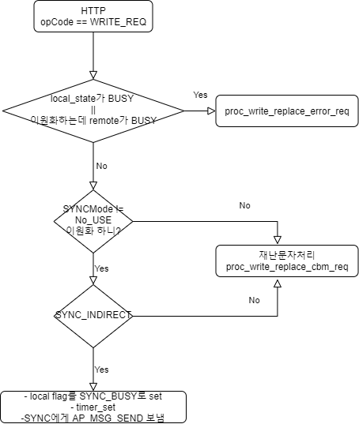
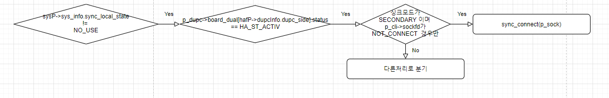
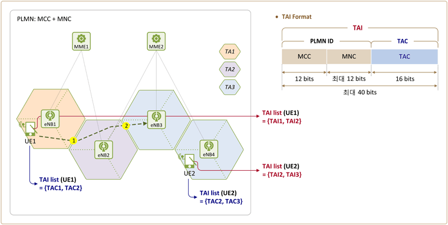

## pool에 대한 개념
=> 말 그대로 풀이며 Linked_List로 이뤄져있다. ctrl이 pool들을 관리한다.  
cf) ipcmsg의 첫 4byte는 항상 cbm_pool ID.  

**poolID를 가지고 ctrl에서 Link[id].occupied된지? 그리고 pool + pool_id * pool_size(ctrl멤버)로 접근**

### pCbmPoolCtrl (관리자, element관리, sysPool과 관련)  
 - element의 사이즈는 어떠며 사용한건 몇갠가
 - 사용하지않은 **head_idx** 는 뭔가 (새로운 pool 생성시 poolId가된다)
 - 이러한 리스트를 link[해당idx]에서 (back, occupied, next/ Linked)  
   -> 나중에 id를 가지고 pool에 접근시 occupied되어 있어야한다.  

### pCbmPool
~~~
p_cbm_pool{
  from
  cbm_pool_id
  mmeRspNum
  http.msgIdChar
  http.areaCnt
  http.areaList
  http.tacCnt
  http.tacList
  cbm_mme_pool_id       // 또 cbm_mme_pool_id가지고 mmeCtrl확인 및 해당 풀에 접근
}
~~~

### 어떻게 Ctrl에서 Pool을 새로 생성할까?
1. pool_id = sp->free_head
2. p_link = sp->list + pool_id
3. sp->use_pool_num++                         // ctrl 내용 갱신  
    sp->free_head = p_link->next  
      ...   
    p_link -> occupied = true    

4. sp->link[sp->used_tail].next = * pool_id   // 링크연결  
   p_link->back = sp->used_tail  s
   sp_used_tail = * pool_id  

---

# CBPP
->  
메세지 Decode, 메세지에대한 cbmPool체크, 이원화여부(sysConfig에서 확인)에 따라 로직 분기,
CBCB에 ipcmsg

**전반적인 처리흐름**  
1. 수신할 데이터가 있는 소켓중 ClientConnected, state가 connected인 소켓(NB소켓이며 완전수신되면 처리)
2. 소켓을 **decode** (http 구조체에 저장)  
  2.1. opCode가 req경우  (다른경우는 다르게 처리)  
  2.2. http_msg_t의 msgid, areaList, 문자내용을 메세지 팝업 이벤트발생 및 구조체에 저장  
3. http_msg_t의 msgId와 sock_t의 cbeid를 이용해 기존 **cbm_pool 존재하는지 확인(있으면 ERR)**
4. **새로운 Pool추가** (p_sock의 cbeid와 sockfd, http의 내용 넣음)
5. **CBCB에 ipcmsg**

## 이원화에 따른 처리 로직(CBPP에서)

**체크사항**  
- sysP->sys_info_sync_**local_state**
- sysP->sys_info_sync_**remote_state** (SYNC_BYSY || SYNC_IDLE)  
   -> 두개의 국사 운영에 따른 **서로의 상태확인**
- sysConfig->SYNCMode (SYNC_NO_USE || PRIMARY || SECOND)  // **이원화 사용여부**
- sysConfig->isSyncDirect (SYNC_INDIRECT || DIRECT)       // 의미궁금함

**CBPP-SYNC간 무슨얘기?** -> 보내도댕?  
decode후 이원화 할경우에만 sync에 AP_MSG_SEND 메세지 보냄

## Auth CBE
-> proc_write_replace_cbe_req()에서  
proc_cbe_auth(p_sock, p_http)를 호출 auth가 타당한지 확인한다.

**이미 정당한 cbe에 대해서는 tblP에 저장되어있음**

1. http로부터 cbis_key_name(함수내 선언된 변수) 처리 로직에 따라 처리.  
2. 전체 CBE 완탐  -> tblP->private_key[i]가 occupied 되어있고  
                  cbis_key_name == tblP->private_key[i].cbe_name 인 것을찾아  
		              buff에 tblP->private_key[i].key (해당 키를 넣음 )  
3. buff += p_http->publicKey;  
4. md5 auth -> md5(buff, strlen(buff), md5Key); 호출하여 md5Key에 buff를 해쉬하여 저장  
5. cbe_tbl_idx는 호가유입된 ip정보를 이용하여 CBE table에서 찾아냄  
(find_cbe_by_ip)
6. 각각의 타당하지 않는 auth 경우에 따라 if를 걸어 ERR를 return하게끔 정리됨

## 참고사항
###  변수

**메세지 처리관련된**
~~~
struct sock_t{
  fd          // 소켓 fd
  buff        // http로 던져진 실제 데이터
  state       // initializing, connecting, connected(연결상태)
  ipaddr      // 보낸놈ip, 이것을 가지고 tbl통해 **cbeID** 알 수 있음  
  cbeid
  cbe_tbl_idx
  ...
}

struct http_msg_t{
  opCode          // cbe가 어떤 요청을 한지?
  msgIdChar   
  msgId           // 추후 cbm_pool 구분에 사용
  msgType         // AREA_TYPE, TAC_TYPE
  areaList[]      // areaId들  
  tacList[]       // tac들
  msg             // 메세지 내용
  resultCode      // S/F
}
~~~

**SYNC와 소통하는 ipcmsg 구조체**
~~~
struct msg_sync_t{
  msgtype              // SYNC_MSG_SEND, ..
  sessionID            // CBPP의 소켓 fd
  result               // SYNC_RESULT_NONE, IDLE, BUSY, NOTSEND, TIMEOUT
}
~~~

- tbl변수는 AreaId등 DB에 저장된 내용

---

## SYNC

이원화 하는경우에만 실질적으로 동작

1. CBPP-SYNC간 무슨얘기? -> 보내도댕? 이원화 할경우만 AP_MSG_SEND(<-> AP_MSG_RESULT) 얘기  
decode후 이원화 할경우에만 sync에 메세지 보냄  

2. SYNC-타SYNC간 무슨얘기?
(g_svr_sock, g_cli_sock)  -> 누가 재난문자 처리할지?

**소켓통신이든 ipcmsg든 항상 msg_sync_t로 얘기한다**

=> 결론적으로 목적은 현재 나와 타국사 상태가 메세지를 처리중인가 대한  
sysP->sys_info.sync_local(|remote)state 관리위해서

### g_svr_sock

**Primary가 즉 server역할**
sync를 init할때 전역변수에 할당되며, 자기자신 ip 바인드 및 listen까지만한다.  
**accept는!**  main에서 rmsk에 변화잡힐때(요청이 들어올때) accept하고 return값을
(accept된 소켓 fd == ClientConnected Socket)을 **g_cli_sock->fd!**

### g_cli_sock
**해당 국사가 Primary이냐 Secondary냐에 따라 다르게 fd를 얻는다.**

1. Primary경우(서버역할)
자신의 g_srv_socket으로 연결요청들어올시 accept된 fd값, 즉 ClientConnectedSocket  
fd을 가지고 있는다.(main에서 처리)

2. Secondary경우(클라이언트역할)
ipcmsg로 SYNC에 AP_TIMER_TICK을 받을때 fd값이 결정됨(ipcmsg처리부분에서 처리)

- sockfd = sysOpenClientSocketTimeout(sysConfig->SYNCPeerIP1, sysConfig->SYNCPort, 2)
 -> sysConfig에 있는 peer의 IP와 PORT를 이용하여 NBClient Socket을 생성

### 그럼 무슨얘기를 주고받나?

**대부분 ipcmsg처리는 g_cli_sock에 data그대로 write, 소켓read 처리는 대부분 state처리 및
result를 data에 담아 ipcmsg로ㄱ**

- 소켓으로 SYNC_MSG_SEND 받았으면  -> SYNC_MSG_RESULT를 다시 보냄
- SYNC_MSG_RESULT 받으면 -> CBPP에 ipcmsg남김(SYNC_MSG_RESULT로)
- SYNC_MSG_END(CBPP가 메세지처리후 다시 백할때) 받으면 sysP->sys_info.sync_remote_state = SYNC_IDLE
**즉 소켓에서 decode는 들어온 data에 따라 sync_local(|remote)state관리다**

### 참고사항
**sync와 ipcmsg하는 구조체**
~~~
struct msg_sync_t{
  msgtype              // SYNC_MSG_SEND, ..
  sessionID            // CBPP의 소켓 fd
  result               // SYNC_RESULT_NONE, IDLE, BUSY, NOTSEND, TIMEOUT
  ipaddr
  update_history
}
~~~

**전체 각 P의 정보를 가지고있는 구조체**
~~~
struct shm_sys_t{
  size_t ap_limit
  ap_info_t ap_list[]
  ipc_t ipc_list[]
  trace_info_t trace_info
  config[]
  sys_info          //이원화 관련 상태(바쁜지 등..)
}
~~~

**이중화 관련**
~~~
struct haf_dupc_t{
  occupied
  board_dual[A|B]
  serviceSide
}
~~~

---

## CBCB
ipc메세지를 받고 proc_ap_write_replace_warning_req()처리
-> 라우팅 (mmeList, ECGI) p_cbm_pool을 통해서 mme_pool을 만들고 tbl을 통한 처리  
**(S_CBM_WAITING 상태며 fdbm에게 보냄 추후 fdbm처리후 status를 SCHEDULING으로 변경)**

**CBCB는 쓰레드들이 무한루프를 돌고있으며 그 루프 내부에서 다음 3가지 p_cbm_pool->status에따라 cbm_pool전체를 탐색하여 처리하고있다(스케쥴링에 따라)**

(쓰레드 내용)
p_cbm_pool->status에서
- S_CBM_LOADED경우 로그만
- S_CBM_COMPLETED가아닌데 만기시간이 지난경우

sche_expiry_msg() 호출  
-> status가 S_CBM_EXPIRED이면 그냥 return  
 아닐경우 pool 에러타입에 MSG_TIMEOUT set하고 proc_cbm_expired() 호출   
-> cbm_pool에 해당하는 mmePool해제 및 status를 S_CBM_EXPIRED로 한뒤  
ap_fdb_req_t 구조체를 선언하여 해당 멤버에 cbmPool id set하고 FDBM, 0, AP_FDB_FILE_MOVE_REQ 보냄

- p_cbm_pool->status가 스케쥴링 상태

1. set total_channel num(p_cbm_mme_pool)
2. set expity_time(p_cbm_pool)
3. check how many channel have sent(p_cbm_mme_pool)
4. set interval time (p_cbm_pool)
하고 p_cbm_pool를 S_CBM_SENDING로 변경

### 라우팅 (mmeList, ECGI)

CBPP에서 http구조체로 Decode처리한 내용이 담긴  p_cbm_pool에서 AreaID를 가지고 각각 처리한다.  
1. tblP->area_tbl[type].adminArea[AreaID]        // AreaId별 serviceArea 구조체 얻음
2. SA의 Zone_id와 AreaId동일시 mmeList를 가져옴  
   p_cbm_mme_pool -> mmeList[applied_mme_idx]     // 해당 idx에 mme에 대한 정보들이 여러 멤버값으로

-> cbm_pool의 AreaId를 가지고 mmePool을 만들어 mmeList 정보를 저장

### 용어참고

- TAC : 통신 사업자가 각 TA마다 할당한 고유값  
    ex) 삼성동 TA1 = ox0001, 역삼동 TA2 = ox0002
- TAI : PLMN ID + TAC
        -> PLMN = MCC (Mobile Country Code, 우리나라 450) +  
                  MNC (Mobile Network Code, 통신사별)  
   => 따라서 **TAI는 전세계 고유한 값** 이다.
- TAIList : 이를 가지고 UE가 어디에 붙었는지 관리
- ECGI : E-UTRAN Cell Global Identifier => 단말식별

---
## FDBM

통계처리및 기록하기위한 단순 DB?(뇌피) (해당 cbm_pool 전체내용 | mmemsc내용)

대부분의 ipcmsg처리에서 fdbm프로세스 쓰레드중 idle한거 아무거나 먼저 점유하여 처리  
해당 쓰레드구조체의 멤버인 ipcmsg에 전달받은 ipcmsg를 저장한다.  
-> 쓰레드 처리부분에서 해당 멤버를 이용  

응답으로 보내는 ipcmsg에서 cc는 이 함수를 처리하면서 오류가 발생하였을때 CC_FDBM_CBM_CREATE_FAIL 와 같이 쓰여지거나 오류 없을시 CC_FDBM_SUCCESS (즉 파일 처리과정의 결과)  
나머지는 원래와 동 하여 보냄

### 쓰레드 처리내용
#### 1. AP_FDB_CREATE_REQ
proc_fdb_create_req()
 -  ipcmsg로부터 cbmpool과 mmepool을 가져옴
 - create_cbm_mme_fdb(), create_cbm_fdb()호출
 - CBCB에게 응답ipcmsg

#### 2. AP_FDB_IF_ERR_STORE_REQ

<발생경우>  
1. CBPP 에서 로직처리중 auth등 오류가 발생할때   
 -> proc_wrtie_replace_error_req호출시(ipcmsg만 처리로직)
2. CBCB에서 mme등 라우팅에서 오류가 발생할때  

<처리과정>  
-> proc_fdb_interface_err_store_req() 호출  
=> 해당 cbmPool을 가져와(common | dupiicate(cbmPoolId가 없는데 msg는 있는경우)에 따라 다름)  
- 1.create_cbm_fdb(cbmpool멤버인 fileid(오늘날짜와 msgId를 가지고 결정)에 따라 fname이 구분됨)  
- 1.1. sysOpenFDB -> 오픈하고 p_fctrl->fd에 저장  
- 1.2. sysInsertFDB -> lseek로 파일 쓸위치 옮겨서  p_cbm_pool을 p_fctrl->rec_size만큼 쓰고 파일닫음  
- 2. update_cbm_fdb(p_cbm_pool, 10, 1);     // create에서 insert한 내용 똑같이;  
- 3. move_cbm_to_history(p_cbm_pool, 1);  
- 4. send_res(ipcmsg) 해서 결과를 온곳에 보냄 그곳멤버인 cc엔 fdbm처리결과가 나타나있음  

**  
Common Nack Case FDB Processing (일반적 nack)  
-> sysGetShmPool로 해당풀 주소 가져옴  
Duplicated Id Nack Case FDB Processing(bmpoolId가 없고 p_req(ipcmsg)->len이 양수)  
-> cbmpoolId가 없고 p_req(ipcmsg)->len이 양수  
cbm_pool(지역변수)을 값을 0으로 초기화 하고 다시 decode.. 및처리  
cbm_pool의 주소값을 p_cbm_pool값에 저장  
**

#### 3. AP_FDB_FILE_MOVE_REQ
move_cbm_to_history(p_cbm_pool, 0) 호출
-> cbm과 mme fdb를 NAS로

### 참고사항

#### create_cbm_fdb(pool, 베이스경로, caller, f_err)
1. fdb쓰레드가 가지고있는 fdb_thread_t에서 fdb_ctrl_t 얻어옴
2. fname  -> NAS or not, err or not, cbm or mme 경우에따라 fname결정
3. sysOpenFDB() 호출
4. sysInsertFDB() 호출

#### sysOpenFDB(p_cbm_fctrl, fname, mode)
fname과 mode를가지고 open하여 p_cbm_fctrl->fd에 저장

#### sysInsertFDB(p_cbm_fctrl, 0, (void*)p_cbm_pool)
조건 : fd가있음 & fdCtrrl->ctrl != null & p_fctrl->ctrl[record_id] != true
1. lseek(p_fctrl->fd, record_id * p_fctrl->rec_size + p_fctrl->rec_num, SEEK_SET)
커서위치조건 에따라 cnt 만큼 움직임
2.  p_cbm_pool 내용을 p_fctrl->rec_size만큼 write
3. p_fctrl->ctrl[record_id] = TRUE

#### update_cbm_fdb()
조건 : fd와 ctrl이 null이 아니며 잘못된 recordId가 아니고 ctrl[recordID]에 True여야한다
1. lseek(p_fctrl->fd, record_id * p_fctrl->rec_size + p_fctrl->rec_num, SEEK_SET)
2. write(p_fctrl->fd, (char*)p_rec_val, p_fctrl->rec_size)

#### move_cbm_to_history
baseDir를 NAS에 해당하는 db를 create하고 기존 db를 move시킨다
(DATAFilesystem , FDB_CBM_W_DIR) -> (DATAFilesystemNAS, FDB_H_CBM_CBM_DIR)

#### 구조체
~~~
typedef struct _fdb_thread_t {
 pthread_t		fdbThrId;
 pthread_mutex_t fdbThrMtx;
 pthread_cond_t  fdbThrCond;
 int 			status;
 ipcmsg_t		ipcmsg;
 fdb_ctrl_t		cbmFdbCtrl;
 fdb_ctrl_t		mmeFdbCtrl;
} fdb_thread_t;
~~~
-> fdb_thread_t은 init에서 초기화 되며  
fdb_ctrl_t의 멤버 rec_num(cbm : 1,  mme : MAX_MME_NUM), rec_size(cbm : cbm_pool size, mme : sizeof(mme_msc_t))

~~~
typedef struct _fdb_ctrl_t {
	int		fd;
	uint		rec_num;
	uint		rec_size;
	char		*ctrl;
} fdb_ctrl_t;
~~~  
-> fdb_thread_t element당 mme, cbm에 해당하는 구조체가 귀속되어있음

---
## SBCP

**cbmPool에 존재한 mme들에 대해서 ctx를 찾고 ctx에 메세지 처리**

ctx가 무슨 역할? 해당 mme에 대한 name이 동일한 ctx그룹을 가지고 있고 ctx는 정보를 가지고 있음(fd, ip, port등..)  

tbl에서 (mme_id, mme_name : cbmPool에있음)과 동일한 mme정보를 가져오고 또한
mme_name동일한 ctx그룹중 ctx가 occupied되어있고  state가 STATE_Initializing 아닌 ctx를 찾자마자 return 그후 pack message(enco..)  -> TRACE Module -> put mqueue (ctx->w_que에 열심히 패킹한 s를 put)-> mask_write(ctx) (ctx마스킹)-> check timer module -> 전역변수인 sockInfo[sockIdx] 값 처리

### 처리내용

<조건> : occupied된 타당한 tac  
해당 cbmpool에 존재한 모든 mme에 대하여 그중..  
조건 : cbm의 mmeList[i]가 occupied(cbcb에서 라우팅함), 또  
또한 tacidx로 mme의 tac[j]가 occupied 되어있어야함 (j는  channel 관련 연산에 의해 특정됨)  
cbmPool -> mmeList -> tac

<find_context_from_saList()>  
1. pfx = &tblP->mme_info[NEW].tblSBCP[mmeId];
2. pfx가 occupied 되어있어야하며 pfx->sysName == mme_name 이여야한다
3. 전역변수 ContextGrp ctx그룹 배열에서 완탐
4. ctx그룹 이또한 occupied 되어야함
5. ctx그룹->sysname 과 mmeName 즉 pfx->sysName 와 같을때
6. ctx그룹중에서(완탐) ctx  -> occupied되고, ctx->state가 STATE_Initializing 아닌것 바로 리턴!
즉 STATE_Connecting || STATE_Connected || STATE_KIN  
</find_context_from_saList()>
7. ctx 멤버값 처리, p_cbm과 연관짓겠금
8. pack message(enco.., 보낼 메세지인 s처리)  -> TRACE Module -> put mqueue (ctx->w_que에 열심히 패킹한 s를 put)-> mask_write(ctx) (ctx마스킹)-> check timer module -> 전역변수인 sockInfo[sockIdx] 값 처리
9. p_cbm_mme_pool->currMmeNum == p_cbm_pool->mmeRspNum 이면 cbcb에게 메세지

### 참고
~~~
typedef struct _tblSBCP {
	unsigned char  occupied;
	unsigned char mme_id;
	unsigned char vendor_code;
	int		rnc_lac;
	char    sysName[MAX_ROUTE_SBCP_NAME];
	char    routeIP1[MAX_ROUTE_SBCP_IP1];
	char    routeIP2[MAX_ROUTE_SBCP_IP2];
	int     connCnt;
	int     sbcpSockFd[MAX_SBCP_CLI_NUM];
	int     realConn;
} tblSBCP_t;
-> ip와 sbcp sock fd 등이 있음.. 즉 한개의 mme 정보
~~~

~~~
typedef struct context_t {
	int		occupied;
	int		msg_id;
	unchar	msgIdChar[MAX_MSGID_SIZE];	// [R2.5.0] CBMC-207 MessageId
	int		active;
	int		ctx_gid;
	int		ctx_proc_code;
	int		ctx_id;
	int		ctx_flag;
	int		ctx_timerId;
	int		pool_id;
	int		seq;
	int		state;
	int		sockfd;
	int		send_cnt;
	unchar	mme_id;
	time_t	timeout;
	time_t	sleeping;
	time_t	timestamp;
	char	ipaddr[MAX_IPADDR_LEN];
	int		port;
	sockaddr_in_t addr;
	int		r_state;
	int		r_header_len;
	int		r_body_len; /* 2007.01.10.msshin.temp */
	int		r_len;
	int		r_offset;
	unchar	r_buff[MAX_INBUFF_SZ];
	int		w_state;
	int		w_len;
	int		w_offset;
	int		w_mask;
	unchar	w_buff[MAX_INBUFF_SZ];
	mqueue_t w_que;
	char	recvOK;
	char	evt[3];
	char	dummy[4];		/* CAUTION!: for byte alignment */
} context_t;
좀더 mme에대해 메세지 쏠수 있는 구조체 pfx와 비슷한 맥락이지만 역할이다른..
~~~
---
temp

- DEBUG(arg1) vs DEBUGS(arg1, arg2)  
=> 둘다 해당 process 디버깅 포인트  
DEBUG  -> 0번 (메인프로세스)  
DEBUGS -> arg1 thread 번호
---
