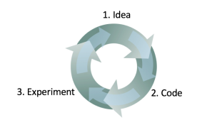
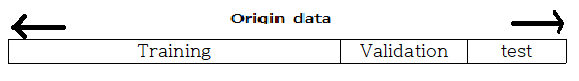

## Machine Learning Yearing
**[Machine Learning Yearing 책을 읽으며 개인적으로 받아들인 내용을 요약한 글입니다.]()**

ML에서 어떠한 문제를 해결하기 위해 modeling - 관찰 - 수정 와 같이 일련의 과정을 반복적으로
이뤄진다. 이러한 과정에서 어떠한 모델이 더 좋을까에 대한 **metric** 이 필요하다.

**빠르게 간단한 시스템을 개발 -> 학습 -> 어떻게 동작했는지 관찰(Error analysis)**

### Data set

- training set : 가중치를 학습시킬 Data
- Dev set(Validation) : 하이퍼 파라미터 조정, Model을 평가하는 목적(가장 성능이 좋은 하이퍼파라미터 세팅을 말한다. 최종 모델 선택)
- test set : **Unseen** 한 data로 모델을 평가한다.

dataset을 위의 그림과 같이 나누기엔 train set이 부족하다면
**K-fold cross validation**(실제 머신러닝에서 모델 평가와 모델 선택을 위해 가장 널리 사용되는 기법.) 을 이용한다.

- cross validation은 연속적으로 훈련과 검증 단계를 교차시키는 것으로 생각.
- 데이터셋에 있는 모든 샘플이 테스트될 기회를 갖도록 한다.
- k-fold는 k번 반복을 말한다.

##### K-fold cross validation example, k=5

data를 5(k)개로 나눈 다음 (각각을 fold라 부름)
첫번째 학습에는 첫번째 폴드를 validation 으로 이용하고
두번째 학습에는 두번째 폴드를 validation으로 이용하고
 ...
다섯(k)번째 학습에는 다섯번째 폴드를 validation으로 이용한다.

## Metric  

이렇게 준비한 data set으로 모델을 학습시키면 어떻 모델이 좋은가에 대한 평가지표를
metric이라 부른다.
metric에는 accuracy가 많이 사용되고 그다음으로 ROC Curve와 Precision Recall Plot,
F-score등이 많이 사용된다.

### - ROC Curve
