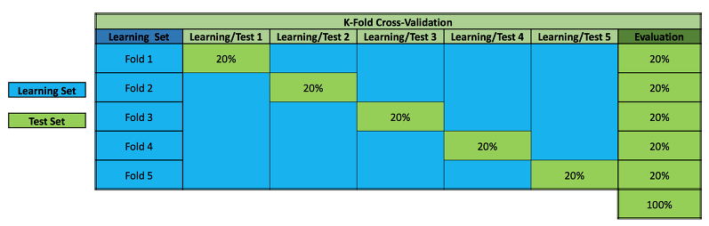
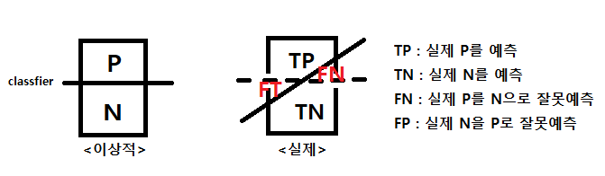
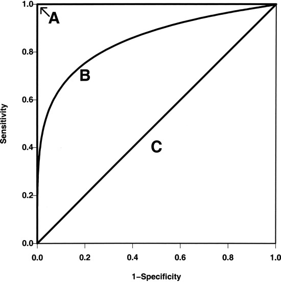
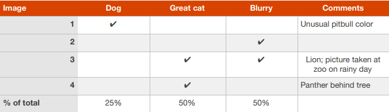
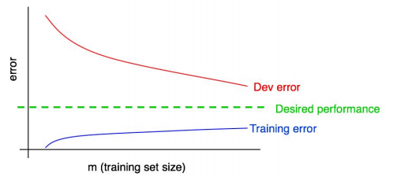

## Machine Learning Yearing
**Machine Learning Yearing 책을 읽으며 개인적으로 받아들인 내용을 요약한 글입니다.**

ML에서 어떠한 문제를 해결하기 위해 modeling - 관찰 - 수정 와 같이 일련의 과정을 반복적으로
이뤄진다. 이러한 과정에서 어떠한 모델이 더 좋을까에 대한 **metric** 이 필요하다.

**빠르게 간단한 시스템을 개발 -> 학습 -> 어떻게 동작했는지 관찰(Error analysis)**

### Data set

- training set : 가중치를 학습시킬 Data
- Dev set(Validation) : 하이퍼 파라미터 조정, Model을 평가하는 목적(가장 성능이 좋은 하이퍼파라미터 세팅을 말한다. 최종 모델 선택)
- test set : **Unseen** 한 data로 모델을 평가한다.

dataset을 위의 그림과 같이 나누기엔 train set이 부족하다면
**K-fold cross validation**(실제 머신러닝에서 모델 평가와 모델 선택을 위해 가장 널리 사용되는 기법.) 을 이용한다.

- cross validation은 연속적으로 훈련과 검증 단계를 교차시키는 것으로 생각.
- 데이터셋에 있는 모든 샘플이 테스트될 기회를 갖도록 한다.
- k-fold는 k번 반복을 말한다.

##### K-fold cross validation example, k=5

data를 5(k)개로 나눈 다음 (각각을 fold라 부름)
첫번째 학습에는 첫번째 폴드를 validation 으로 이용하고
두번째 학습에는 두번째 폴드를 validation으로 이용하고
 ...
다섯(k)번째 학습에는 다섯번째 폴드를 validation으로 이용한다.

## Metric  

이렇게 준비한 data set으로 모델을 학습시키면 어떻 모델이 좋은가에 대한 평가지표를
metric이라 부른다.
metric에는 accuracy가 많이 사용되고 그다음으로 ROC Curve와 Precision Recall Plot,
F-score등이 많이 사용된다.

- Acc : (TP + TN) / (P + N)  (전체중에 제대로 예측한 비율.)
- Error rate : (FP + FT) / (P + N) (전체중에 잘못 예측한 비율.)
- Sensitivy(= recall, TPR) : TP / (TP + FN) (실제 P중 제대로 P로 예측한 비율.)
- Specificity(특이도) : TN / (FP + TN) (실제 N중 N으로 예측한 비율.)
- Precision(PREC, 정확율) : TP / (TP + FP) (P로 예측한 것중 실제로 P인 비율.)
** FPR(False Positive Rate) : 1-Specificity
** TPR(True Positive Rate) : Sensivity
### - ROC Curve

- A 모델 일수록 model의 성능이 좋다.
- AUL (area under the curve)  넓을수록 좋다.

##### ** 복수 지표를 가져야 할때 한개의 지표로 만들어준다
~~ex) 이거 있는데 까먹었ㅇ.ㅏㅓㄴㅇ라ㅓㄴㅇㄹ 다시 공부하고 올리기 미ㅓㅏㄴ~~

##Error analysis
맨 윗사진의 루프를 돌때 방향성을 잡는다.

1. dev set 잘못 분류 한걸 수작업 으로 오류 분류

표를 만들고 해당 오차를 해결하면 전체 성능 얼마나 좋아질지 생각해보고 방향수정

만약 dev가 너무많아 분석 어려울땐?
dev set의 10%를 eyeball dev set 으로 두고 한다.
나머지 90%는 black dev set ->이걸로 파라미터 조정
~~이것도 수정 필요~~

### 편향과 분산

- 편향 : Train 의 에러율
- 분산 : dev/test가 train에 비해 얼마나 나쁜지
편향과 분산은 딜레마를 가지고 있다.

- Overfiting : 편향 낮으나 분산이 높다, Train set -> good,  dev/test -> bad
- Underfiting : 편향 높으나 분산이 낮다.

편향이 높아? -> 더깊게 모델을 만든다 -> 오버피팅주의! -> 정규화, dropout으로 막자.
분산이 높아? -> Train set 추가 (편향에 영향 안준다.)

~~뒷부분 공부해서 올리기~~
